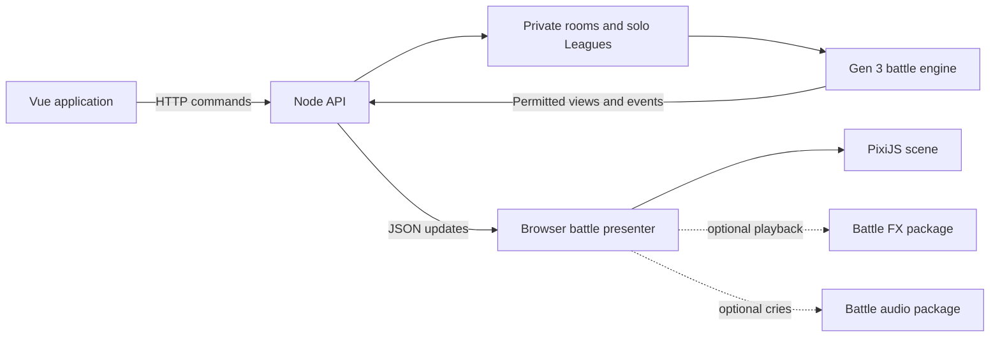

# Battle Lab — Pokémon Battle Simulator

A modular Pokémon battle application with authentic Generation 3 mechanics, private multiplayer rooms, regional League challenges, and independently authored battle animations.

Built with **Vue 3, JavaScript, PixiJS 8, GSAP 3, Vite, and Node.js 24**. Battle simulation, reference data, sprites, and visual effects live in separate workspace packages. The authoritative battle engine runs on the server; the browser presents its results.

**[Play multiplayer](https://pokemon-battle-sim-f0414a78774c.herokuapp.com/multiplayer)** · **[Challenge a League](https://pokemon-battle-sim-f0414a78774c.herokuapp.com/simulation)** · **[Explore move effects](https://pokemon-battle-sim-f0414a78774c.herokuapp.com/preview)** · **[Home](https://pokemon-battle-sim-f0414a78774c.herokuapp.com/)**

> **Project status:** active development. The frontend and Node API are hosted together on Heroku. Battles and guest sessions currently live in memory; accounts, durable match history, and recovery across server restarts are not implemented.

## Features

### Private multiplayer

- Create a private room and invite another player with a shareable link.
- Play as a guest without creating an account.
- Select a Kanto, Johto, or Hoenn preset team and choose its lead.
- Start when both players are ready, then submit moves and switches through server-issued decisions.
- Receive a separate permitted view for each player, including exact own HP and public opponent HP.
- Reconnect in the same browser while the room and guest session remain available.
- Forfeit explicitly, with server-enforced decision deadlines and protection against duplicate commands.

Multiplayer uses HTTP commands and short polling. It currently supports preset teams only.

### Regional League challenges

Face four Elite Four members and a Champion in a single region:

| Region | Roster reference | Opponents |
| --- | --- | --- |
| Kanto | FireRed / LeafGreen | Lorelei → Bruno → Agatha → Lance → Blue |
| Johto | Gold / Silver | Will → Koga → Bruno → Karen → Lance |
| Hoenn | Ruby / Sapphire | Sidney → Phoebe → Glacia → Drake → Steven |

All teams battle at **level 100** using Generation 3 mechanics. Your original team is fully restored between opponents, including HP, PP, status and held items. Trainer parties are sourced adaptations; the automated opponent uses a simple legal-action policy rather than cartridge trainer AI. See [League roster provenance](docs/LEAGUE_ROSTERS.md) for the exact sets and adaptations.

### Custom teams for solo play

Build a six-Pokémon team with species, moves, abilities, held items, natures, EVs, IVs, gender and friendship settings. The server validates complete sets and move combinations before battle. One draft can be saved in browser storage; this is not an account-backed team library.

### Animation tools

- **335 registered move effects**, authored as individual recipes.
- Move previews from either side of the battlefield.
- A standalone FX playground for testing effects without battle rules.
- Poké Ball releases, fainting, idle motion, effectiveness feedback, battle introductions and result overlays.
- Optional effects, reduced motion and skip controls that preserve the authoritative result.

### Pokémon cries

Solo and multiplayer play optional cries at each Pokémon's send-out reveal. Sound has separate mute and volume controls, with preferences saved in this browser. Start/Ready activates browser audio; **Enable sound** retries if the browser blocks it. Reconnects and corrected snapshots do not replay cries. Late or unsupported recordings stay silent and never delay battle decisions.

The pinned catalog covers 386 species and 33 explicit forms using 386 local recordings (2.25 MB total). Only relevant team and revealed-opponent cries load during play, with a bounded decoded cache. Heroku serves static files; playback and decoding happen in the browser. See [cry playback](docs/CRY_PLAYBACK.md) and the [asset pipeline](tools/cry-import/README.md).

Battle SFX Stage A adds an independent candidate catalog and reproducible decoded audit of 530 supplied recordings. It accounts for all 354 game moves, with 352 filename candidates and explicit unresolved policies for Mirror Move and Nature Power. Candidate lookup alone does not enable playback. See the [measured audit](tools/audio-import/reports/sfx-audit.md), [pipeline commands](tools/audio-import/README.md) and [integration plan](docs/BATTLE_SFX_PLAN.md).

Stage B's local [SFX audition bench](docs/SFX_AUDITION_BENCH.md) is available at `/sfx-bench` during `npm run dev`, after `npm run audio:setup`. Compare pinned/browser waveforms with real move animations, author frame regions and export listening reviews. It is excluded from production. [User-approved pilot reviews](tools/audio-import/review/PILOT_REVIEW.md) cover 11 saved configurations across 10 moves.

Stage C connects ten selected move recordings to preview, solo and multiplayer through the shared audio player and actual visual-start clock. Sound, cries, move sounds and volume have separate controls. The pilot requires Chrome 152 and matching reviewed 48 kHz decode measurements; other profiles, unreviewed moves and reduced-motion/effects-off presentations remain silent for move SFX. The hashed additions total 867 KiB; existing audio and animations remain unchanged. Run `npm run sfx:runtime:check` to verify the selected outputs, and set `VITE_BATTLE_SFX_ENABLED=false` before building to disable the pilot. See the [runtime guide and remaining release gates](docs/SFX_RUNTIME_PILOT.md). Music remains deferred.

The [remaining-collection audition pass](docs/SFX_REMAINING_REVIEW.md) measures all 530 recordings and supplies 502 technical drafts in eight batches at `/sfx-bench?collection=remaining`. It offers frame-region and cue-alignment comparisons plus attenuation-only volume proposals. Reproduce them with `npm run sfx:analyze-remaining` and verify with `npm run sfx:remaining:check`.

The [simulation and move-preview draft integration](docs/SFX_SIMULATION_DRAFTS.md) enables 323 additional whole-recording defaults, for 333 covered attack animations including the pilot. These remain technical drafts, with no invented listening approval. They use actual native buffers at visual start, with measured attenuation and on-demand loading; optional trims and energy-alignment comparisons remain in the bench. Both pages share the same 27.0 MiB of hashed assets. Multiplayer uses the pilot plus accepted review batches. Run `npm run sfx:simulation:check` to verify the shared pack; set `VITE_SIMULATION_DRAFT_SFX_ENABLED=false` or `VITE_PREVIEW_DRAFT_SFX_ENABLED=false` before building to disable the additions on the corresponding page.

[Sound/animation batch 1](docs/SFX_SYNC_BATCH_01.md), [batch 2](docs/SFX_SYNC_BATCH_02.md) and [batch 3](docs/SFX_SYNC_BATCH_03.md) are accepted: their 18 final timing plans override the historical defaults in simulation, move preview and multiplayer, including Psychic's sound accent and Thunder Punch's impact spark. Their local pages replay only the final versions. Verify with `npm run sfx:accepted:check`. [Batch 4](docs/SFX_SYNC_BATCH_04.md) retains its six saved keep decisions. [Batch 5](docs/SFX_SYNC_BATCH_05.md) contains feedback revisions for the ten requested odd ones out at `/sfx-bench?batch=sync-005`, with eight approved proposals kept, doubled Eruption lava balls and smaller Blizzard crystals that grow upright and fade; the exact previous proposals remain available, and these reviews stay separate from game playback.

[Batch 6](docs/SFX_SYNC_BATCH_06.md) contains five accepted final versions at `/sfx-bench?batch=sync-006`: Leaf Blade's upper crescent, Tri Attack's elemental aftermath, Meteor Mash's cosmic impact, Ancient Power's doubled rendered rocks in a surrounding orbit, and Sacred Fire's purple release and flame crown. Exact sounds, timings and artwork are pinned to the user's final approval; earlier comparisons remain archived.

[Batch 7](docs/SFX_SYNC_BATCH_07.md) reviews Sing, Grass Whistle, Attract, Morning Sun, Moonlight and Confuse Ray at `/sfx-bench?batch=sync-007`. Existing motion extends through the full recordings, with healing finishes for the light moves and circling ducks for Confuse Ray.

## Application pages

| Route | Purpose |
| --- | --- |
| `/` | Home and mode selection |
| `/multiplayer` | Private rooms and guest battles |
| `/simulation` | Regional Leagues and solo team building |
| `/preview` | Individual move demonstrations |
| `/playground` | Standalone effect authoring and playback |

The frontend uses multiple Vue entry points with clean public URLs. Direct visits and refreshes are supported. Older `.html` links redirect to the corresponding clean path, preserving query strings and browser fragments such as invitation tokens.

## Getting started

### Requirements

- **Node.js 24**; the local version is recorded in `.nvmrc`.
- npm and the checked-in `package-lock.json`.
- A modern browser with WebGL support for the full PixiJS presentation.

### Local development

From the repository root:

```bash
npm ci
npm run dev
```

Open the address printed by Vite, normally `http://localhost:5173`. The development server hosts both the frontend and the local battle APIs. No database, API key, data import or sprite download is needed for normal application startup.

To test multiplayer yourself, open the same local origin in two separate browser profiles, or a normal window and a private window. Two ordinary tabs sharing cookies represent the same guest.

### Run the production build locally

```bash
npm run build
npm start
```

Open `http://127.0.0.1:3000`. The Node process serves the built `dist/` pages, static assets, and both API namespaces. `npm run preview` is also available after building and mounts the local API services through the Vite plugins.

For access from another device on your network:

```bash
HOST=0.0.0.0 PORT=3000 npm start
```

## Architecture

The application separates battle authority from presentation. The server validates an action, resolves it through the engine, and returns permitted observations and ordered events. The browser uses those facts to update the interface and play animations. Animation completion, failure, skipping and reduced motion never determine damage or battle outcomes.



### Workspace packages

| Package | Responsibility |
| --- | --- |
| [`@battle/battle-engine`](packages/battle-engine/README.md) | Server-only Gen 3 mechanics, full-team validation, decisions, private observations, checkpoints and replay, backed by pinned Pokémon Showdown |
| [`@battle/battle-core`](packages/battle-core/README.md) | Immutable, simplified rules and fixed results for the move preview |
| [`@battle/battle-fx`](packages/battle-fx/README.md) | Independent move animations, transitions, visual randomness, asset ownership and cleanup |
| [`@battle/game-data`](packages/game-data/README.md) | Immutable Gen 3 reference records, lookups, manifests and provenance |
| [`@battle/pokemon-sprites`](packages/pokemon-sprites/README.md) | Pinned front/back artwork, asset URLs and measured visible bounds |
| [`@battle/pokemon-cries`](packages/pokemon-cries/README.md) | Pinned cry catalog, explicit form mappings and pure asset lookup |
| [`@battle/battle-audio`](packages/battle-audio/README.md) | Optional browser audio, gesture activation, loading, bounded cache and voice cleanup |
| [`@battle/battle-sfx`](packages/battle-sfx/README.md) | Independent sound candidates, decoded metadata and explicit unreviewed move/event policies; no playback |

The two rule packages serve different purposes. The move preview is a controlled demonstration with guaranteed-hit, fixed-result examples. It does not attempt a complete battle. Solo and multiplayer use `battle-engine` for actual turn order, accuracy, PP, damage, conditions, switching and battle results. Preview behavior must not be used as competitive battle logic.

The FX package receives cosmetic requests and actor references. It does not own HP, teams, turn state or rule RNG, and a valid move can resolve even without a matching animation.

### Repository layout

```text
apps/
  home/                 Home page and navigation
  multiplayer/          Private-room lobby, choices and update coordination
  simulation/           Solo Leagues, team builder and battle controls
  game/                 Move preview and shared scene foundations
  fx-playground/        Standalone animation tools
  shared/battle/        Reusable battle view, presenter and visual sequencing
  server/
    rooms/              Guest identity, room service, HTTP routes and RAM store
    start.mjs           Production HTTP server and static file host
    simulation.js       Solo battle API and session lifecycle
    league-*.js         Regional rosters and challenge progression
    team-builder.js     Team editor catalog from pinned reference data
    pageRoutes.js       Clean page URLs and legacy redirects
packages/               Independent battle, FX, audio, data and sprite packages
tools/
  data-import/          Reproducible Gen 3 reference-data importer
  roster-import/        Pinned sprite import and roster validation
  audio-import/         Sound optimization, pinned decoded audit and SFX catalog generation
  cry-import/           Pinned cry sources, validation, import and listening audit
tests/                  Application, transport, presentation and FX tests
docs/                   Contracts, implementation guides and design reviews
```

The multiplayer room store is injected behind an asynchronous transaction interface. A future persistent adapter must preserve atomic ownership, checkpoints, deadlines, results and command receipts. Adding a database does not require moving battle calculations into the browser or coupling the FX package to storage.

## Data and artwork

The checked-in reference snapshot is generated from **Pokémon Showdown `0.11.11`**, resolving its `gen3` data rather than filtering modern-generation values. The battle-engine dependency is pinned to the same version.

| Resource | Coverage |
| --- | ---: |
| Base species | 386 — National Dex #001–386 |
| Explicit forms | 33 |
| Reference moves | 354 |
| Abilities | 76 |
| Items | 106 |
| Natures | 25 |
| Front/back PNGs | 838 |

Reference move coverage and animation coverage are separate: the data snapshot contains 354 moves, while the FX catalog registers 335 effects. Displayable forms are also distinct from legal starting forms; the engine validates battle eligibility.

Sprites come from a pinned revision of the PokeAPI sprite repository. They use **Gen 5-style static artwork**, independently of the game's Gen 3 mechanics. Sprite sizing uses measured visible artwork, uniform scaling and minimum display sizes rather than Pokédex height values.

Both import pipelines record source revisions, hashes, validation results and discrepancy reports. Normal builds consume the committed output without fetching Pokémon data at runtime.

For data maintenance, start with the [data importer guide](tools/data-import/README.md) and [sprite importer guide](tools/roster-import/README.md). Their dependencies are isolated from the application:

```bash
# Verify the reference-data snapshot.
npm run data:setup
npm run data:check
npm run test:data

# Verify the sprite/roster output after preparing the pinned source cache.
npm run roster:setup
npm run roster:fetch
npm run roster:check
npm run test:roster
```

The setup and fetch steps require network access. Review source-lock and generated artifact changes when updating upstream data; do not replace missing values or assets with guesses.

## Testing and development

| Command | Purpose |
| --- | --- |
| `npm test` | Root application and FX regression suites |
| `npm run test:engine` | Headless engine mechanics, legality, projections, recovery and replay |
| `npm run test:simulation` | Solo UI logic, presentation and HTTP integration |
| `npm run test:multiplayer` | Room ownership, retries, deadlines, private views and presentation |
| `npm run audio:setup` | Install the isolated pinned SFX audit decoder |
| `npm run sfx:check` | Re-decode all sound effects and verify committed catalogs/reports without writes |
| `npm run sfx:simulation:check` | Verify simulation/preview technical drafts, provenance and hashed assets |
| `npm run sfx:accepted:check` | Verify accepted final timing plans and existing hashed assets |
| `npm run test:sfx` | SFX source integrity, decoding, mapping, catalog and pipeline failure tests; requires audio setup |
| `npm run test:sfx-bench` | Authoring schema, native audio, visual timing, dev routes and production exclusions; requires audio setup |
| `node --test tests/clean-urls.test.mjs` | Clean routes, redirects, Vite and production host behavior |
| `npm run engine:demo` | Complete a headless battle and verify checkpoint/replay behavior |
| `npm run build` | Build all frontend entries and assets |

Data and sprite suites use the setup steps above. HTTP integration tests bind temporary loopback ports. The root test command does not include every package's separate test suite.

When contributing:

1. Read the relevant package guide and [repository boundaries](AGENTS.md).
2. Keep mechanics in the engine, room/session policy in the server, and cosmetic behavior in presentation or FX.
3. Preserve each move's independent choreography and cleanup behavior.
4. Verify changes with the relevant suites and a production build when application code changes.
5. Include provenance and validation changes alongside generated data or artwork updates.

See [Adding moves](docs/ADDING_MOVES.md) and [Opponent previews](docs/OPPONENT_PREVIEW.md) for animation development.

## Heroku deployment

The current deployment serves **both the frontend and backend from one Heroku application**:

```text
https://pokemon-battle-sim-f0414a78774c.herokuapp.com
├── /multiplayer, /simulation, /preview, /playground
├── /assets/*
├── /api/multiplayer/*
└── /api/simulation/*
```

Browser requests use relative API paths on the same origin. No separate frontend host, API proxy or browser API-base-URL variable is required.

Deploy the **repository root**, including its workspace packages and lockfile, using Node.js 24 and the Node buildpack. Build with `npm run build`; run the web process with `npm start`. Vite's development dependencies must be available during the build and can be pruned afterward. The existing start script launches `apps/server/start.mjs`.

To select the Node 24 release line explicitly on Heroku, add `"engines": { "node": "24.x" }` to the root `package.json` and update its lockfile. The current `.nvmrc` records the local version; it does not configure the Heroku buildpack's runtime selection.

Configure these environment variables on Heroku:

| Variable | Value / purpose |
| --- | --- |
| `HOST` | `0.0.0.0` — accept connections from Heroku's router |
| `PORT` | Supplied by Heroku; do not override |
| `NODE_ENV` | `production` |
| `PUBLIC_ORIGIN` | `https://pokemon-battle-sim-f0414a78774c.herokuapp.com` |

For another deployment or a custom domain, set `PUBLIC_ORIGIN` to that browser-facing origin, without a page path. It controls request-origin validation and secure-cookie behavior behind HTTPS termination. The current implementation accepts one configured public origin.

After deploying, check both public configuration endpoints, then exercise an actual battle:

- [`/api/simulation/config`](https://pokemon-battle-sim-f0414a78774c.herokuapp.com/api/simulation/config)
- [`/api/multiplayer/config`](https://pokemon-battle-sim-f0414a78774c.herokuapp.com/api/multiplayer/config)

A JSON response confirms API availability. Also verify solo battle creation, a private-room turn between isolated browser sessions, refresh/reconnect and forfeit on the deployed origin. Run **one web dyno with one Node process** until shared storage and multi-instance room coordination are implemented.

## Current boundaries

- **No database or accounts.** Active rooms, guest credentials, matches and League progress are process-local. Solo team drafts are browser-local.
- **Restart recovery is not durable.** A deploy, crash or dyno restart clears server memory. Same-browser reconnect only works while the original server state remains available. Heroku's [dyno restart lifecycle](https://devcenter.heroku.com/articles/dyno-restarts) must be considered even on an always-on plan.
- **Single-instance operation.** The default host allocation is 14 solo sessions and 10 active multiplayer matches. These are admission limits, not verified production throughput guarantees.
- **Explicit expiry.** Solo sessions expire after 30 minutes of inactivity. Multiplayer defaults are a 15-minute idle lobby, a five-minute required-decision deadline, 15-minute terminal-result retention and a 24-hour guest credential lifetime.
- **Singles first.** Doubles, ranked matchmaking, spectators, trading and an overworld are outside the current release.
- **Preset-only PvP.** Custom teams are currently available for solo Leagues, not private multiplayer.
- **No persistent player progression.** Cross-device teams, match history, achievements and account recovery remain future work.

## Further documentation

| Guide | Focus |
| --- | --- |
| [Battle engine](packages/battle-engine/README.md) | Engine API, formats, validation, privacy and replay |
| [Visual simulation](docs/BATTLE_SIMULATION.md) | League flow, team builder and presentation behavior |
| [Multiplayer runtime](docs/MULTIPLAYER.md) | Room protocol, transaction model, limits and local load observations |
| [League rosters](docs/LEAGUE_ROSTERS.md) | Trainer sources and explicit adaptations |
| [Project contract](docs/PROJECT_CONTRACT_V1.md) | First-release scope and acceptance criteria |
| [Architecture guide](docs/PRODUCTION_ARCHITECTURE_GUIDE.md) | Modular design and longer-term production work |

This README describes the current Heroku hosting arrangement. Detailed design and implementation documents may retain historical deployment notes; use the deployment instructions above for the current application.

## Credits and licensing

Battle Lab is an unofficial fan project and is not affiliated with or endorsed by Nintendo, Game Freak or The Pokémon Company. Pokémon names, characters and artwork belong to their respective rights holders.

- **Pokémon Showdown:** battle simulation and Gen 3 reference data; see the [engine notice](packages/battle-engine/NOTICE), [data notice](packages/game-data/NOTICE) and [upstream software license](packages/game-data/LICENSE).
- **PokeAPI sprites:** pinned Pokémon artwork; see the [sprite notice](packages/pokemon-sprites/NOTICE) and [upstream license notice](packages/pokemon-sprites/UPSTREAM-LICENCE.txt).
- **PokeAPI cries:** pinned recordings and explicit form mapping evidence; see the [cry notice](packages/pokemon-cries/NOTICE) and [upstream license](packages/pokemon-cries/UPSTREAM-LICENSE.txt).
- **Bootstrap Icons:** included artwork retains its [MIT license notice](packages/battle-fx/assets/bootstrap-icons-LICENSE.txt).
- **Lorc / Game-icons.net:** rock artwork retains its [CC BY 3.0 attribution](packages/battle-fx/assets/rock-ATTRIBUTION.txt).

No repository-wide license is currently declared. Third-party software licenses and asset notices apply to their respective material; they do not grant blanket rights to Pokémon artwork or franchise content.
