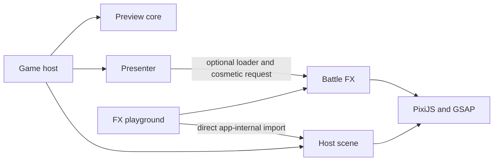

# Architecture and implementation review

Review date: 14 September 2026. Scope: the current working tree, including existing uncommitted additions. Companion: [Production architecture guide](/Users/cdr/pokemon-battle-vue/docs/PRODUCTION_ARCHITECTURE_GUIDE.md).

## Verdict

**The first iteration earns 7.5/10: a good foundation for an engine-independent effects package.** The central separation is implemented, not merely described in documentation. Preserve it. The remaining work for this milestone is package usability, lifecycle hardening, independent validation and real-browser evidence.

The repository is a substantial animation showcase and a small preview resolver. It is not yet a multiplayer game or a Generation 3 battle simulator. Those capabilities are future work, rather than failed implementations. A production-completeness percentage would be misleading without an agreed product scope.

The strongest decision is that battle results become authoritative before presentation. The greatest architectural risk is gradually promoting the preview resolver and its fixtures into the real engine without first designing turns, rulesets, private state and event contracts.

Grades are engineering judgments against the stated first-iteration goal, not measured percentages. Roughly: 9–10 means independently usable and strongly verified; 7–8 means sound with identifiable gaps; 5–6 means useful but needs substantial hardening. An absent future subsystem is marked unimplemented.

## What was examined and verified

- Both package manifests and public entry points; core state/resolution and move metadata; FX runtime, registry, catalog, assets and coordinate adapter.
- Both applications, the presenter, scene construction, actor transforms, anatomy profiles, preview fixtures, host descriptions, build configuration and central documentation.
- Representative recipes across projectiles, beams, physical contact, drains, source effects, field effects, snapshots and two-phase moves. This was not a line-by-line artistic review of all 339 recipe modules.
- The complete existing test suite, whose loops exercise all 335 registered effects and many combinations of direction, actor shape, conditions and lifecycle.
- Focused reproductions of the findings below. No application code was changed. Existing edits were preserved; this review did not publish a site or a package.

Current measurements:

| Check | Observed result |
| --- | --- |
| Runtime | Node v24.4.1; repository `.nvmrc` specifies 24 |
| Catalogs | 335 core rules, 335 FX descriptors, 335 effect registrations |
| Recipe files | 339: 335 normal clips plus four preparation clips |
| Automated checks | 37 test files; **287 tests passed**, zero failures, about 15.48 seconds |
| Production build | Passed; Vite reported a chunk-size warning |
| Main effects-containing chunk | `index-D79zeSPH.js`: **1,061.06 kB minified / 293.44 kB gzip**; other renderer/shared chunks are additional |
| FX pack dry run | 355 files, 2,635,430 bytes packed / 3,812,747 bytes unpacked; README is the only Markdown file included |

These are observations from this review, not copied historical verification results. Headless Pixi display-tree tests do not establish GPU rendering quality, actual network download time, frame rate or memory stability. No new browser pixel, accessibility, load or security audit was performed. `npm pack --dry-run` inspects package contents; it does not prove installation in a clean external application. The npm distinction is documented in [npm pack](https://docs.npmjs.com/cli/v11/commands/npm-pack/).

## Current structure

| Location | Actual responsibility | Assessment |
| --- | --- | --- |
| `packages/battle-core/src/index.js` | Validates preview actors; synchronously resolves a selected move to frozen before/after/event records | Proper renderer boundary; increasingly dense rule branching |
| `packages/battle-core/src/moves.js` | Fixed preview damage, reference metadata and rule flags | Useful demo data; not a generation-aware dex |
| `packages/battle-fx/src/index.js` | Runtime construction, loading, playback handles, cues, cancellation, deadlines, reduced motion, cleanup | Strong foundation; callback reentrancy defect below |
| `packages/battle-fx/src/registry.js` | Statically imports recipes and supplies timing/subject metadata | Explicit and inspectable; loads the whole set |
| `packages/battle-fx/src/catalog.js` | Lightweight names, IDs, colors and phase metadata | Correct separate entry for selectors without rendering |
| `packages/battle-fx/src/effect-space.js` | Mirrored, uniformly scaled art space; semantic sockets and pose proxies | Valuable boundary; calibrated constants are art units, not a data-model dependency |
| `packages/battle-fx/src/assets.js` | Package-relative artwork URLs and cached texture loading | Clear asset ownership; custom effect requirements remain hardcoded by ID |
| `packages/battle-fx/src/moves/restored/` | Independent artwork, geometry, timing and reactions | Preserves move identity; shared lifecycle can improve without genericizing choreography |
| `apps/game/src/presentation/presenter.js` | Queued display of committed transactions and fallback reconciliation | One of the strongest components |
| `apps/game/src/scene/` | Pixi scene, logical layout, actor transforms, textures and anatomy | Good separation; reusable machinery still lives inside an app |
| `apps/game/src/previewState.js` | Labeled demonstration fixtures and single-move transactions | Keep explicitly demo-only; confirmed fixture invariant violations |
| `apps/game/src/moveDetails.js` and `moveCatalog.js` | User-facing move descriptions joined with core metadata | Correct ownership of host prose; manually maintained catalog burden |
| `apps/game/src/components/` | Vue preview controls and display | Adequate showcase; growing rule-specific caption branching |
| `apps/fx-playground/` | Direct engine-free effect authoring | Real engine independence; imports game-app scene internals |
| `public/assets/` | Pokémon artwork used by the host | Correctly outside FX |
| `tests/` | Core, presentation, lifecycle, geometry and recipe regression tests | Broad useful coverage; package-local and real-browser coverage need work |
| Root Vite configuration | Builds game and playground HTML entries | Appropriate for the preview; not a backend deployment |
| `docs/`, `AGENTS.md`, `examples/`, export script | Contracts, history, authoring instructions and teaching/export support | Valuable context, but some central claims are stale |

Both packages have manifests and package exports. The root is an npm workspace for `packages/*`. The two apps share root tooling and do not have their own package manifests or independent pipelines. Separate folders alone therefore do not imply separate build/test/release units.

The principal dependency flow is:

There is no reverse dependency from FX to core, Vue or Pokémon textures, and no renderer dependency in core. FX is **engine-independent and Vue-independent, but intentionally PixiJS/GSAP-specific**. That is sufficient for the stated goal. A renderer-neutral abstraction is optional future scope and would carry a substantial cost.

## Grades by implementation area

| Area | Grade | Reason |
| --- | --- | --- |
| Engine/FX dependency boundary | **8.5/10** | Actual import separation, cosmetic inputs, no HP authority in FX |
| FX lifecycle and extensibility | **7/10** | Handles, deadlines, cancellation and reduced motion; reentrancy cleanup gap and partial registry injection |
| Recipe organization | **7.5/10** | Independent art and geometry with broad contact checks; dense formatting and uneven authoring ergonomics |
| Scene/anatomy boundary | **8/10** | Semantic sockets, visible bounds, facing, stable layout and texture ownership |
| Presentation ordering | **8.5/10** | Committed/displayed separation, stale-work invalidation, skip/failure reconciliation |
| Preview core | **7/10** | Pure synchronous results and useful edge coverage; permissive schema and expanding conditional resolver |
| Independent package consumption | **6/10** | Exports/peers/assets exist; incomplete shipped contract, eager catalog and no clean-consumer gate |
| Logic/geometry tests | **8/10** | Broad behavioral coverage, especially both-side contact and cleanup; several missed invariants |
| Documentation currency | **5/10** | Extensive instructions, but conflicting overview/count/limitation claims |
| Browser performance and appearance | **Unverified** | Cannot infer from headless geometry or successful bundling |
| Gen-aware data, full rules, audio, multiplayer, production operations | **Unimplemented** | Separate future milestones |

The overall 7.5 is a holistic grade for this iteration, not a weighted average of future features.

## Findings that should be fixed

### 1. P2 — A callback can mutate actors after playback has already cleaned up

Evidence: [runtime cleanup](/Users/cdr/pokemon-battle-vue/packages/battle-fx/src/index.js:26), [callback guard](/Users/cdr/pokemon-battle-vue/packages/battle-fx/src/index.js:45), [cue dispatch](/Users/cdr/pokemon-battle-vue/packages/battle-fx/src/index.js:82), and [Flamethrower contact callback](/Users/cdr/pokemon-battle-vue/packages/battle-fx/src/moves/restored/flamethrower.js:19).

Flamethrower calls `onCue()` and then writes `defender.tint`. If the consumer throws, cancels the current handle or starts a replacement effect during that cue, the runtime settles and resets actors synchronously. The recipe callback then continues and writes the old tint after cleanup.

Confirmed reproduction: begin Flamethrower; at its impact callback immediately start source-only Barrier. Flamethrower reports `cancelled`. Barrier reports `completed`. The effects layer is empty, but the target tint remains **16745518**, instead of white **16777215**. A throwing cue consumer also leaves the tint behind. This affects the reusable package's public callback contract, even though the existing game presenter normally handles its own display callbacks safely.

Recommended repair: define reentrant callback behavior and ensure settled runs cannot perform further pose writes. Possible approaches include a guarded pose boundary or a callback-dispatch boundary that completes safe finalization before starting replacement work. Merely adding another reset later can corrupt the replacement run. Add regressions for throw, cancel, replacement with a source-only clip and replacement involving different participants. Preserve contact-before-cue geometry and normal choreography.

### 2. P2 — Preview fixtures can revive fainted sources and increase existing low HP

Evidence: [final fixture branch](/Users/cdr/pokemon-battle-vue/apps/game/src/previewState.js:55), [direct-heal fixture](/Users/cdr/pokemon-battle-vue/apps/game/src/previewState.js:40), and [special-HP fixture](/Users/cdr/pokemon-battle-vue/apps/game/src/previewState.js:49).

With source HP 0 and maximum HP 100, `createPreviewState(absorb)` returns HP 65 and `createPreviewState(rest)` returns HP 45. The resulting Absorb transaction reports `hit`: the host has revived the actor before the otherwise-correct core fainting guard runs. With source HP 1, the same fixtures produce 65/45; Recover and Pain Split fixtures produce 40.

Recommended repair: every fixture must preserve fainted actors. Where a fixture creates missing health, cap its chosen HP at the supplied current HP. Use a consistent invariant across fixture families and both selected sides. Explicit demo preparation remains host-owned; do not modify production battle rules to accommodate it.

### 3. P2 — The public immutable-state claim exceeds input validation

Evidence: [shallow freeze](/Users/cdr/pokemon-battle-vue/packages/battle-core/src/index.js:17), [actor validation](/Users/cdr/pokemon-battle-vue/packages/battle-core/src/index.js:29), and [actor field spread](/Users/cdr/pokemon-battle-vue/packages/battle-core/src/index.js:46).

`condition` is not validated. A consumer can supply `{ condition: { code: 'burn' } }`, resolve a move, then change the original object's code. Both the before and after snapshots change internally despite their frozen actor wrappers. Unknown nested actor fields are also preserved by reference. An unsupported scalar condition is accepted too.

Recommended repair: define a closed serializable input schema, validate recognized conditions, and choose an explicit extension policy. Copy/freeze permitted structured fields or reject them; do not preserve arbitrary mutable objects under an immutable API promise. This is a consumer-contract defect, not evidence that the current app accepts hostile network commands. The move-rule array and its records are already frozen and contain scalar values.

## Structural weaknesses relevant to the next milestone

### Entire FX code loads through the standard entry

[index.js](/Users/cdr/pokemon-battle-vue/packages/battle-fx/src/index.js:4) imports the complete registry. [registry.js](/Users/cdr/pokemon-battle-vue/packages/battle-fx/src/registry.js:1) statically imports all recipes. Injecting a small `effects` object does not remove that default import graph from the published entry's source contract.

The game does defer the FX package until effects are needed, and textures are loaded on demand. The remaining cost is loading/parsing the full recipe set on first use. Add an optional runtime-only entry and lazy recipe loaders or coherent bundles. Keep the existing full entry for backwards compatibility. Benchmark cold-start and prepared-match preloading; splitting into hundreds of tiny requests is not automatically better.

### Independent testing lags behind runtime independence

[core.test.mjs](/Users/cdr/pokemon-battle-vue/tests/core.test.mjs:4) imports the FX catalog and requires exact ordered catalog equality. Adding a legitimate unanimated battle move would fail this test even though the runtime supports a valid core move without FX. Keep showcase consistency checks in integration tests and give each package its own runnable tests. Assert overlap/fixture requirements appropriate to the demo rather than universal equality between engine and animation catalogs.

[Boundary assertions](/Users/cdr/pokemon-battle-vue/tests/core.test.mjs:383) are regex-based. They are useful guards for existing patterns, but not complete dependency-graph enforcement: they do not comprehensively prohibit dynamic-import escapes, deep imports, cycles or app-to-app imports.

### Scene reuse currently depends on the game app

[Playground.vue](/Users/cdr/pokemon-battle-vue/apps/fx-playground/src/Playground.vue:4) imports the game scene and preview profiles directly. Extract reusable Pixi scene/actor mechanics into a package when hardening independent consumption. Keep sample roster data, sprite URLs and measured artwork profiles supplied by a host or demo fixture module. Preserve the approved dimensions, sockets and move art during that extraction.

### Package documentation is incomplete when packed

[FX README](/Users/cdr/pokemon-battle-vue/packages/battle-fx/README.md:15) refers to workspace documentation and the game scene for the full adapter contract. Those sources are not shipped in the package dry run. The brief socket list also omits several relied-upon sockets/semantics.

Ship the full contract, ownership rules, supported outcomes/phases, coordinate conventions, callback behavior and a minimal geometric-host example with the package. JSDoc and declarations can improve plain-JavaScript consumers without rewriting the project in TypeScript. A standalone tarball consumer test should verify imports, assets, rendering and teardown outside this repository.

### Some scene initialization work is unbounded

[Scene startup](/Users/cdr/pokemon-battle-vue/apps/game/src/scene/index.js:58) awaits renderer initialization and all sprite loads without an application deadline or AbortSignal. Rejected assets have a fallback, but a never-settling load can leave startup pending. The presenter deadline starts later. This is a static resilience risk, not a measured browser outage. Add cancellation/deadline handling with disposal of late arrivals; the existing effects-off path remains useful.

### Source readability and documentation need a maintenance pass

Core resolution is 306 lines, rule data 780, host details 828 and the FX registry 634. Size alone is not the issue: many statements are compressed onto single lines, making review, debugging and ownership changes harder. Format small files incrementally; extract cohesive rule operations when developing the real engine. Preserve separate move art rather than replacing recipes with shared colored templates.

[PROJECT_OVERVIEW.md](/Users/cdr/pokemon-battle-vue/docs/PROJECT_OVERVIEW.md:3) still describes 33 effects and older limitations; [index.html](/Users/cdr/pokemon-battle-vue/index.html:7) retains an old count. Current README/registrations say 335. Generate catalog counts/timing indexes where feasible, distinguish historical verification from current guarantees, and keep architectural instructions shorter than per-move history.

## What should remain intact

1. Committed state and displayed state remain separate. Impact changes display timing, not damage authority.
2. FX receives move/actor IDs, cosmetic outcomes and visual seeds. HP, PP, rule RNG, items and authoritative conditions stay out.
3. Actor artwork, texture profiles, visible bounds and semantic anchors remain host concerns. Logical stage scaling and horizontal reflection are valuable tested invariants.
4. Each move keeps its own art and choreography. Shared runtime, lifecycle and coordinate code are appropriate; a generic visual recipe is not a necessary modularity improvement.
5. Source-only and field effects work without opponents. Missing effects, reduced motion, failure and cancellation must reconcile committed outcomes.
6. Shared textures remain loader-owned, temporary graphics remain playback-owned, and the runtime disposes its generated assets.
7. Keep the current preview engine available for deterministic authoring. It lets FX development proceed while the real engine is built or integrated separately.

## Immediate acceptance gate for the FX package

Call the first iteration complete when the three confirmed defects have focused regression coverage; a clean external consumer can install the tarball and implement the shipped scene contract; the package's own tests do not require battle-core; a small registry can be consumed without the full recipe graph; and representative browser tests verify appearance, cancellation and resource stability. Establish a measured loading/frame/memory budget on named target devices.

This is a bounded release-hardening milestone. It does not require implementing all battle rules, networking, sound, persistence or future generations before shipping a useful effects package.
