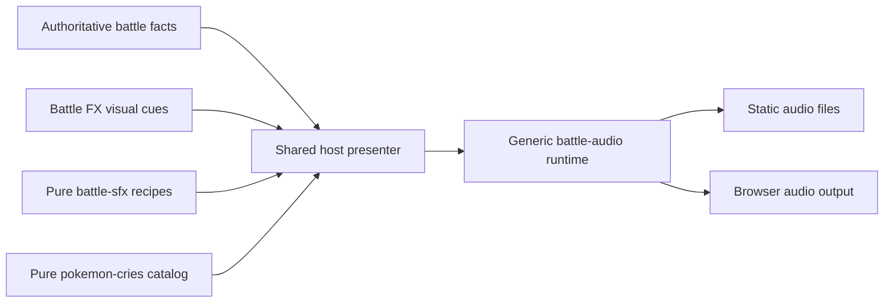

**Battle sound effects: implementation plan and design review**

Prepared 18 September 2026. Original design proposal with implementation status below. Sections 1–7 describe the starting point and planned architecture; the [Stage C runtime guide](SFX_RUNTIME_PILOT.md) documents the implemented subset and its precise limits. Recordings, animation choreography and battle mechanics remain unchanged.

**Stage A implemented:** the [decoded audit](../tools/audio-import/reports/sfx-audit.md) and independent [candidate catalog](../packages/battle-sfx/README.md) now exist. All 530 recordings decode under a pinned build-time decoder; all 354 moves have explicit policies. The Stage A catalog remains candidate-only; approvals live separately. The [pipeline guide](../tools/audio-import/README.md) documents reproduction and remaining limits.

**Stage B representative listening gate recorded:** the local [audition bench](SFX_AUDITION_BENCH.md) compares pinned/native waveforms with original animations, authors bounded reference regions and exports revision-pinned reviews. The user approved 11 saved configurations across 10 moves; see the [approval scope and evidence](../tools/audio-import/review/PILOT_REVIEW.md). Unreviewed phases, variants and audio-only studies remain pending.

**Stage C implemented for the approved subset:** ten compact runtime plans, hashed original-byte assets, a shared cry/SFX mixer, owned playback scopes and an additive visual clock are connected to preview, solo and multiplayer. Native eligibility is Chrome 152 with matching reviewed 48 kHz frame counts. Normal successful animation playback is the only approved mode. Automated integrity, lifecycle, presentation and delivery checks pass; broader device listening, combined-mix approval and production deployment remain Stage E work. See the [runtime guide](SFX_RUNTIME_PILOT.md).

**Stage D technical preparation and host integration implemented:** the [remaining-collection review](SFX_REMAINING_REVIEW.md) measures all 530 sources and generates 502 bounded drafts with region, timing-comparison and attenuation proposals. Its separate audition page preserves pilot approval pins. At the user's request, the [shared draft pack](SFX_SIMULATION_DRAFTS.md) enables 323 whole-recording defaults in solo simulation and move preview, retaining draft status and exact attenuation proposals. No listening approvals are added; per-move perceptual alignment and production device review remain incomplete. Multiplayer retains the approved pilot.

The agreed creative direction is to **match the existing custom animations while preserving the original sound character**. The recommended architecture adds one independent `@battle/battle-sfx` catalog/recipe package and extends the existing `@battle/battle-audio` browser runtime. Both cries and SFX use one audio context and one resource budget. Music has a reserved boundary but is a later implementation.

**1. What the repository actually contains**

The read-only asset integrity check, `npm run audio:check`, passes. The existing optimization removed ID3v2 artwork/metadata only, preserving all remaining bytes. Source: [optimization report](../tools/audio-import/reports/optimization.json), [preservation contract](../tools/audio-import/README.md), and [deployed manifest](../public/sound_effects/manifest.json).

| Filename category | Files | Bytes |
| --- | ---: | ---: |
| Base move tracks | 335 | 30,277,617 |
| Multipart tracks | 134 | 9,059,525 |
| One-/two-hit variants | 32 | 2,035,335 |
| Periodic damage/healing variants | 9 | 724,209 |
| Generic impact/status/stat/battle tracks | 18 | 1,213,316 |
| Present outcome variants | 2 | 299,094 |
| Total | 530 | 43,609,096 |

Original size was 90,366,242 bytes; current outputs are 51.74% smaller. All files report MPEG-1 Layer III, 44.1 kHz, stereo, 320 kbps. These categories come from filenames and are not a listening review. The linked [collection page](https://downloads.khinsider.com/game-soundtracks/album/pokemon-sfx-gen-3-attack-moves-rse-fr-lg) also lists 530 files, including full recordings, parts and hit variants.

The Stage A reference decode found no exact duplicate whole-file, MPEG-payload or PCM hashes; perceptual duplication is unreviewed. Actual gapless decoded duration is 1,053.88 seconds, totaling 371,809,856 bytes (354.59 MiB) of stereo 44.1 kHz Float32 PCM before overhead. One recording exceeds sample full scale slightly and remains unchanged for review. Decoding the whole library at startup is unsuitable. Native decoding resamples to the audio context's rate, so runtime accounting must use actual buffers. [MDN decoding behavior](https://developer.mozilla.org/en-US/docs/Web/API/BaseAudioContext/decodeAudioData)

The game data has 354 moves; FX has 335 recipes. Filename candidates cover 352 moves after explicit aliases and suffix classification. This is candidate coverage, not 352 approved sound mappings. Mirror Move and Nature Power have no named tracks. `visegrip` in game data, `vice-grip` in FX and `Vice Grip.mp3` illustrate why runtime filename guessing is unsafe. Nineteen valid game moves lack FX recipes but still have sound-name candidates; missing FX must not invalidate a legal move or force silence globally.

Generic files include normal/super-effective/resisted hits, faint, healing, held-item activation, stat changes, major conditions, confusion, recall and low-health variants. There is no obvious dedicated intro, victory, defeat, menu-click or ball-opening track. Recall is not automatically a suitable release sound. Source those separately or mark them deferred. The source manifest's existing `rightsStatus: unverified` remains unresolved; catalog provenance and a replaceable asset pack should preserve that fact rather than imply permission.

The cry player already supplies gesture activation, silent failure, a decoded LRU, concurrency limits and cleanup. Its present API plays a complete ready buffer immediately, with two voices and global stopping. It does not yet supply segments, category buses, owned voice handles or independent scope cancellation. The static server serves MP3/Ogg correctly, but currently sets no explicit cache policy or ETag. These are specific extension points, not reasons to replace the engine or frontend.

**2. Package ownership and dependency injection**

| Location | Owns | Must not own |
| --- | --- | --- |
| `packages/battle-audio` — existing | Browser context, decoding, loading, cache, buses, voices, segment playback, fades and cancellation | Pokémon IDs, battle protocol, HP, move rules, Vue or Pixi |
| `packages/battle-sfx` — proposed | Pure asset descriptors, authored recipes, semantic IDs, aliases, review status and coverage | Browser APIs, fetching, engine state, renderer or server |
| `packages/pokemon-cries` — existing | Exact species/form-to-cry lookup | General move sound recipes |
| `apps/shared/battle/audio.js` — existing, extended | Server-visible facts → cosmetic request; scope ownership, preferences, priorities, preload policy and deduplication | Damage, legality, hit-count or status calculations |
| `packages/battle-fx` — existing, additive cue support | Visual choreography and neutral visual markers | Sound URLs, audio package imports or battle state |
| `tools/audio-import` — existing, extended | Pinned source inspection, decoding analysis, reviewed transformations and generation | Production playback or runtime downloads |
| `public/audio/sfx/<hash>.mp3` — proposed | Selected versioned playable outputs | Original archives, waveforms, editor metadata or decoder binaries |

The dependency flow is:



Expose pure lookups/planning functions such as `getSoundAsset(id)` and `createSoundPlan({ moveId, phase, outcome, presentationMode, visualRevision })`. These names are proposed contracts, not implemented APIs. Plans refer to semantic IDs such as `move.flamethrower.sustain` or `battle.hit.super-effective`; filenames and CDN addresses remain behind the asset resolver.

Use canonical game IDs for move mappings with explicit FX aliases. Keep generations, asset-pack versions and schema versions separate: an authentic Gen 3 ruleset may use a revised presentation pack without changing battle results. Avoid a package per elemental type or a separate AudioContext per category. No additional audio framework is justified by the current needs.

**3. Reproducible asset and annotation pipeline**

1. **Freeze and back up sources.** Preserve the current source lock, stripped MP3s and original hashes. Keep a durable original archive outside the ignored workstation cache; record archive hash and retrieval provenance, leaving unknown dates/credits explicitly unknown. Nothing is downloaded or transformed at battle-server startup.
2. **Decode and inspect all 530 files.** Pin a build-time decoder/FFmpeg release and binary/container identity. Record decoded frames/duration, sample rate, channels, PCM hash, finite-sample checks, peak, RMS, silence boundaries, stereo correlation and decode errors. Measure true peak when the selected tool supports it. Treat short-clip loudness results cautiously rather than imposing one LUFS target on every transient. FFmpeg's `astats`, `silencedetect` and loudness tools can support this inspection. [Official filter documentation](https://ffmpeg.org/ffmpeg-filters.html)
3. **Separate three kinds of metadata.** Immutable source facts; reviewed editorial decisions; compact generated runtime data. Store source hash, decoder/configuration version, review status, selected clip regions, gain, source onset/impact markers, native-browser observations and visual timing revision. Changed source bytes invalidate dependent annotations.
4. **Generate candidate mappings.** Account for all 354 game moves and all 530 files. Use explicit aliases and classify whole/part/hit/residual/outcome variants. Filename heuristics may propose candidates during import; they cannot silently approve a runtime mapping. Mirror Move/Nature Power need an explicit called-move policy based on executed-move events the server actually reveals. Never guess the called move from client rules.
5. **Audition and annotate.** Use a development-only bench showing waveform, original/selected region, actual animation, visual contact markers and playback outcome. Export reviewed data. A `part 2` filename does not prove that it is an impact sound. Check whether a full clip already contains a hit accent before adding a generic one. No asset receives `approved` merely because it decodes or has a familiar title.
6. **Optimize only where evidence helps.** Initially retain the existing MP3 encodings. Prefer decoded-buffer offsets/durations for approved portions so the source is not re-encoded. Preserve natural attacks/tails. Small fades are auditioned, not blindly applied over transients. Only downmix after stereo/phase inspection; only trim after cue remeasurement; only create new lossy variants after a measured size/quality/browser comparison. MP3 byte slicing is not valid segment authoring. A lossy MP3 converted to another lossy format is another encoding generation.
7. **Publish deterministic outputs.** Generate a content-hashed asset set, pure catalog, per-move recipes and provenance/coverage/discrepancy reports. Validate in staging before publication. Use a release manifest to avoid exposing a mixed asset/catalog generation. Pin recipes, assets and visual-cue compatibility in one presentation-pack release. Deterministic PCM checks use the same pinned decoder environment; do not demand identical PCM hashes from different browser decoders.

Suggested additive commands are `audio:audit`, `sfx:build`, `sfx:check` and `test:sfx`; preserve the existing `audio:check` contract during migration. Build tools remain isolated dev/CI dependencies and are excluded from the Heroku slug. No decoder/editor dependencies enter browser runtime bundles.

Mapping states should distinguish `candidate`, `approved`, `partial`, `called-move`, `missing`, `intentionally-silent` and `needs-review`. Every advertised supported move must have a reviewed policy for phase and mode. Silence is permitted when explicit; unknown values must not become invented assets. Reports should list unresolved cue roles, gain warnings, duplicate candidates, unsupported decodes, absent assets, stale visual revisions and selected/deployed/unreferenced files separately.

**4. Synchronization without changing battle behavior**

The existing FX runtime accepts `impact` and optional `recovery`, or `prepared`, once per type. Those cues control when the host displays committed results. Add a separate optional cosmetic channel, for example:

```js
onVisualCue({ name: 'contact', index: 0, timelineSeconds: 0.52 })
```

Its contract can include `start`, `launch`, indexed `contact`, `sustain-start`, `sustain-end` and `complete`. Emit markers from the owning visual timeline after the relevant geometry update. Isolate optional observer failures. Deduplicate per run and marker/index, not only by cue type. Keep the existing result cues unchanged and keep asset identifiers out of FX. The minimal example above is not the complete clock diagnostic: also capture the actual observed timeline position, plus a monotonic run-start/observation reference in the host. A marker's authored timestamp alone cannot establish how late its callback arrived, particularly after lag smoothing.

Double Kick demonstrates the distinction: its visible contacts occur at 0.52 and 0.94 seconds, but the existing result `impact` deliberately fires only at 0.94. Two cosmetic contact sounds can follow the two visible strikes while the result remains one server-decided presentation. Cosmetic projectile/contact count must never determine actual hit count or damage. Absorb separately aligns target contact and returning energy/healing presentation. Fly/Dig/Dive/Bounce require separate prepare and attack plans; do not play a combined recording twice.

Each reviewed recipe selects one of four approaches:

| Approach | Use |
| --- | --- |
| Complete recording | Only when its internal timing naturally fits the reviewed animation |
| Approved source region | Isolated launch/contact/recovery accent with known audible onset |
| Several regions or existing parts | Independently aligned phases or repeated visual contacts |
| Explicit compact fallback/silence | Missing, ambiguous, unsupported or poorly fitting recordings |

The default is cue-driven playback of predecoded transients at their visual marker. For an impact segment, its audible attack must be aligned near the segment start; otherwise merely starting the file at contact is still late. Whole clips need a measured internal sound anchor, not just duration matching. If aligning that anchor would require starting before the actual animation can begin, reject that mapping or select a different region rather than delaying battle controls or changing choreography.

Expose an actual FX-start point after asynchronous visual asset loading. Calling `fx.play()` does not mean the animation has started. Web Audio supports future start times and buffer offsets against its own clock, but a precomputed seconds-long sound schedule can drift when the visual ticker stalls. Begin with short marker-driven units; add short-horizon scheduling only if pilot measurements justify the added complexity. [Audio scheduling API](https://developer.mozilla.org/en-US/docs/Web/API/AudioBufferSourceNode/start), [audio and JavaScript clocks](https://web.dev/articles/audio-scheduling)

Do not change global GSAP lag smoothing for audio. GSAP can adjust its timing after a long stall, while an already-started sound continues. Long clips/sustains therefore need a scoped drift policy: detect interruption, fade the affected layer and resume only at a fresh valid marker; never replay a backlog of missed hits. A late-frame burst of cosmetic contacts should be coalesced or dropped according to an explicit maximum cue age, with result presentation preserved. [GSAP ticker behavior](https://gsap.com/docs/v3/GSAP/gsap.ticker/)

Keep normal playback rate at 1. Arbitrary rate changes resample the sound and alter its character; a pitch-preserving stretching engine is unnecessary for the first release. Future battle-speed controls would need a separate transport/audio policy. [Playback-rate behavior](https://developer.mozilla.org/en-US/docs/Web/API/AudioBufferSourceNode/playbackRate)

Native MP3 gapless/delay handling can differ. Store region boundaries as frame indices against a named reference decode, recording its sample rate, decoder identity and gapless/priming convention. Convert those coordinates to seconds, then use the browser's actual resampled buffer coordinates at playback. Validate region bounds, but do not mistake valid bounds or similar duration for correct onset: an MP3 priming shift can move the attack while keeping the region in bounds. The pilot must establish onset compatibility on each supported native decoder, or select an approved alternative asset/region or silence. Never guess corrective offsets or clamp into unrelated sound. Selecting a region at rate 1 preserves its decoded content, but trimming its attack/tail or adding fades changes the original envelope and still needs listening review.

Target a measured foreground onset-to-contact error of at most 50 ms for reviewed transients on the reference device matrix. This is a proposed acceptance threshold, not a measured result or guarantee for all hardware. Distinguish cue-dispatch delay, audio-output latency and visually captured onset error. `getOutputTimestamp()` and available latency fields help correlate clocks; they do not eliminate Bluetooth or OS output delay. Use real audiovisual capture/listening for the final judgement. [Output timestamps](https://developer.mozilla.org/en-US/docs/Web/API/AudioContext/getOutputTimestamp), [base latency](https://developer.mozilla.org/en-US/docs/Web/API/AudioContext/baseLatency)

**5. Extend the audio runtime deliberately**

Keep `play(id)` compatible for cries. Add a separate advanced method returning an owned handle, accepting asset ID, optional decoded region, start time, category, priority and scope. Loading and playback remain separate: a pending asset never starts after its cue has passed. A cached asset can serve its next legitimate use.

Route individual voices → cries/SFX/UI category gains → master gain → output, with music reserved. Add smooth volume ramps and brief nonblocking cancellation fades. A match owns presentation scopes; a batch owns move scopes and their voices. Normal completion ends sustained layers and permits explicitly approved short tails; cancellation invalidates scheduled and active child voices. Quit/background/global mute cancels everything relevant. Do not reuse the presenter's signal that aborts even on successful cleanup as a sound lifetime.

Shared file loads need independent subscribers or cache-job ownership: cancelling one move cannot abort a download still required by a cry or UI scope. Remove obsolete queued work, keep concurrency bounded, and never attach playback to a cache-job completion.

Replace oldest-of-two voice stealing with deterministic priority and category limits. Outcome feedback and cries should not be cut off by a low-priority repeated particle accent. Preserve the cry mix deliberately: simply raising `maxVoices` in today's gain formula changes cry loudness. Per-asset measured gain, category gain, ducking and master headroom need overlapping-sound tests; a voice cap or compressor alone does not prove no clipping.

Provisional pilot limits: 16 MiB decoded LRU across cries and SFX; 3 load/decode jobs; 8 total active short-sound voices, with suggested category caps of 2 cries, 4 SFX and 2 UI. Tune downward if mobile evidence requires it. Reserve/check decoded working bytes for active sources and in-flight work as well as the cache; cache size alone is not a total memory bound. Define per-file encoded/decoded limits, queue length and optional-load deadlines after the audit. Initially preserve the current 10-second load deadline, while playback never waits for it.

Prefetch a small shared feedback bank, selected action/active moves and incoming server-revealed sounds. Do not decode all moves for all six party members, or fetch an opponent's private moves. Prioritize current cues over speculative prefetch. Keep unrelated pages from loading the SFX catalog/player. Authoring tools are dev-only.

Preferences migrate the current cry setting to a versioned master/cries/SFX model without resetting an existing mute. Add UI/music controls only when those categories exist. Activation remains directly inside a click/tap handler, before network awaits, with an explicit retry if blocked. [Autoplay guidance](https://developer.mozilla.org/en-US/docs/Web/Media/Guides/Autoplay)

**6. Behavior contracts for difficult cases**

| Situation | Required policy |
| --- | --- |
| Successful hit | Move layers follow visual markers; choose at most one normal/super-effective/resisted accent from confirmed facts, and suppress it if the recipe already contains that accent |
| Critical plus super effective | Preserve textual facts; choose the reviewed accent policy without automatically stacking several loud impact clips |
| Miss/immunity/failure/no action | Use only an approved truthful outcome cue or silence; no damaging-hit audio; do not invent a missing immunity track |
| Healing/status/item/residual damage | Trigger from explicit relevant events and their displayed reveal, not arbitrary HP snapshots or client rule inference; deduplicate grouped events |
| Repeated cosmetic contacts | Use indexed visual markers, bounded voices and repetition gain; do not also layer the complete two-hit recording |
| Called move | Use the executed move only if exposed by real server events; otherwise explicit partial/silent mapping pending review |
| Reduced motion | Audio stays independently enabled; use reviewed compact accents at the shortened visual cue, not a long full recording |
| Animations disabled | Preserve existing entry cries and instant result reconciliation. Allow at most one compact batch feedback cue; do not replay a queue of all move sounds |
| Renderer unavailable | One appropriate confirmed host feedback cue or silence; do not manufacture a launch/contact sequence |
| Skip/quit/reset/supersession | Cancel owned sounds and future markers immediately; optional fade must not hold up the game |
| Snapshot/reconnect | Preload current needs, but no replay of historical move/result audio |
| Mute/unmute/background/foreground | Stop on mute/background; returning only restores readiness, not missed sounds |
| Asset/decode failure | Drop only the affected layer, surface concise nonblocking diagnostics, retain the same authoritative final view |
| Intro/faint/result | Host lifecycle owns once-per-run cues; unsupported assets remain deferred, not guessed |

For animations-off summary selection, first consider a newly revealed terminal result only if an approved result cue exists; otherwise the latest confirmed action's significant outcome, preferring faint, then effective/resisted/normal damage, then healing/status/item, then miss/immunity/failure when that action has no confirmed success. Pick only among approved mappings. A failure on one action must not label another action's successful hit. Deduplicate by match and event cursor/result identity. If no approved truthful candidate exists, remain silent. Future full sound-only battles would be a separate paced presentation mode.

Do not enable persistent low-health alarms or weather ambience in the initial release. Their state transitions, repetition, fatigue, mute and terminal cleanup require a separate product pass. Text, HP, status badges and battle logs continue to convey every relevant fact.

**7. Delivery, scale and future persistence**

Start with Heroku serving selected static SFX. There is no server-side audio mixing, per-match media stream or new battle endpoint. Audio load mostly adds client decoding/memory and cold static transfers; it does not change damage-computation cost. It still shares the origin's bandwidth/connections with API requests, so measure both together.

Generate content-hashed paths. Hash-addressed assets can use `Cache-Control: public, max-age=31536000, immutable`; unversioned HTML/catalog pointers must revalidate, and API responses retain their own private/no-store policy. Never apply immutable caching to the current unhashed filenames. A JS-bundled catalog can be pinned by the hashed JS release instead of adding a mutable runtime manifest fetch. [HTTP cache semantics](https://developer.mozilla.org/en-US/docs/Web/HTTP/Reference/Headers/Cache-Control)

Keep current `/sound_effects/` URLs intact during the first migration. Publish only the pilot's selected hashed additions at first; audit total deployment bytes and set a later reviewed retirement plan for the legacy public tree. Do not silently delete its source-copy role or duplicate the entire 43.61 MB library indefinitely. Publish new assets before the referencing catalog, retain old versions for open clients and rollback, and verify every selected path in CI. A plain Heroku release replaces its file set, so retained versions must actually be included in the release or moved to durable asset storage.

Later, move the same hashed files to object storage/CDN through the injected resolver/base URL. Configure CORS for browser fetches of public assets, without attaching guest/session credentials. Keep matching content types and avoid HTML fallbacks for missing audio. Short buffered sounds do not require HTTP range requests; evaluate range/stream delivery separately for future music.

Do all preprocessing in development or CI. Deployed static files are part of the release, but runtime-generated/downloaded dyno files are ephemeral and are not a durable archive. [Heroku filesystem behavior](https://devcenter.heroku.com/articles/how-heroku-works)

Budget scale with **unique uncached bytes per client**, not sounds played. An illustrative 1 MiB audio download per client × 2,000 clients is about 1.95 GiB transferred; this is an example, not a measured per-match load. Decoded-buffer reuse adds no fetch; fresh HTTP-cache hits avoid retransferring audio, subject to browser eviction. Do not promise a concurrent-match capacity from audio size: the current room store and battle CPU have separate scaling limits.

A future database may save audio preferences. It should not store audio binaries, decoding state or an active browser sound queue. Match history retains server facts; optionally record a presentation-pack version if exact historical presentation matters. Without that extra goal, replays can use the current pack. Account/team/achievement schemas remain independent.

Long music tracks should later use an appropriate streaming/media-element path into the shared mixer, with loop/crossfade/ownership rules of their own. Fully decoding a music library into the short-SFX LRU is not appropriate. [Web Audio loading recommendations](https://developer.mozilla.org/en-US/docs/Web/API/Web_Audio_API/Best_practices)

**8. Implementation sequence and acceptance gates**

| Stage | Deliverable | Exit condition |
| --- | --- | --- |
| A — Source audit and pure catalog | Pinned decoded audit, all 354 move policies, 530 file records, explicit aliases/discrepancies, proposed pack schema | Every file accounted for; no fabricated measurements; all mapping states explicit; deterministic read-only check |
| B — Audition bench and representative recipes | Waveform/animation alignment workflow and 10–12 reviewed moves | Human review confirms sound identity, chosen regions, gain and both field perspectives |
| C — Runtime/cue pilot | Shared mixer, owned scopes, additive cosmetic markers and selected recipes in preview plus both live modes | Existing cries and result cues unchanged; compact/failure/cancellation behavior verified |
| D — Coverage batches | Expand by sound structure, not bulk filename matching | Every advertised move/phase/mode individually approved or explicitly excluded; audit reports remain truthful |
| E — Production release | Hash delivery/cache policy, budgets, device matrix, rollout switch and rollback assets | Real-device sync/listening/memory evidence plus transport and battle-integrity tests pass |

Stages A and B are complete for their stated scopes. Stage C uses the approved attack configurations for Tackle, Flamethrower, Hyper Beam, Double Kick, Bullet Seed, Absorb, Protect, Will-O-Wisp, Rain Dance and Fly. Absorb uses its whole recording; its separately approved Part 1 remains an unscheduled alternative. Stage D adds 323 explicitly labeled technical defaults to solo simulation, including Present damage. Present healing, Fly preparation and other variants remain pending; Mirror Move has no named source. Hit/heal/faint sounds remain audio-only drafts pending lifecycle visual studies. Perceptual coverage review and Stage E production-release work remain.

Required validation:

- **Data:** checksum/size integrity, real decode, invalid/empty/non-finite buffers, source-change invalidation, region bounds, aliases, per-mode coverage and generated reproducibility.
- **Runtime:** actual buffer byte accounting, bounded jobs/queue/voices, shared-load ownership, independent scope stopping, normal tails, gain/fades, stale async work, blocked activation and missing/failed assets.
- **Presentation:** unchanged authoritative snapshots/cursors with audio enabled/disabled/failing; double-contact sounds with a single result reveal; proper prepare/attack separation; duplicate/reconnect silence; renderer failure and both viewer seats.
- **Sound quality:** listening against original and selected portions, no truncated attack/objectionable clicks, no unintended double-impact, appropriate relative levels, worst-case overlap peak checks and safe default volume. Automated waveforms cannot certify perceived quality.
- **Browsers/devices:** desktop Chrome/Edge and Firefox, Safari/macOS, Safari/iOS and Android Chrome; foreground/background, tab/device interruption, speaker/wired output and documented Bluetooth observations. Record versions actually tested rather than promising all historical browsers.
- **Performance/delivery:** cold and warm start; no playback-critical network await; byte/voice/working-memory limits over 100 repeated presentations; throttled fetch/decode; second-use cache behavior; old-tab/new-release compatibility; no encoder tools in runtime bundles.

Roll out by a host-side SFX feature flag with independently retained cries and immediate rollback. Diagnostics should count ready/cache-miss/dropped-late/unsupported/decode-error/voice-steal events and measured offsets using pack version and anonymous presentation identifiers. Avoid logging guest tokens or private teams/choices. Keep traces developer-focused rather than adding implementation details to player UI.

**9. Iterative review and grades**

These are design-review scores against this project's constraints, not measured implementation or production certifications. Independent read-only reviews covered asset coverage, cue synchronization and production lifecycle; the final revision incorporates their concrete findings.

| Iteration | Score | Review and revision |
| --- | ---: | --- |
| Filename lookup and `new Audio()` at move start | 4/10 | Unreviewed mappings, whole-clip mismatch, duplicated lifecycle and uncontrolled loading |
| Pure catalog with the current cry player unchanged | 7/10 | Reuses good boundaries, but global stop/two voices, immediate full playback and unversioned delivery remain limiting |
| Shared scoped mixer and authored cue recipes | 8.8/10 | Correct architecture; initially underspecified compact modes, shared-load cancellation, normal tails and cross-browser segment validation |
| Revised plan in this document | **9.2/10** | Explicit outcome precedence, preserved result cues/cry levels, subscriber-safe loading, pack compatibility, working-memory gates and staged listening/device proof |

Final rubric: module boundaries 20/20; battle safety/lifecycle 19/20; synchronization design 16/20; reproducible pipeline 14/15; performance/delivery 14/15; testing/rollout 9/10 = **92/100**. The remaining uncertainty is empirical: actual audible fit, native decoder alignment, output latency, mobile working memory and mixed levels. Existing source-rights status is also unresolved. More written iterations cannot substitute for those checks. A 9.5+ implementation score should be earned by passing the pilot and release gates, not assigned in advance.

Stage A supplies the decoded asset audit and pure, explicit candidate catalog. Stage B's user-confirmed reviews now feed the implemented Stage C subset; full-collection coverage and production device testing remain later gates.
