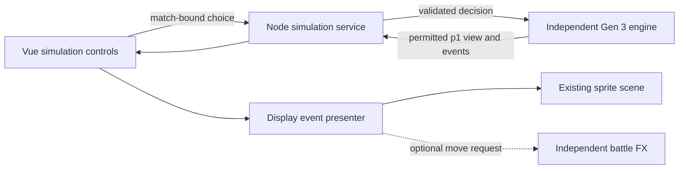

# Visual battle simulation

The home page (`/`) links the live battle simulation (`/simulation.html`), existing move preview (`/preview.html`) and independent effects playground (`/playground.html`). The preview and FX recipes keep their existing behavior.

## Run the complete slice

Use the existing Node 24 workspace installation, then `npm run dev`. The Vite server hosts all pages and the simulation API. For a built local version, run `npm run build` followed by `npm start`, then open `http://127.0.0.1:3000`. `npm run preview` also provides the API. An HTML-only static host can serve home/preview/playground but cannot run the Node engine.

Select a Kanto, Johto or Hoenn preset, then choose its lead. Every six-member team validates through the engine's `gen3opensinglesv1` profile. The match starts immediately without team preview. Choose one legal move or switch per decision; a faint or other forced replacement exposes the replacement choices supplied by the engine. A simple automated opponent chooses legal actions, preferring the first available damaging move. This is a mechanics demonstration, not a strategic AI benchmark.

The interface shows move PP and pinned Gen 3 metadata, exact own HP, public opponent HP, major conditions, stat changes, side conditions, revealed abilities/items and a battle log. Opponent HP is shown as an approximate percentage of the public bar, never reconstructed as exact HP. Finish normally or forfeit, then choose another team. Refreshing or navigating back resumes the browser's current in-memory match without replaying old animations.

## Ownership and data flow

- `apps/server/simulation.js` owns the engine factory and match sessions, validates HTTP input, drives the automated seat, and returns only the permitted p1 view/events. The engine, its rule seed, checkpoints, and private p2 requests never enter the browser bundle.
- `apps/simulation/src/api.js` handles bounded same-origin requests. The random HttpOnly session cookie remains browser-managed. Decision retries retain the same command ID; every mutation binds to the displayed match so a stale tab cannot alter a replacement battle.
- `App.vue` keeps the latest authoritative view separate from the displayed snapshot. Buttons use legal options from the latest view and remain disabled while a request or presentation is active. Uncertain requests offer sync/retry rather than submitting a different command silently.
- `presentation.js` reads ordered, already-redacted protocol facts into display snapshots. It groups each move for optional animation, applies HP/status facts at an impact cue, and preserves switch/form/faint ordering. Missing FX, errors, missing cues, skip, reduced motion and deadlines all converge on the same final server view. Residual damage follows the move instead of being presented as contact damage.
- `scene.js` maps species to the existing pinned sprite profiles. Near and far actors retain stable `source`/`target` scene IDs. Replacements rebuild only the scene, preserving native artwork, sockets, scale and platform geometry. Late asynchronous loads cannot attach stale canvases. A renderer failure leaves DOM sprites and all engine controls available.

The browser does not import `battle-engine`, vendor Showdown code or the preview's fixed-result `battle-core`. FX receives only move ID, source/target field IDs, cosmetic phase/outcome and visual seed. The existing preview presenter remains independent. Animation clips are cosmetic: for example, a multi-hit recipe can show a different number of visible strikes from the engine's rolled hit count; the log and HP reflect the engine's complete result.

## Verification and limits

`npm run test:simulation` covers transport deadlines/retry payloads; presentation perspectives, preparation, miss/failure, HP reveal, switching, knockout, residuals, cancellation and late loads; and actual HTTP validation, privacy, stale-tab conflicts, session recovery, expiry, complete battles and static path protection. `npm test` includes that suite alongside the existing visual and boundary tests. `npm run test:engine` tests the headless package independently.

This is a single-process simulation interface. Sessions expire after 30 minutes without requests and are lost on server restart. The server defaults to 24 active sessions; that bound is not a measured production capacity target. Custom teams, invite rooms, human opponents, accounts, persistent match recovery, deadlines, deployment hardening and capacity testing remain future host-service work. The independent engine and data package support the full agreed species scope; this interface currently exposes three preset teams.
