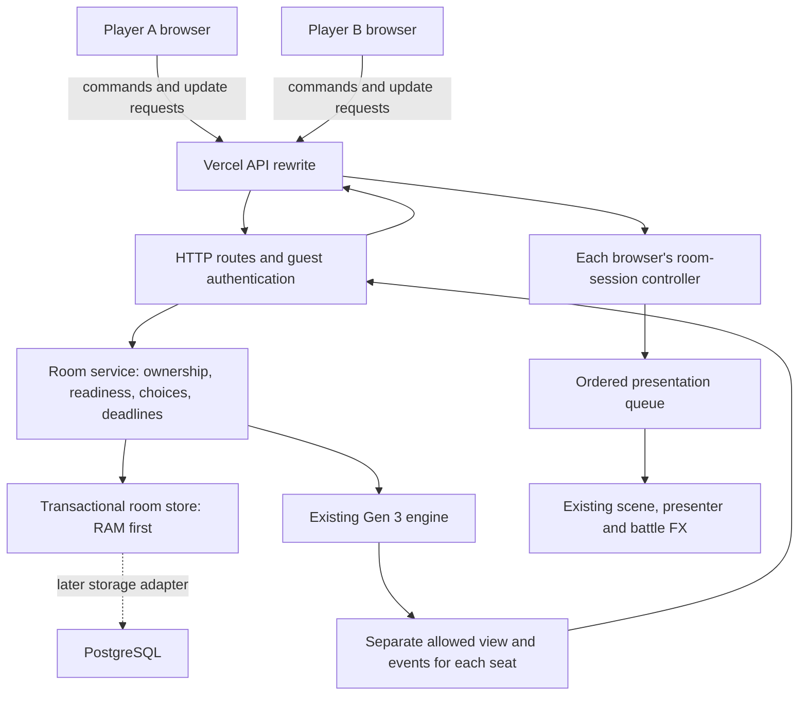
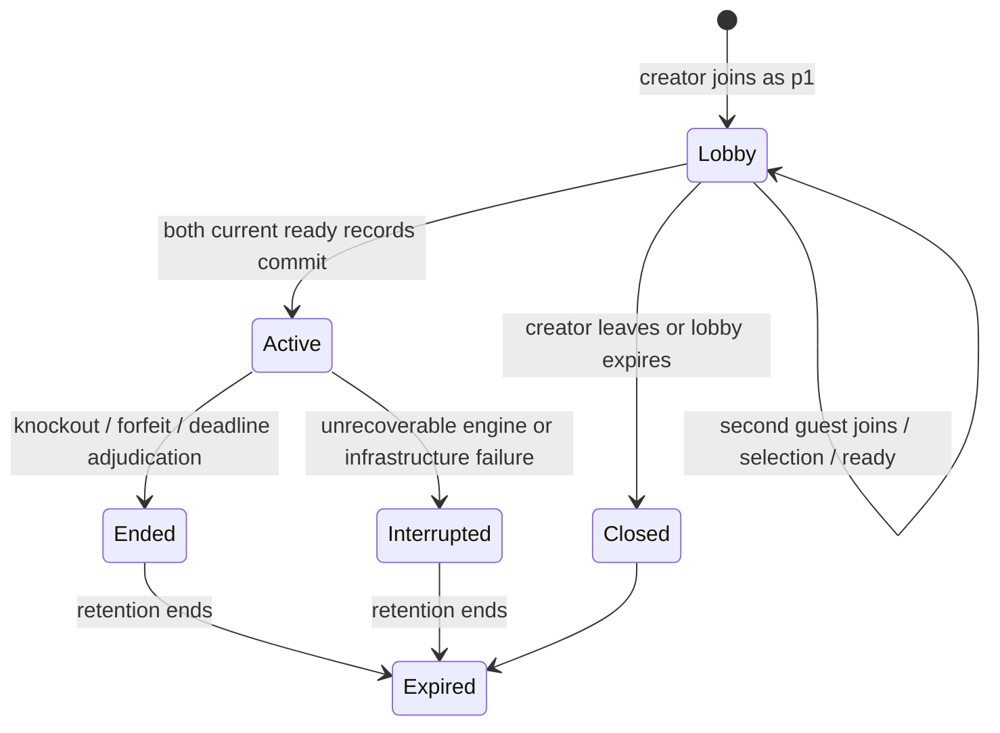

# Private-room multiplayer: implementation plan and design review

Date: 16 September 2026. Status: implemented as the bounded RAM-only first slice. This document preserves the design review; see [the runtime guide](MULTIPLAYER.md) for the actual modules, commands, operating limits and verification results. Live Vercel/Render deployment verification remains a release step.

## Recommendation

Add a separate private-room application and server service around the existing Gen 3 battle engine. Two authenticated guests choose existing preset teams, become ready, and play an authoritative battle. Keep room records and engine checkpoints in memory behind an asynchronous transaction interface. Connect each player's filtered server events to the existing presentation system through a new update/animation queue.

For this release, use HTTP POST commands and short HTTP polling through Vercel to the existing Render backend. Keep transport replaceable. A database, accounts, WebSockets and a Python service are not prerequisites.

The essential preparation for persistence is **atomic ownership, checkpoint, result and command-receipt updates**. Merely wrapping a mutable engine Map in `get()` and `save()` methods would not provide that guarantee.

Design grade: **9/10 for the requested bounded first release**, subject to the acceptance gates below. This is an architectural judgment, not a performance measurement or a production-readiness certification. RAM-only restart loss and single-instance hosting remain explicit limitations.

## 1. First-release contract

| Area | Proposed behavior |
| --- | --- |
| Entry | Add a Private battle option and a dedicated multiplayer page. |
| Players | Two guests, no registration. Optional bounded plain-text display names. |
| Discovery | Create a room and share its invitation link; no public room listing or matchmaking. |
| Format | Existing `gen3opensinglesv1`: authentic Gen 3 mechanics, singles, six distinct base species, level 100, existing legality rules. |
| Teams | Select one complete existing preset and its lead; fixed moves, abilities, held items, nature, IVs and EVs. Both players may select the same preset. |
| Start | Both players become ready; the second valid ready operation atomically starts the match. |
| Battle | Each player chooses only actions in their current server decision. No automated opponent. |
| Presentation | Existing move FX, send-outs, fainting, idle, effectiveness feedback, introduction and result overlay. |
| Reconnect | Same browser and guest cookie, while the room remains in the current server process. |
| Quit | Before battle: leave lobby. During battle: explicitly forfeit the caller's seat. After battle: return to menu. |
| Completion | Both players receive the same authoritative outcome, displayed from their own perspective. |
| Persistence | In-memory records only. A process restart loses rooms, guest ownership and results. |

Initial presets are the existing fixtures in `apps/server/presets.js`:

| Preset | Pokémon |
| --- | --- |
| Kanto companions | Charizard, Blastoise, Venusaur, Raichu, Alakazam, Machamp |
| Johto explorers | Typhlosion, Feraligatr, Meganium, Ampharos, Espeon, Heracross |
| Hoenn expedition | Sceptile, Blaziken, Swampert, Gardevoir, Flygon, Metagross |

These are selectable demo fixtures, not a claim of competitive balance. Validate all three under the ordinary Open Singles profile for both seats. Freeze the selected team and lead ordering when the match starts; attach a preset catalog revision/digest. Preserve the existing sets unless validation finds a concrete defect.

The catalog can show all preset details so players understand their choice. Do not send the opponent's selected preset or lead before battle. Because presets are public, a revealed Pokémon may identify its team; full team secrecy is not a promise of this mode.

Excluded from this iteration: custom PvP teams, accounts, saved teams across devices, ranked play, public matchmaking, spectators, chat, achievements, durable history, cross-device guest recovery, same-room rematch negotiation and horizontal backend scaling. Existing solo custom teams, regional leagues, preview and FX playground remain available.

## 2. What the current code already provides

| Existing area | Finding | Consequence |
| --- | --- | --- |
| `packages/battle-engine/src/index.js` | Separate p1/p2 decisions, final choices, per-seat command receipts, checkpoints and adjudication already exist. | Reuse the engine; implement room orchestration around it. |
| `packages/battle-engine/src/projection.js` | Own/private and opponent/public views and event cursors are separate. | Project for the authenticated seat on the server. |
| `packages/battle-engine/src/profile.js` | Open Singles and regional NPC profiles are distinct. | PvP explicitly uses Open Singles; never accept a client profile override. |
| `apps/server/simulation.js` | Solo service owns one browser session, always projects p1, runs the bot and can delete the match. | Do not turn this session into a shared multiplayer room. |
| `apps/simulation/src/scene.js` | Own active member is near/back; opponent is far/front. | The layout can serve either human viewer. |
| `apps/simulation/src/presentation.js` | Maps engine facts into optional FX and displayed snapshots. | Reuse this boundary and choreography. |
| `apps/simulation/src/App.vue` | Result title and side-condition labels contain p1 assumptions. New responses replace pending presentation. | Fix viewer-relative labels during extraction and add ordered update ingestion. |
| `vercel.json` | Only `/api/simulation/*` is proxied. | Add the multiplayer namespace and private-response cache policy. |

One important behavior was checked with a small engine probe: p1 submitting its choice changed its decision from `move` to `wait` while its event cursor and decision ID stayed unchanged. P2's view did not change. Therefore **event cursor alone cannot identify every meaningful update**.

Keep `battle-core` as the preview's simplified rule implementation. Multiplayer uses `battle-engine`; it must not calculate real battle damage using preview rules. The FX package continues to receive cosmetic requests only.

## 3. Architecture and responsibilities



Suggested source organization; filenames can be adjusted during implementation without changing responsibilities:

```text
apps/server/rooms/
  service.js             room operations and transaction orchestration
  routes.js              bounded HTTP inputs, responses and errors
  guestSessions.js        guest principal and credential handling
  memoryStore.js          serializable records, transactions and indexes
  projections.js         authorized room/update envelopes
  policy.js              injected clocks, limits and expiry rules

apps/multiplayer/src/
  App.vue                create/join, lobby, presets, ready and leave flows
  api.js                 multiplayer HTTP transport
  roomSession.js         identity, receipts, revision and queue coordination

apps/shared/battle/       extracted common battle view and presentation modules
multiplayer.html         Vite entry point
```

Extract a small shared battle view from the simulation app instead of copying its whole application. Keep solo league progression, team builder and bot setup in the solo shell. Keep the shared battle view independent of rooms, cookies and transport. Start with ordinary modules and dependency injection; another published package is unnecessary until the shared interface stabilizes.

Inject `roomStore`, `guestIdentity`, `engineFactory`, `presetCatalog` and `clock` into the room service. HTTP routes translate transport inputs into service operations. Engine factories never import repositories; FX never imports rooms or mechanics. Runtime timers and any future subscriber connections belong to the host, not serialized records.

## 4. Guest identity, invitation and authorization

Create a guest principal before creating or joining a room. A cryptographically random bearer credential in a separate HttpOnly cookie authenticates that principal. Store its hash, not its raw value, in the in-memory identity store. In production use Secure and SameSite; scope the cookie to `/api/multiplayer` and keep the solo cookie unchanged. Use a provisional absolute credential lifetime of 24 hours, enforced on the server and not extended by polling. Show expiry clearly; an expired credential cannot reclaim an old seat, even if an unusually long match remains active. A new credential creates a new guest in this slice. Keep normal room/decision expiry independent of credential expiry; its existing deadlines settle any abandoned play.

The existing solo cookie's `/api/simulation` path does not cover the new namespace. Host-only Vercel cookies also do not accompany direct requests to the Render hostname. This is one reason to retain same-origin HTTP through the proxy. Cookie path and host matching are browser rules; cookie paths are not a substitute for authorization. [MDN Set-Cookie](https://developer.mozilla.org/en-US/docs/Web/HTTP/Reference/Headers/Set-Cookie)

Use a separate random invitation token with at least 128 bits of entropy. Put it in the copied URL fragment, for example `multiplayer.html#join=<token>`. The page reads it, creates/resumes the guest, and supplies it in a join POST. Remove it from the address bar after joining; avoid logging it. A fragment avoids ordinary navigation URL/referrer transmission, although anyone with the link can still share it.

Invitation possession grants an opportunity to claim an empty lobby seat. It grants no right to reclaim an occupied seat, read a live match or control a player. Every subsequent request resolves membership from the authenticated guest; ignore/reject caller-supplied seat identities.

Rules:

- One nonterminal room per guest. Enforce this atomically across rooms, not with room-local locks alone.
- A guest cannot occupy both seats. Two tabs of one browser are the same guest, not two players.
- Existing members can resume their own room; a third guest cannot read its private state.
- Active seats are never replaced by a new guest.
- A lost cookie cannot be recovered using the invitation or display name.
- Rate-limit guest creation, create/join attempts and commands. Bound names, JSON bodies, room counts and retained receipts. Do not derive trusted client identity from arbitrary forwarded headers.
- Preserve the existing configured-origin, Fetch Metadata and JSON request checks on mutating routes. Names are rendered as text, never injected HTML.
- Never log bearer tokens, invitation tokens, unredacted checkpoints or hidden choices.

## 5. Room lifecycle and clocks



Each player's readiness binds to their `selectionRevision` and the room's `membershipEpoch`. Changing a preset or lead clears that player's readiness. A join or leave changes membership epoch and clears both ready flags, so a player cannot inadvertently start against a replacement guest. Reject selection and ready operations after start.

Two simultaneous join requests compete for p2; one succeeds. Two ready requests can create exactly one match. A failed engine creation or checkpoint export leaves the prior lobby intact. The host has no power to delete another player's active battle.

Proposed casual-mode defaults, configurable and tested with an injected clock:

| Policy | Default and meaning |
| --- | --- |
| Lobby expiry | 15 minutes without meaningful lobby mutation. Polling does not extend it. |
| Presence warning | No authenticated contact from a guest for 45 seconds shows connection uncertainty. |
| Decision deadline | 5 minutes for each newly required move/switch decision, including presentation time. |
| Disconnect loss | No separate disconnect-forfeit timer in this iteration. The decision deadline continues. |
| Terminal retention | Keep the result accessible for 15 minutes. Retained results do not block creating a new room. |

Store each required seat clock as `{ decisionId, requiredSince, deadlineAt }`. Waiting and finished seats have no decision clock. Reconnect, refresh, polling, retries, invalid actions and animation completion never reset it. Presence is informational and reflects any tab belonging to the guest; closing one tab cannot forfeit a seat.

Check overdue deadlines within the same serialized room operation as choices and forfeits, using the current engine decision and server time sampled under the transaction lock when the operation is admitted. Do not trust a client timestamp or equate network arrival with admission. A choice admitted after its deadline fails even if the cleanup timer has not run yet. A stale scheduled callback cannot affect a completed decision. Show the server deadline in the UI; use the local countdown only for display.

If one required player expires, adjudicate its timeout forfeit. If both unresolved decisions have exactly the same earliest deadline, use no contest. If a delayed sweep sees different overdue deadlines, process the earliest logical expiry, not seat iteration order. The engine currently permits `no-contest` only with reason `infrastructure`; add a narrow `timeout` reason with tests for the simultaneous-expiry policy. This is host adjudication metadata, not a rewrite of Gen 3 move mechanics.

If the engine fails, preserve the last committed checkpoint. Return a temporary error while a safe retry is possible; if the failure is reproducible, stop accepting play and show both players an interrupted outcome. Use the existing infrastructure no-contest adjudication only when the engine can safely produce it. Otherwise retain an explicit interrupted host state without fabricating a winner. Terminal outcomes cannot be overwritten by late choices, forfeits or timers.

The fallback interruption is a host-only transaction that must work even when engine restoration/export is impossible: retain checkpoint bytes for diagnosis, record `interrupted`, reason and `endedAt`, clear decision clocks, release both active-guest indexes and advance both viewer revisions. Keep authorized membership for result retention. Clients disable actions and idle from terminal host status even if the preserved engine snapshot still contains an old actionable decision; show “Battle interrupted” without victory/defeat celebration. Normal completed matches also release active-guest indexes atomically with their result.

An intentional in-battle quit says “Forfeit battle” and submits a seat-specific command. A lost connection, closed tab or unload event is not a forfeit command. On server restart, show that the room is no longer available; no surviving record exists from which to invent a result.

## 6. Storage contract to build before UI integration

Records must be serializable independently of live engine objects:

| Record | Minimum content |
| --- | --- |
| Guest | Stable guest ID, credential hash, created/expiry timestamps, display name. |
| Room | Schema version, room ID, invite hash, status, internal version, membership epoch, policy version, timestamps. |
| Membership | Guest ID, room ID, seat, preset/catalog revision, lead, selection revision, readiness references. |
| Match | Unique match ID, frozen seat bindings and teams, engine/profile identity, private checkpoint, result, timestamps. |
| Decision clocks | Required decision IDs and server deadlines per seat. |
| Delivery metadata | Independent viewer update revisions; engine event cursors remain separate per seat. |
| Operation receipt | Principal, operation ID, scope, semantic request hash, original acknowledgement, committed version. |

Use an asynchronous transaction API now, such as `roomStore.transact(scope, operation)`, with immutable reads. The scope covers the room and any affected guest-active-room/invite indexes. Define a consistent lock order for operations touching multiple records. A room-only mutex does not protect one-active-room-per-guest uniqueness across two concurrent joins.

For a new mutation:

1. Authenticate, bound and validate input; enter the correct serialized transaction.
2. Look up an operation receipt bound to the authenticated principal and semantic request. An identical retry returns its original acknowledgement; conflicting reuse is rejected. Recheck current membership separately before providing any current room view. For a new operation, require the appropriate current ownership before mutation.
3. Clone committed records. For gameplay mutation, restore a candidate engine from the committed private checkpoint; for start, create a candidate from frozen server presets.
4. Apply due deadlines, then apply the requested operation if still legal. Derive the seat from membership and submit the caller's decision without invoking the solo bot. A normal action rejection after a deadline is a response outcome, not an exception that rolls back the valid deadline transition; commit its result, clocks and released active-guest indexes before returning the rejection.
5. Export the candidate checkpoint and compute the allowed views/events and affected viewer revisions.
6. Commit checkpoint, room/membership changes, result, clocks and acknowledgement receipt in one atomic replacement.
7. Release locks, then respond or publish update notifications. Dispose temporary engine instances on every exit.

If mutation, projection, checkpoint export or commit fails, discard the candidate. The last committed state and retry ledger must remain intact. Do not acknowledge progress or expose it through polling before commit. This also matters in RAM: an export failure after mutating the sole live engine would otherwise leave the room inconsistent.

Reads can use cached, immutable per-viewer DTOs/event indexes derived at commit; polling must not restore and replay a whole engine on each request. These caches are rebuildable and never become a second authority. Measure checkpoint copy/restore cost before introducing a live-engine cache. Any later cache must be keyed by match identity and committed version and invalidated on failed writes.

Keep checksums, private checkpoints and receipts server-only. Checkpoints include RNG state and pending choices; a display snapshot cannot restore a battle correctly. Do not persist HTTP responses, locks, timers, GSAP/Pixi objects or network connections.

## 7. Commands, receipts and concurrency

Suggested HTTP surface under `/api/multiplayer`; exact naming is secondary to these semantics:

| Route | Purpose |
| --- | --- |
| `POST /guest` | Create/resume a guest cookie. |
| `GET /session` | Discover current membership for same-browser recovery. |
| `GET /config` | Sanitized preset catalog and public room policy. |
| `POST /rooms` | Create a private lobby with an operation ID. |
| `POST /rooms/join` | Join using invitation token and operation ID. |
| `POST /rooms/:roomId/selection` | Change own preset/lead with expected own selection revision. |
| `POST /rooms/:roomId/ready` | Set readiness tied to own selection revision and membership epoch. |
| `POST /rooms/:roomId/choice` | Submit match ID, command ID, decision ID and legal action. |
| `POST /rooms/:roomId/forfeit` | Forfeit only the authenticated active seat. |
| `POST /rooms/:roomId/leave` | Lobby leave or terminal UI departure; reject active use in favor of explicit forfeit. |
| `GET /rooms/:roomId/updates` | Read changes after this viewer's revision/cursor, or request full sync. |

All mutating room operations have bounded unique operation IDs. Engine choices reuse the engine's `commandId` and `decisionId`. Receipt hashes cover semantic intent, not delivery fields such as `afterCursor`. Create/join receipts also need guest-scoped lookup because a dropped create response may leave the caller without its room ID.

Preserve match command receipts through room retention. Keep minimal guest-scoped create/join/leave receipt tombstones until the credential's absolute expiry, even after the room is gone. An old create retry must never create a second room after its first room expires. Bound admitted operations per credential and guest creation globally; check existing receipts before applying this admission cap, then reject new operations at the bound instead of evicting still-valid receipts. Bound pre-admission failures without allocating arbitrary new ledger entries forever.

A ready retry after successful auto-start must receive its original acknowledgement, not fail because the room is now active. A successful leave retry also returns its acknowledgement even though membership was removed. A retry includes a fresh current view **only if the caller is still authorized to read the room**; otherwise it returns the acknowledgement and appropriate left/expired status without a room view. An old receipt's embedded decision must never replace a newer snapshot.

Choice admission uses the authenticated seat's current `decisionId`. Do not require a client-supplied global match version: accepting p1's action would otherwise invalidate p2's still-valid decision. Keep internal versions for repository concurrency only. The first accepted choice is final; a retry of that command is idempotent, while another command for the already-submitted decision is rejected.

Validate switch identities against the caller's actual legal options. Do not copy the solo service's p1-only member parsing. The engine decides whether both players must act or only a forced-switch seat; the host must not impose an unconditional “wait for two moves every turn” rule.

## 8. Delivery protocol and transport choice

Use a transport-neutral update envelope with:

- Protocol version; room ID; match ID when active; explicit authenticated viewer seat.
- Per-viewer `updateRevision`, current authoritative view and permitted room metadata.
- Viewer-specific event range, ordered facts and event cursor.
- Current own decision/deadline and relevant command acknowledgement.
- Delivery mode: normal changes, unchanged heartbeat, or explicit full synchronization.

A viewer's revision advances when its allowed DTO changes, including its own decision changing to `wait` without new battle events. Do not expose an internal global version that changes solely because an opponent made a hidden choice. Heartbeat timestamps alone do not increment the gameplay/update revision. Never include the opponent's decision clock becoming null as a side channel for its submitted action; expose only the caller's decision clock and coarse public presence.

Privacy includes exact opponent HP, unrevealed moves/items/team, pending choices, credentials, private logs, seeds and checkpoints. Send each seat's existing projection, not one full state to be filtered by the browser. Engine cursors and revealed Pokémon identities are not interchangeable across viewers.

Return complete committed event groups and the snapshot at their end. Do not split a move from its damage/faint facts to meet an arbitrary page size. Bound retained delivery batches and response bytes; if the cursor is unavailable or the backlog exceeds the budget, return an explicit full sync at the latest cursor. Never silently truncate facts. Include logs as bounded text history separately if needed.

### Selected transport

Start with POST commands plus polling: approximately **1.5 seconds in an active foreground battle, 2 seconds in a lobby and 10 seconds in a background tab**. These are proposed defaults, not platform requirements. Poll immediately after commands, focus and reconnect. Use one in-flight poll per page, separate cancellation for POST commands, and jittered backoff on network errors or rate limiting. Unchanged polls return a small response without the full snapshot/history. Stop on expiry/unmount; terminal pages can stop polling after receiving the final snapshot.

The other player usually learns about a move within one poll interval plus network/server latency. This is the chosen first-release tradeoff; it is not an instantaneous push guarantee. At 100 foreground players, a 1.5-second interval means roughly 67 update requests/second before commands. This is arithmetic, not a capacity benchmark.

Vercel external rewrites can proxy these HTTP requests while retaining the frontend URL. Extend the rewrite and caching opt-out to the multiplayer prefix, and return `Cache-Control: no-store` for private responses. [Vercel rewrites and cache behavior](https://vercel.com/docs/routing/rewrites)

| Option | Fit for this iteration | Why |
| --- | --- | --- |
| POST + short polling | 9/10 | Smallest deployment change; ordinary cookie authentication; easy failure/reconnect testing. Costs empty requests and update delay. |
| POST + bounded long polling | 8/10 | Less idle traffic and immediate wakeup, but adds waiter cleanup, lost-wakeup races and request-deadline coordination. |
| POST + SSE | 8/10 initially | Natural server push upgrade. Needs deployed streaming verification, connection lifecycle and bounded replay. |
| WebSockets for all messages | 6/10 initially | Useful later, but adds connection authentication and acknowledgements while all room correctness work remains necessary. |

SSE is one-way server-to-browser communication and supports reconnect/event IDs, making it a plausible later replacement for polling while retaining POST commands. Event IDs do not implement server replay automatically. [MDN SSE guide](https://developer.mozilla.org/en-US/docs/Web/API/Server-sent_events/Using_server-sent_events)

Render supports WebSockets, but direct Render WSS would not receive the Vercel host-only cookie. A future design could issue a short-lived, single-use connection ticket through authenticated HTTP and exchange it after connecting. Do not put the long-lived guest credential into a socket URL. [Render WebSockets](https://render.com/docs/websocket)

Do not base the decision on “Vercel cannot support WebSockets”: newer Vercel Services material advertises that capability. That is a different deployment configuration from this repository's current static frontend and external rewrite. [Vercel Services announcement](https://vercel.com/blog/vercel-services-run-full-stack-on-vercel)

## 9. Connecting existing animations correctly

The room-session controller is the critical new frontend component. Keep **latest received state**, **queued presentation state**, and **currently displayed state** distinct.

1. Validate room, match, seat and local session generation. Reject late responses belonging to a previous room.
2. Accept only monotonic viewer revisions and ordered, nonduplicated events. A command receipt may still be useful when its accompanying snapshot is stale.
3. Apply own-decision, receipt and connection metadata without restarting the presenter. Clear a pending command only for its matching acknowledgement or confirmed decision advancement.
4. Queue complete new battle batches and play them one at a time. Keep network ingestion running during all animations.
5. Enable an action only when the viewer has a current actionable server decision and the displayed state has caught up sufficiently to choose correctly.
6. On a gap, excessive backlog, room change or reconnect, cancel cleanly and reconcile to the latest snapshot. Do not replay old entrances, fainting or celebrations during synchronization.

Track received event cursor separately from displayed event cursor so polling does not repeatedly enqueue facts that are still animating. Reject a late POST snapshot if a newer poll already arrived. Retry uncertain commands using the original command ID, decision ID and action; never auto-submit a fresh choice merely because the first response was lost.

The server resolves the battle first. Presentation then reveals the already-authoritative HP/status changes at the appropriate impact cue. Attack recovery precedes fainting; fainting precedes replacement release. Existing skip, reduced-motion, effects-off, timeout and missing-animation paths all reconcile to the same state.

Both clients render their own Pokémon near the camera with back artwork. Engine `p1/p2`, viewer-relative `own/opponent`, and stable scene `source/target` are different identities. An opponent attack uses the far actor without swapping IDs, textures or camera. Correct result titles and side-condition labels to compare with `view.seat`. Require an explicit valid multiplayer seat rather than silently defaulting to p1.

Reuse the existing entry/faint transitions, idle controller, effectiveness overlays and result sequence. Extend intro labels to accept sanitized human opponent names independently of the league run object. Pause idle synchronously before FX borrows actor poses. Late imports/callbacks from an old room must not revive or remount old actors.

The two players can see the same turn at slightly different wall-clock times and can choose different FX settings. Gameplay never waits for animation acknowledgements. Identical particle trajectories are unnecessary; cosmetic seeds must remain independent of private battle RNG.

## 10. Database migration path

Implement the boundary now, then add durable storage as a separate release:

| RAM release component | Later durable equivalent | What stays stable |
| --- | --- | --- |
| Guest principal | Guest or authenticated account resolved by an identity adapter | Room ownership is a stable principal ID, never a connection ID. |
| Memory transactions and uniqueness indexes | PostgreSQL transactions, row locks and unique constraints | Room operations and receipt semantics. |
| Private checkpoint record | Stored versioned checkpoint plus engine/runtime identity | Engine input/output and restoration contract. |
| Terminal room result | Durable match record and participant records | Server-authored outcome; no client-reported winner. |
| Frozen preset team | Frozen preset or a validated saved-team version | Matches do not change when a saved team is edited. |
| Polled committed changes | Polled records, optionally SSE notifications/outbox | Viewer revisions, cursors, full sync and presentation queue. |

A PostgreSQL adapter can lock the room/match row with `SELECT ... FOR UPDATE`, enforce membership and receipt uniqueness, and commit all affected records together. Use a consistent lock order and bounded retry policy. Never hold a database transaction open while waiting for a player or network stream. [PostgreSQL explicit locking](https://www.postgresql.org/docs/current/explicit-locking.html)

Persist pending choices, receipts, checkpoints, results, deadlines and viewer revisions atomically before acknowledging durable progress. A database of final results alone does not provide mid-battle recovery. Derive future achievements from committed server results, with an idempotent event/outbox record written in the same result transaction when that feature is added.

Accounts later resolve a stable principal and authorize saved-team access. Guest-to-account conversion needs an explicit ownership-linking policy; login must not silently transfer someone else's room. The frontend continues receiving the same filtered decisions/events. Saving a team should create a versioned source from which an immutable match team is copied.

Keep one battle worker first even after adding PostgreSQL. Multiple workers additionally require single-writer room ownership or database serialization, coordinated deadline processing, cache invalidation and cross-instance notifications. Notification delivery is a wakeup hint; storage revisions/checkpoints remain authoritative.

The engine's checkpoint identity includes its runtime/build details. Restore only with a compatible build; keep supported workers or drain old matches during incompatible deployments. A database does not solve version compatibility. The previously identified Hidden Power canonicalization issue in executable replay should be fixed and regression-tested before promising arbitrary-team replay; checkpoint restoration is the planned room mechanism, and current presets do not depend on Hidden Power.

Adding a database will still require migrations, authentication policy, crash tests, backups and operational work. This design removes the need to rewrite battle mechanics, FX, room semantics or the client delivery protocol; it does not make persistence a configuration-only change.

## 11. Implementation sequence and completion gates

| Step | Deliverable | Exit gate |
| --- | --- | --- |
| 1. Contracts and engine probes | Freeze preset policy, command/update DTOs, lifecycle and clock rules. | Both seats validated; private projection, pending-choice checkpoint and equal-cursor wait behavior covered. |
| 2. Storage and identity | Guest sessions, serializable records, atomic memory transactions, bounded receipts and ownership indexes. | Concurrency, rollback and unauthorized-access tests pass with an asynchronous test adapter. |
| 3. Headless room service | Create/join/select/ready/start/choice/forfeit/expiry. | Two independent clients complete a battle without UI; no bot actions; exactly one result. |
| 4. HTTP and deployment wiring | Multiplayer routes, polling, cookie path, Vite and Node registration, Vercel rewrite. | Two isolated browser contexts can join and resume through the same-origin route. |
| 5. Shared battle view and room UI | Extract presentation, add lobby/private page and room-session queue. | Full p1/p2 perspective, animation ordering and stale-response tests pass. |
| 6. Failure and release verification | Timer, retry, renderer failure, resource cleanup and load tests; update operational docs. | Deployed two-device smoke test and existing regression/build gates pass. |

Complete and verify each step before expanding scope. Shared extraction is a dedicated change so solo behavior can be checked before networking complexity is introduced. Do not simultaneously migrate to FastAPI, add accounts or change team balance.

Required acceptance scenarios:

- Two isolated browsers create/join, select presets and leads, ready, exchange moves/switches, finish and see opposite victory/defeat perspectives.
- Correct p2 view for attacks, self-healing, weather, side conditions, switching, fainting and results. Existing tests of both attackers from a p1 view are not sufficient.
- Simultaneous joins, ready/selection changes, ready/member replacement, duplicate auto-start and concurrent same-guest joins to different rooms remain consistent.
- First submission waits privately; the other player's valid decision is unaffected. Forced-switch and simultaneous-switch behavior follows the engine.
- Lost POST response, identical retry, conflicting command-ID reuse, retry after later turns and same-guest multi-tab actions never apply a choice twice. Leave retries succeed without restoring membership; create retries after room expiry do not create another room.
- Metadata-only updates do not restart animations or clear unrelated pending commands. Duplicate/out-of-order responses do not regress HP or replay FX.
- Queued updates during long moves/intro, full resync, skip, reduced motion, effects off and renderer failure converge on the current authoritative view.
- Reconnect during a pending choice, faint, replacement or finished battle restores current state without historical entrances/celebrations.
- Network payloads and errors reveal no private opponent requests, exact HP, unrevealed selected team, seed or checkpoint. A third guest and a forged seat cannot act/read.
- Choice versus deadline, forfeit versus final knockout, simultaneous deadlines and stale timer callbacks produce exactly one outcome.
- Failure injection after mutation, export and repository write leaves committed records and retry receipts consistent. An unrecoverable engine can enter a terminal host interruption without successful engine export; both seats are released and neither client continues acting or celebrates a winner.
- Lobby/terminal expiry and repeated create/play/leave cycles release timers, temporary engines and client listeners. Polling does not keep a forgotten lobby alive forever.
- Server restart returns a clear room-expired/unavailable state; it never presents a newly created unrelated match as a recovered one.
- Existing solo league/team-builder behavior, preview, FX playground, sprite sizes and all move choreography are preserved.

When implementation occurs, run the new room/service/client suites, `npm run test:engine`, `npm run test:simulation`, the required shared-runtime `npm test`, and one production build after the final changes. Browser verification must include actual two-player isolation and deployed proxy behavior; unit tests alone cannot establish either.

## 12. Hosting, capacity and operational boundaries

Run this RAM version on **one Node process and one Render instance**. Multiple replicas with independent Maps would split room ownership and views. Include an environment/configuration guard and deployment documentation; sticky routing is not persistence.

Keep the frontend on Vercel and the current Node backend on Render. Register the multiplayer service in both Vite development and `apps/server/start.mjs`, using the same room factory. Preserve the configured `PUBLIC_ORIGIN` checks and relative frontend API paths. No backend secret belongs in a Vite-exposed variable.

Free Render services can sleep after inactivity, take time to wake and restart. RAM-only matches are lost whenever their process disappears. Paid always-on hosting avoids free-tier sleep but does not make memory durable. [Render free-service limits](https://render.com/docs/free)

For initial validation, target 10 simultaneous matches, then measure higher counts before raising the cap. This is a test target, not a statement that the current instance supports it. Measure command latency, checkpoint bytes/restore time, polling throughput, event-loop delay and total RSS while the solo service is also in use. Set a shared engine/resource budget, bounded rooms/lobbies/receipts and explicit capacity errors from those measurements; do not assume each mode can independently consume all available memory.

Use a warm-instance target of roughly two seconds for a remote player's new state to arrive under ordinary test-network conditions, excluding animation duration. Record the actual percentile and conditions instead of claiming this as a universal latency guarantee. If polling or checkpoint copying becomes the limiting cost, optimize the measured bottleneck; changing transport cannot fix expensive engine mutations.

Keep logs and metrics limited to operation type, sanitized room/match identifier, result code, timing, queue depth and resource counts. Record failure/expiry counters and monitor active rooms versus configured limits. Do not store secrets or hidden battle contents in ordinary logs.

## 13. Review iterations and final assessment

These iterations describe alternatives reviewed during planning; none has been implemented or benchmarked here.

| Review | Grade | Findings and resulting revision |
| --- | --- | --- |
| 1. Extend the solo endpoint into two-player hosting | 4/10 | Reuses useful code, but solo ownership, p1 projection, bot loop, destructive quit and response-driven animation cancellation are unsuitable for shared rooms. Create a separate room service and shared presentation boundary. |
| 2. Separate rooms, guests and serialized in-memory engines | 7/10 | Correct basic ownership and gameplay. Still incomplete for atomic failed writes, global-version choice races, readiness on member replacement, equal-cursor waiting changes and duplicate playback. Add transactional checkpoint records, per-seat decisions, membership epochs and viewer revisions. |
| 3. Transactional room service, filtered updates and ordered presentation | **9/10** | Supports both humans, safe retries, deliberate expiry, existing FX and a practical PostgreSQL path. Select simple polling and one decision timer to keep the first slice bounded. |

Independent reviews covered engine/room/storage rules, client presentation and p2 perspective, and current hosting/transport documentation. Cross-checks changed the plan in concrete ways:

- A global public revision was replaced with per-viewer revisions to avoid exposing hidden opponent submissions.
- Ready state now depends on membership epoch as well as team selection.
- A separate disconnect-forfeit timer was removed; it would conflict with the advertised decision allowance.
- Pending receipts and current snapshots are separated, preventing a successful retry from rolling the UI backward.
- The client receives metadata updates independently of animation playback.
- Short polling was selected over persistent connections for the first implementation, with explicit latency and request-volume tradeoffs.

The remaining score gap is deliberate: in-memory state has no crash durability; preset balance is unevaluated; deployment latency, capacity and shared-view extraction still need implementation evidence. Passing the specified gates would establish a solid guest multiplayer beta. Durable accounts, recovery and production scaling remain subsequent, compatible increments.
