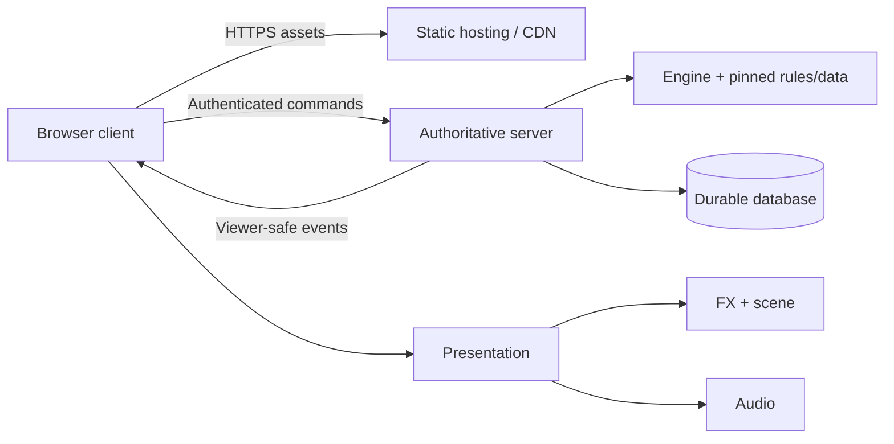

# From independent battle effects to a production multiplayer game

Prepared 14 September 2026 for this repository. Read with the [implementation review](/Users/cdr/pokemon-battle-vue/docs/ARCHITECTURE_REVIEW_2026-09-14.md).

This is a proposed architecture and delivery plan. Package names and APIs below are illustrative; they have not been implemented by this review.

The [first-release scope contract](/Users/cdr/pokemon-battle-vue/docs/PROJECT_CONTRACT_V1.md) records current product choices and proposed acceptance targets. It takes precedence over the illustrative scope options below as decisions are finalized.

## 1. Define the product and the first release

The selected first release is **turn-based singles battles between connected players, with authentic Generation 3 mechanics and all National Dex species #001–386**. A continuously moving action game is outside this release; section 14 explains that architectural alternative.

The linked scope contract records these decisions and marks remaining proposed defaults:

- Battle format: singles first; team size and legal roster explicitly listed.
- Rules: authentic Generation 3 mechanics, with pinned mechanics, data and legality versions.
- Mode: competitive battle rooms first, with invites and unranked matching.
- Player flow: create/select a team, invite or match, choose actions, finish, see result, reconnect if interrupted.
- Release exclusions: doubles, ranked matchmaking, spectators, trading and an overworld follow the first release.
- Compatibility: supported browsers/devices, acceptable loading time and expected simultaneous matches.

Roster generation and mechanics generation are different axes. Your current reference values and preview flags include modern behavior; they should not silently become an authentic Gen 3 ruleset. For example, the reference implementation's Gen 3 logic assigns physical/special damage category by type, rather than per move. [Pokémon Showdown Gen 3 scripts](https://github.com/smogon/pokemon-showdown/blob/master/data/mods/gen3/scripts.ts)

A professional first release should fully support one explicit format. If only a subset is implemented, reject unsupported teams and moves in that format. An animation existing for a move does not establish that its battle mechanics are implemented.

## 2. Use a modular monolith with explicit boundaries

Start with one repository, independently testable packages, a browser application, and one authoritative backend deployment. Dependency injection can be ordinary factory arguments; a DI container is unnecessary here.

Independent development means each module has a clear owner, public contract, fixtures and tests. It does not mean every module runs in its own process or owns a network service. This approach keeps refactoring affordable while boundaries are still being discovered, consistent with the reasoning in [Monolith First](https://martinfowler.com/bliki/MonolithFirst.html).

Use packages for substantial reusable boundaries. Use folders/modules for closely interacting rules such as items, moves, conditions and abilities until separate distribution actually helps. Moving every noun into a package can replace code coupling with versioning and integration overhead.

Proposed eventual layout, introduced in stages:

```text
apps/
  game/                       Vue client and client composition
  fx-playground/              FX authoring and scene fixtures
  server/                     Auth, rooms, transport, persistence composition

packages/
  battle-fx/                  Existing PixiJS/GSAP move artwork and runtime
  scene-pixi/                 Reusable actor/scene transforms and rendering
  battle-audio/               Audio playback, buses, loading and disposal
  battle-presentation/        Optional extraction of ordered client playback
  game-data/                  Immutable, versioned content and ruleset data views
  battle-engine/              Deterministic simulation API or engine adapter
  battle-protocol/            Versioned client/server messages and validation

tools/
  data-build/                 Import, normalize, validate and generate data

tests/
  integration/               Composition and end-to-end contracts

docs/
  decisions/                 Short architecture decision records
```

Keep `battle-core` as the preview engine initially. Add an explicit compatibility/migration decision before renaming or replacing its public API. Do not create every proposed directory today. The next useful extraction is reusable scene mechanics; audio and the real engine can arrive when their vertical slice begins.

## 3. Assign ownership, inputs and outputs

| Module | Owns | Receives / returns | Must not depend on |
| --- | --- | --- | --- |
| Game data | Species, forms, moves, items, abilities, learnsets, type data and provenance | Read-only records by stable ID and ruleset/version | Vue, renderer, live HTTP calls during resolution |
| Battle engine | Battle state, legality, turn order, damage, effect ordering, RNG progression | Validated commands + state → next state + ordered domain events | FX, audio, sockets, database, wall-clock timers |
| Ruleset modules | Generation-specific mechanics and approved effect hooks | Engine context with bounded operations | Browser, transport, arbitrary database access |
| Match service | Participants, command deduplication, room lifecycle, deadlines, durable match progress | Authenticated commands → acknowledgments and viewer projections | Pixi or audio APIs |
| Protocol | Wire schemas, versioning, commands, public/private message shapes | Plain serializable values | Renderer classes, database objects |
| Client presentation | Event ordering, displayed snapshots, local playback policy, catch-up | Viewer-safe events/snapshots → UI, FX and audio requests | Authoritative damage/rule calculation |
| Battle FX | Move artwork, particles, cosmetic poses and playback resources | Cosmetic request + scene → cancellable completion/cues | Engine state, HP, rule RNG, Vue, sprite URLs |
| Battle audio | Audio buffers, voice limits, channels, volume and playback resources | Cosmetic sound requests + clock → cancellable handles | Engine state, Pixi, FX implementation |
| Scene | Sprites, layout, camera, semantic anchors and posed bounds | Actor appearance descriptors and pose requests | Battle decisions or HP calculations |
| Vue client | Screens, controls, input intent, preferences and accessible rendering | Projected state and legal action choices | Server-only secrets and authoritative command processing |

The application entry points are the **composition roots**: the few places allowed to know concrete implementations and connect them. An import graph check should enforce the table. Public exports should be the only cross-package entry points.

Keep domain contracts and cosmetic contracts distinct. FX does not need to import a giant shared battle-state package merely to understand a string move ID. Its own request schema and scene contract can remain small and locally owned. Extract a shared cosmetic-contract package only if multiple implementations genuinely need it.

## 4. Model data separately from mechanics and presentation

Three concepts should have separate identities:

1. **Content:** a species or move exists, has names and identifiers, and was introduced in a certain generation.
2. **Ruleset interpretation:** its stats, typing, power, accuracy, learnset availability and behavior in the selected format.
3. **Presentation assets:** sprite versions, cries, animation IDs, artwork bounds and sockets.

Use stable machine IDs, such as `charizard`, `flamethrower`, `oran-berry`. Names are localized display data, not primary keys. If importing another engine's IDs, normalize once in a data/adapter boundary; do not scatter punctuation conversions throughout recipes.

Distinguish a species definition from an owned creature instance and from a battle participant. A species contains base data. A persistent creature might contain identity, level, training and learned moves. A battle participant contains current HP, active modifiers and volatile effects. A scene actor is a visual representation of a participant at a particular slot.

Species, participant, player and field-slot IDs must remain separate. With switching, a slot can hold different participants; with two identical species, species ID cannot identify an actor. Preserve stable view identities during an effect and rebuild bindings at explicit switch events.

Suggested data API:

```js
const dex = dataBundle.forRuleset('gen3-singles-v1')
const species = dex.species.get('charizard')
const move = dex.moves.get('flamethrower')
const legalMoves = dex.learnsets.forSpecies('charizard', formatOptions)
```

Data compilation should:

1. Import from a pinned source revision and record provenance.
2. Normalize IDs and resolve generation/version-group changes.
3. Validate references: learnsets point to existing moves; forms reference species; rules refer to valid items/abilities/types.
4. Validate semantic constraints and compare chosen historical examples with authoritative/reference behavior.
5. Generate immutable local bundles and a manifest containing schema version, content version, hash and source revision.
6. Publish/cache those bundles as part of the release, so a battle never depends on a live third-party API request.

PokéAPI exposes generation, version-group and historical move-value information, and asks consumers to cache resources. It is a data source, not an executable rules engine. A top-level current move record alone is insufficient to reconstruct historical mechanics. [PokéAPI documentation](https://pokeapi.co/docs/v2)

Do not move sprite sockets into species biology data. Sockets describe a particular artwork file/view, and the existing 18 measured profiles belong with those visual assets.

## 5. Choose whether to build or adapt the real engine

This is the largest schedule decision in the project.

| Approach | Best fit | Main cost |
| --- | --- | --- |
| Integrate an established simulator behind an adapter | Production reliability and faithful Pokémon mechanics are the priority | Adapter work, version pinning, output projection and upstream compatibility |
| Build a custom engine | Learning, custom mechanics or engine ownership is the priority | A large implementation and conformance-testing program |

**My default recommendation for a production Pokémon battle game is to evaluate an established engine before writing full mechanics.** Your distinctive work can remain the client, effects, audio and product. Pokémon Showdown exposes a Node simulator API that accepts choices and produces protocol messages, plus team-validation and dex APIs. Its documented simulator API does not validate supplied teams automatically: validation must precede battle creation. [Node API](https://github.com/smogon/pokemon-showdown/blob/master/sim/README.md), [simulator contract](https://github.com/smogon/pokemon-showdown/blob/master/sim/SIMULATOR.md)

Wrap an adopted engine behind your own server-facing adapter. Pin an exact tested version, especially when relying on undocumented APIs, and translate its messages into your projection/presentation contract. Do not make FX parse an upstream battle log. Do not claim bit-identical cartridge accuracy merely because a reference simulator is integrated; choose and test a conformance target.

If building your own, replace the preview resolver's ever-growing conditional path with a coherent simulation pipeline:

- Battle creation and team validation.
- Legal decisions for each player/slot.
- Choice collection and any allowed choice replacement/cancellation.
- Action ordering, priority and tie-breaking.
- Move attempts, targeting, hit checks, immunity and protection.
- Damage/healing, per-hit effects, item/ability reactions and fainting.
- Forced switches, residual effects, timers/volatile expiry and victory checks.
- Next decision state and ordered events.

Moves, items, abilities and conditions can be developed in separate modules, but the engine owns their interaction order. Expose explicit hooks with defined phases and tie-breaking. Avoid an unrestricted event bus where registration order silently determines damage. Keep small primitive operations such as applying damage or a stage change separate from complex move-specific behavior.

Example item separation: the data bundle says what an Oran Berry is; its battle handler describes when/how it activates; the engine decides ordering and consumption; a persistent inventory module owns out-of-battle possession. The audio package only receives a berry-activation sound request.

Suggested authoritative state shape:

```js
{
  battleId, revision, turn, phase, decisionId,
  rulesetId, rulesetVersion, dataVersion,
  rngState,
  field: { weather, effects },
  sides: { /* party ownership, screens, hazards, side effects */ },
  participants: { /* HP, moves/PP, condition, stat stages, volatiles */ },
  activeSlots: { /* slotId -> participantId */ },
  pendingChoices: { /* server-private, until resolution */ },
  outcome
}
```

The exact schema depends on the engine choice. A future engine should not simply expand the current actor boolean bag: screens belong to sides, weather to the field, move restrictions need parameters/durations, and charge moves need actual state transitions.

For a custom engine, make randomness deterministic from serialized battle RNG state and a versioned algorithm. Never use a process-global RNG shared by matches. A reducer can accept explicit RNG state and return the next RNG state. Keep the combat seed private during a competitive battle; generate cosmetic seeds independently so clients cannot infer future rule rolls. A wall-clock deadline is converted by the server into an explicit timeout command/event; the engine need not read time itself.

## 6. Version four contracts independently

Record **protocol version, engine/ruleset version, data version and presentation/asset version**. They change for different reasons. An artwork update should not invalidate battle rules; a rule correction must not silently change the meaning of an old replay.

The current `{ before, after, event }` API is a good local preview boundary. Real battles need an ordered stream of machine-readable events and viewer-safe snapshots, because one turn may include many actions, hits, reactions and switches.

Illustrative client command:

```js
{
  protocolVersion: 1,
  battleId: 'battle-123',
  commandId: 'unique-client-command-id',
  decisionId: 'turn-4-choice',
  kind: 'choose-move',
  moveSlot: 1,
  targetSlot: 'opponent-active-0'
}
```

Do not accept claimed HP, damage, source ownership, legality or RNG rolls from a client. The authenticated connection determines the player's seat. Validate message shape, ownership, current decision, chosen action and target.

Illustrative server event envelope:

```js
{
  protocolVersion: 1,
  battleId: 'battle-123',
  sequence: 42,
  revision: 8,
  kind: 'battle-events',
  events: [/* viewer-safe semantic events in engine order */]
}
```

Domain events might include move-started, move-missed, hit-resolved, condition-changed, item-activated, participant-fainted, switched, weather-changed and battle-ended. Use codes and structured arguments; localize prose at the client boundary. Do not parse English messages to trigger animations.

Keep internal outcomes separate from wire DTOs. A server event projector decides what this viewer can know, including unrevealed moves/items, exact HP policy, private choices, party composition and RNG. Spectators need an explicit projection too. Full internal before/after snapshots must never be sent wholesale just because the current presenter accepts them.

Contract compatibility includes rejected inputs, missing fields, unknown optional events and version mismatches. Reject incompatible protocols with a clear reload/update response; do not let clients partially apply events with an unknown schema.

## 7. Dependency injection in practice

Use narrow factories and ports at boundaries. Do not inject every small internal helper.

```js
// Proposed server composition; implementation-specific details are omitted.
const dex = createDex(pinnedDataBundle)
const engine = createEngine({ dex, ruleset, randomAlgorithm })

const matches = createMatchService({
  engine,
  repository: createMatchRepository(database),
  publish: transport.publishToViewer,
  projectForViewer,
  clock: serverClock,
  commandIds,
  logger,
})

transport.onCommand(async (session, rawMessage) => {
  const command = protocol.parseCommand(rawMessage)
  return matches.handle(session, command)
})
```

`engine` receives no sockets or database connection. `matches` owns the transaction around a command. A headless test substitutes an in-memory repository, fake transport and controlled clock while running the same engine. A new deployment adapter changes composition rather than battle rules.

On the client:

```js
// Proposed composition; existing APIs can be adapted incrementally.
const scene = createScene(hostElement, appearanceProvider)
const fx = createBattleFx({ assetLoader, effects })
const audio = createBattleAudio({ audioContext, audioAssets })
const presentation = createBattlePresentation({
  scene, fx, audio, displayStore, presentationClock,
})

transport.onBattleUpdate(update => {
  authoritativeView.accept(update)
  presentation.enqueue(update)
})
```

The client's authoritative view is the **server-approved, viewer-safe view**, not the server's complete private state. The display store can lag for animation, while action controls and server deadlines follow the current authoritative decision. Skipping cosmetics must not skip applying server updates.

In a preview, the local resolver stands in for the engine/server adapter. In production, the server supplies resolved events. FX should not need to know which source was used.

## 8. Evolve effects and audio without coupling them

Finish the current FX package before adding a larger abstraction. Preserve its move files, asset ownership and semantic geometry.

Recommended package improvements:

- Retain the current full entry; add a runtime-only entry and a supported lazy effect resolver/manifest.
- Let custom descriptors declare their assets, instead of requiring changes to a global move-ID table.
- Publish required/optional sockets, logical coordinate conventions, callback semantics, supported outcomes and snapshot ownership.
- Define whether only one runtime may own a scene; if so, enforce/document that composition rule.
- Establish extension behavior for missing effects and unsupported phases/outcomes.
- Add JSDoc/declaration contracts and minimal shape-actor integration examples.

Current multi-contact clips preview one committed total result. A real multi-hit move may stop early on fainting, miss later hits, activate an item between hits, or affect multiple targets differently. Preserve existing clips for the showcase; introduce versioned clip/segment support when needed. Feed each animation immutable **visual outcome information** or a resolved hit plan, not mutable battle state. A presentation adapter can temporarily skip unsupported fine-grained choreography and still show correct results.

Do not promise exact seeking from a visual seed alone. Some current particles integrate frame deltas, so playback history/frame rate can change frames. Deterministic battle replays and pixel-identical animation seeking are separate requirements. A professional FX roadmap can add a deterministic authoring clock or precomputed particle birth times when exact seeking is required.

Audio should own decoded buffers, sound selection, voice limits, volume buses, mute state and cancellation. It should not import FX or recompute battle logic. The presenter can coordinate both using a shared presentation event ID and clock. Audio must continue to work when FX is disabled; use a presentation schedule or a minimal no-FX schedule instead of depending exclusively on emitted visual cues.

Example cosmetic audio request:

```js
audio.play({
  eventId: 'battle-123:42',
  soundId: 'move.flamethrower.impact',
  pan: 0.4,
  volume: 0.8,
}, { signal, startAt: presentationClock.now() })
```

If autoplay is blocked, resume/create the audio context from a user interaction and continue the game silently until sound is available. Muting, decode failure or missing sounds cannot delay battle progression. [Web Audio best practices](https://developer.mozilla.org/en-US/docs/Web/API/Web_Audio_API/Best_practices)

Extract scene mechanics from `apps/game` so both the game and playground consume a public package. Keep Pokémon-specific appearances supplied from outside. This is more useful now than building a universal renderer layer or changing Vue, PixiJS, GSAP or the project's language.

## 9. Make multiplayer authoritative and recoverable

For turn-based play, WebSocket messages are sufficient; a 60 Hz server loop is not required to resolve player choices. Select transport based on the product: a simple WebSocket/Socket.IO adapter can suit battle rooms; a room framework can help with matchmaking, reconnection and a future overworld. Colyseus documents server-owned room state with client-requested mutations; that is compatible with keeping your engine behind an adapter. Do not let a framework's synchronized state classes become your domain model. [Colyseus state synchronization](https://docs.colyseus.io/state)

Each battle should have one logical writer. Initially one backend process can own many battle queues. Serialize work per battle and keep engine execution free of network I/O.

A robust command path:

1. Authenticate the connection and validate the message schema/rate limits.
2. Check battle membership and decision eligibility.
3. Check `(battleId, playerId, commandId)` for an existing result. Retries reuse the result.
4. Persist/replace the player's pending choice under the rules for this decision.
5. When enough choices exist, or a server timeout policy supplies one, resolve the next transition.
6. Atomically persist new state/revision, command result and outbound event records.
7. Publish per-viewer projections and acknowledge according to the persisted outcome.

Choose retry-safe semantics, not a claim of exactly-once network delivery. A duplicate command must not apply damage twice. If the server crashes after persistence but before broadcast, a reconnect/outbox path must still deliver the result. Socket.IO guarantees message order but provides at-most-once arrival by default; additional delivery semantics require application work. [Socket.IO delivery guarantees](https://socket.io/docs/v4/delivery-guarantees/)

For simultaneous turn choices, use a `decisionId` and per-player choice state. Do not blindly reject the second player's valid choice because the first player's private acknowledgment changed some revision. Keep opponent choices sealed until the engine's resolution policy reveals them.

Clients track a sequence cursor, ignore duplicate events, detect gaps and request recovery. On reconnect, authenticate again and return the current decision plus either retained projected events after the cursor or a viewer-safe snapshot with its cursor. Never replay old client animation callbacks into authority.

The current presenter queue needs a catch-up policy before consuming remote streams: cap queued work, accelerate or omit old cosmetic clips, then reconcile the latest snapshot. A slow phone or background tab cannot hold a server turn open. Persistent cosmetic effects, such as weather, should be reconstructed from public state after reconnect, rather than assuming an old animation is still running.

When scaling beyond one process, route a battle to its owner. If ownership can move, use leases/fencing or another mechanism that prevents an old owner from writing after failover. A shared pub/sub connection alone does not enforce single-writer authority. Split deployment services only when measured capacity or ownership warrants the added complexity.

## 10. Persistence and production deployment

Initial topology:



A production backend is separate from the current Vite static build. `vite preview` is a preview workflow, not the game authority. Preserve any existing hosting identity/configuration if present; this review did not verify a current `.openai/hosting.json` file or publish anything.

Start with a durable relational database adapter for accounts/teams and match records. Keep persistence concerns out of the engine. Suggested records include battles, participants, command receipts, event/outbox entries, snapshots and results. Key records by battle ID and sequence/revision. Keep sensitive internal replay data access-controlled.

You do not need full event sourcing for every subsystem. For battle recovery, snapshots plus a retained command/event log provide practical debugging and replay options. If promising deterministic reconstruction, persist engine/ruleset/data versions and RNG state, and keep a compatible replay implementation. Final results alone cannot recover an in-progress match.

Define restart behavior explicitly. Either restore active matches and their remaining deadlines, or mark them interrupted with a documented outcome. Graceful shutdown should stop assigning new matches, drain/persist ongoing work, and allow clients to reconnect. Deployment must not silently discard active rooms.

Use managed secrets, TLS, authenticated room access, message-size/rate limits and validated origins where browser cookies are involved. Recheck authorization for actions, not just connection setup. Do not log session tokens or unrevealed opponent choices in public telemetry. These are production requirements, not findings of vulnerabilities in the current local showcase. [OWASP WebSocket security guidance](https://cheatsheetseries.owasp.org/cheatsheets/WebSocket_Security_Cheat_Sheet.html)

For assets, retain a provenance/license manifest covering code, sprites, icons, generated artwork, sounds and data sources. Existing icon attribution does not by itself establish distribution rights for every other asset. Resolve the distribution basis for each asset class before a public release; this report makes no legal determination.

Add structured logs keyed by battle/command/event ID, metrics and actionable error reporting. Measure active matches, command rejection rate, duplicate suppression, resolution latency, event gaps, reconnect success, disconnects, queue lag, database errors and FX/audio failures. Keep combat authority metrics separate from cosmetic failures.

Pick service objectives after defining expected traffic and supported devices. Test above that expected load before launch. A useful client budget names device/browser, frame-time percentile, long-task threshold, cold-load bytes/time and repeated-play memory behavior. Avoid declaring performance from a desktop build result.

Backups need restore drills; migrations need forward/backward compatibility plans; deployment needs a rollback path that remains compatible with in-flight battles and client versions. Deploy immutable client/assets with cache-safe versioning and keep older assets available long enough for existing sessions.

## 11. Testing should follow ownership

| Layer | Tests that establish confidence |
| --- | --- |
| FX | Existing all-move contact/lifecycle tests; reentrant cue regressions; custom host contract; missing assets; package-only execution |
| Scene | Socket transforms, artwork bounds, stable platforms, resize, custom IDs/profiles and disposal |
| Browser rendering | Real textures/filters/masks; representative screenshots; cancel/resize/unmount; context loss; target mobile performance |
| Data | Referential integrity, generation overlays, legal learnsets, schema/hash reproducibility and provenance |
| Engine | Rule fixtures, deterministic replay, serialization, HP/stage invariants, targeting and interaction ordering |
| Items/abilities/statuses | Unit behavior plus interaction cases inside actual turn resolution |
| Presentation | Ordering, missing/duplicate cues, interruption, no FX/audio, backlog catch-up and snapshot reset |
| Protocol/server | Schema rejection, ownership, duplicate commands, simultaneous choices, event gaps, reconnect and crash-after-commit |
| End to end | Two browsers finish a match; disconnect/rejoin; skip/mute does not alter outcome; restart/deploy recovery |

Keep numeric geometry tests: they cheaply locate contact/reflection defects. Add selected pixel tests rather than replacing all numerical checks with screenshots. Use fixed seeds, fixed clocks, pinned real assets and documented browser settings for baselines.

For a custom engine, use property tests for invariants and differential tests against a chosen reference where rules match. An expected-output array for fixed preview damage is useful regression coverage, but not evidence of full mechanics correctness.

Keep package-local tests free of unrelated packages. Add root integration tests that wire actual implementations together. A mocked unit test proves your assumptions about an interface; a contract test verifies both sides agree.

For every public package, CI should pack a tarball and test a minimal external consumer against it. That catches missing docs/assets, broken export paths and reliance on files outside the package that local workspace links can conceal.

## 12. Practices for working on one piece at a time

Each module should have a small README with purpose, inputs/outputs, ownership, examples and guarantees. Add a change procedure and compatibility policy. Independent work becomes practical when fixtures let you run the module without the complete game.

Recommended development loop:

1. Describe the behavior and acceptance criteria.
2. Change one module behind its public API.
3. Run its focused tests and a minimal consumer.
4. Run affected integration tests at the composition boundary.
5. Review package/export/contract compatibility and update relevant documentation.
6. Build and validate the composed product before release.

Use small architecture decision records for choices with lasting consequences: ruleset target, engine adoption, IDs, authority, data provenance, event protocol and package boundaries. Do not bury those decisions in a growing list of historical animation tweaks.

Preserve plain JavaScript unless a later decision justifies a language migration. JSDoc, runtime input validation and declarations for public contracts give immediate value. Add formatting and import-boundary checks incrementally instead of rewriting every recipe during an unrelated feature.

Introduce CI with a locked install, package tests, boundary checks, production build and representative browser smoke tests. Run broader rule/visual matrices for shared lifecycle/coordinate/engine changes, and focused tests for a local recipe change. Publish versioned packages only after tarball-consumer checks; a monorepo does not require publishing every commit.

Teams or future contributors should use the same public APIs as external consumers. Ban deep imports and app-to-app imports through enforcement, not convention alone. Avoid a miscellaneous `shared` package that grows into a dependency hub for all domains.

## 13. A staged implementation sequence

| Stage | Deliverable | Exit condition |
| --- | --- | --- |
| 0 — Complete FX milestone | Fix reviewed lifecycle/fixture/schema defects; ship adapter contract; independent consumer; improve loading | A separate application runs selected effects without battle-core or game internals, with verified cleanup and browser behavior |
| 1 — Composition foundation | Reusable scene package, demo fixtures separated, minimal independent audio package, CI | Game and playground use public APIs; shape-only host runs; sound and FX can each be disabled |
| 2 — Data/rules decision | Explicit format; pinned data pipeline; mature-engine spike or custom engine skeleton | A legal team can be validated; selected historical behavior is tested; builds use a fixed data/rules version |
| 3 — First complete online battle | Authoritative room, two clients, legal choices, result, basic reconnect | Two players complete a supported match; duplicate commands and disabled cosmetics do not alter outcomes |
| 4 — Full declared format | Required species/moves/items/abilities/conditions and interactions | Every legal feature is implemented or explicitly excluded by format validation; deterministic/reference tests pass |
| 5 — Production hardening | Durable match recovery, private projections, monitoring, load/device tests, deploy/rollback/restore | Failure drills pass and a supported production environment meets measured objectives |
| 6 — Expansion | Additional formats/generations, ranked play, spectators or overworld | Old matches/replays still use pinned versions; new features do not require changing FX authority boundaries |

Build the first complete online battle with a small legal roster before completing all content. That exposes integration problems while the modules are still easy to change. Continue using the extensive existing FX catalog independently throughout.

The first five review-follow-up PRs could be:

1. Safe cue/cancellation/replacement semantics with focused lifecycle regressions.
2. Consistent preview fixture HP invariants and a closed core input schema.
3. Shipped FX contracts, JSDoc, a shape-only consumer and package-local tests.
4. Optional lean FX entry and recipe/asset loading, preserving the existing API and all artwork.
5. Reusable scene extraction, representative browser validation and CI/package-consumer gates.

These are proposals for subsequent implementation, not changes made by this review. Do not add new battle mechanics to those PRs simply because the resolver is nearby.

For each later generation, create a new versioned data/rules view, add generation-specific mechanics behind the existing engine contract, validate affected interactions, and reuse unchanged move art. Never change a running match's rules by swapping its data bundle in place.

## 14. If the intended game is continuous action combat

Keep the data, audio, asset, presentation and dependency principles, but replace the turn engine design with an authoritative fixed-step simulation. Commands become timestamped/sequenced input samples; state includes movement, collision, cooldowns and action phases. Clients may predict local movement and reconcile with server snapshots; remote actors interpolate.

The gameplay simulation decides hitboxes, timing windows and collision outcomes. Visible FX contact still cannot decide damage. Network delays may require prediction policy, rollback or lag compensation appropriate to the game. A traditional Pokémon simulator would not provide those action mechanics.

The current one-effect-per-scene runtime also cannot directly support many simultaneous attacks. You would need explicit ownership per actor/effect channel, camera arbitration, composition of concurrent visual layers, particle budgets and interruption rules. Treat this as a separate architecture decision before investing in turn-specific server logic.

If the product has a real-time overworld but turn-based battles, keep two bounded simulations: a world module owns movement/encounters, while battle instances own combat. Transfer participants through explicit commands/results. Collection, trading, inventory and progression belong to their own application/domain modules; they should not be embedded in FX or the combat reducer.

## 15. Production release checklist for the declared scope

- A user can enter, complete and leave a match with validated content and legal actions.
- The server owns all combat decisions; private information is projected correctly for each viewer.
- Retries, duplicate commands, disconnects, event gaps and server restarts have tested outcomes.
- Turning effects or sound off, losing the renderer, skipping playback or backgrounding a tab cannot change combat results.
- Rules/data/protocol/assets have explicit versions and compatibility behavior.
- Public packages work through their shipped exports, documentation and assets in independent consumers.
- Real browsers and target devices meet agreed loading/frame/memory budgets.
- Deploy, rollback, database migration, backup restore and active-match recovery have been exercised.
- Telemetry identifies match failures and distinguishes them from cosmetic failures.
- Asset/data provenance and distribution requirements are recorded for the actual release.

This defines a deployable product in operational and user-flow terms. A successful frontend build is one necessary check within it.
