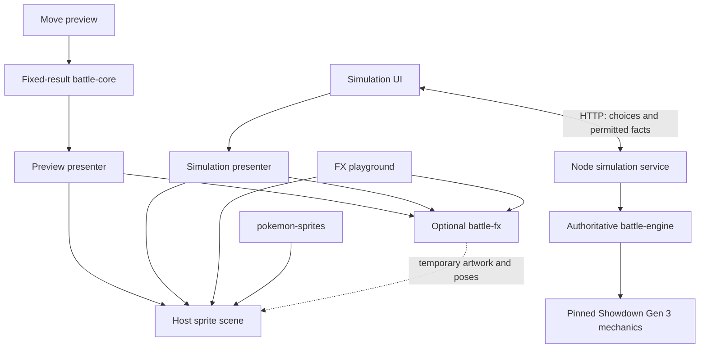

**Current project guide — 16 September 2026**

This guide describes the source inspected at commit `d914c01` and separates working features from proposed release work. It is a current reading map; older architecture reviews and chronological verification notes describe earlier stages. No application behavior was changed to produce this guide.

Your project is a modular Pokémon battle workspace: an independent effects library, a fixed-result move preview, reproducible Gen 3 data and sprite packages, and an authoritative Gen 3 engine connected to a playable browser simulation. The current simulation is one human against an automated opponent. The two-human multiplayer release remains unfinished.

**1. The repository and its entry points**

The repository is an npm-workspaces monorepo. A monorepo keeps independently owned modules together so they can be developed and tested in one checkout. Packages are linked locally through their manifests; separate directories do not imply separate deployed services.

| Layer | Current technology and role |
| --- | --- |
| Browser interface | Vue 3 and plain JavaScript; controls, selections, HP cards and logs |
| Graphics | PixiJS 8; sprites, platforms, canvas, particles and temporary artwork |
| Animation | GSAP 3; timelines, poses, cues and cleanup |
| Frontend build | Vite 7; four HTML entry points and emitted assets |
| Server | Node 24; HTTP middleware and a standalone static/API host |
| Real battle mechanics | Project-owned adapter around pinned Pokémon Showdown `0.11.11` |
| Reference data | Generated JSON with exact source pins, manifests and validation reports |
| Testing | Node's test runner, real Pixi display objects and controlled GSAP timelines |

```text
pokemon-battle-vue/
  index.html, preview.html, playground.html, simulation.html
  apps/
    home/                 Navigation between the three experiences
    game/                 Fixed-result move preview and shared scene implementation
    fx-playground/        Direct FX authoring and inspection
    simulation/           Real battle UI and server-event presentation
    server/               HTTP API, demo teams, automated opponent, static host
  packages/
    battle-core/          Fixed-result preview rules
    battle-engine/        Authentic Gen 3 simulator adapter
    battle-fx/            Independent move effects and entry/faint transitions
    game-data/            Immutable Gen 3 reference snapshot
    pokemon-sprites/      Pinned front/back images and measured bounds
  tools/
    data-import/          Reproducible Showdown metadata extraction
    roster-import/        Reproducible sprite and UI-roster generation
  tests/                  Host, preview, FX and simulation integration tests
  docs/                   Contracts, guides, reports and historical reviews
  public/assets/          Original starter artwork retained from the preview
  examples/               Inactive teaching/reference code
  scripts/                Explicit source-export tooling
```

| URL | Application | What it does | Battle API required? |
| --- | --- | --- | --- |
| `/` | `apps/home` | Choose simulation, move preview or playground | No |
| `/preview.html` | `apps/game` | Select either Pokémon and replay a move with a fixed sample outcome | No |
| `/playground.html` | `apps/fx-playground` | Run an effect with configurable actors, layouts and motion preferences | No |
| `/simulation.html` | `apps/simulation` | Select a preset and lead, battle the bot, switch, finish and reconnect | Yes |

These are separate Vite HTML entries, not a single Vue Router application. The composition and build settings are in [package.json](/Users/cdr/pokemon-battle-vue/package.json) and [vite.config.js](/Users/cdr/pokemon-battle-vue/vite.config.js).

**2. The two battle paths**

The most important distinction is between `battle-core` and `battle-engine`. Their names are similar, but they serve different purposes.



The preview is a laboratory for animation. It intentionally uses fixed HP fixtures, guaranteed successful samples and selected illustrative rule changes. Its move metadata includes historical preview values that are not all authentic Gen 3 values. For example, its Flamethrower descriptor has reference power 90 and fixed preview damage 64; the Gen 3 data record has power 95, and real damage is calculated by the engine.

The simulation uses the pinned simulator's rules for accuracy, PP, turn order, damage, statuses, abilities, held items, switching and results. It does not run the preview resolver. The same visual recipe can illustrate either path without receiving authority over its outcome.

The governing invariant is: **resolve gameplay first, then optionally present what happened**. An animation failure, a skipped effect or an inactive browser cannot change the already-resolved battle result.

**3. The five packages**

| Package | Public surface | Responsibility and limits |
| --- | --- | --- |
| `@battle/battle-core` | `createBattleState`, `resolveMove`, `/moves` | Validated immutable preview snapshots and fixed/sample rules. No renderer, browser API, Vue or server engine. |
| `@battle/battle-engine` | `createEngineFactory`, `EngineError` | Node-only authoritative mechanics, team validation, decisions, private projections, checkpoint and replay. No graphics or networking. |
| `@battle/battle-fx` | `createBattleFx`, catalog/timings, `/catalog`, `/transitions` | Cosmetic graphics, actor poses, cues and cleanup. PixiJS/GSAP dependent, Vue and gameplay independent. |
| `@battle/game-data` | `GEN3`, `GEN3_MANIFEST`, exact-ID getters, JSON exports | Static frozen reference records. No executable mechanics or complete team validator. |
| `@battle/pokemon-sprites` | `SPRITE_VIEWS`, `SPRITE_URLS`, `/manifest.json` | Static artwork URLs, measured visible bounds and provenance. No battle rules or anatomical targeting logic. |

These are local workspace packages. Their manifests are a basis for independent packaging, but this repository does not demonstrate that they have been publicly published. Scene and UI sharing still includes relative imports between apps; that layer has not yet become its own reusable package.

**4. Data: where it comes from and what it means**

The authoritative reference snapshot is [gen3.json](/Users/cdr/pokemon-battle-vue/packages/game-data/data/gen3.json). Its [manifest](/Users/cdr/pokemon-battle-vue/packages/game-data/data/manifest.json) identifies source and output hashes.

| Collection | Records |
| --- | ---: |
| Base species, National Dex #001–386 | 386 |
| Additional explicit forms | 33 |
| Moves | 354 |
| Items | 106 |
| Capture-ball reference identities | 20 |
| Abilities | 76 |
| Natures | 25 |
| Regular types | 17 |
| Learnsets | 419 |
| Front/back sprite PNGs | 838 |

The additional forms are 27 Unown cosmetic forms, three Castform weather forms and three Deoxys alternate forms. Thus there are 419 visual identities, with two images each. A displayable form is not automatically a legal starting team choice.

The data importer resolves `Dex.mod('gen3')` from Showdown `0.11.11`, commit `739a5e1fee432ad80ff7136d70cca993be358b59`. It does not filter modern Pokémon by National Dex number and assume their modern values are historical values.

Its sequence is:

1. Verify the pinned package, lockfile/source identity and installed source-tree checksum.
2. Resolve the Gen 3 Dex and extract an explicit allowlist of static fields.
3. Separate base species/forms, expand cosmetic identities and merge typed Hidden Power placeholders.
4. Preserve Gen 3 learnset source tokens, source ownership and original event indices.
5. Validate counts, IDs, ranges, links, source formats and historical regression examples.
6. Run candidate learnset and complete-set diagnostics against the pinned provider.
7. Produce deterministic JSON, manifests, a source-file inventory, licensing material and discrepancy reports.

`data:check` regenerates expected artifacts in memory and compares them with committed bytes. Generated records must be changed by deliberate source/schema updates and regeneration, not by guessing missing values or editing generated JSON until a test passes.

The [checked-in import report](/Users/cdr/pokemon-battle-vue/tools/data-import/reports/REPORT.md) records 20,186 passing candidate species/move pairs and eight complete-set fixtures meeting their expected outcomes. These compare against the same provider; they establish reproducibility and consistency, not independent exhaustive cartridge accuracy.

Important distinctions:

- A learnset contains acquisition candidates. Two individually obtainable moves can form an illegal combination; full legality belongs to the engine validator.
- Move descriptions and power values do not encode all mechanics. Executable upstream callbacks are omitted from the data snapshot.
- `basePower: 0` can represent a fixed-damage or variable-power move. Hidden Power requires IV-dependent engine calculations.
- Curse retains the Gen 3 `???` type sentinel, separate from the 17 regular types.
- Capture-ball records preserve references used by encounters/events. They do not implement a capture system or establish availability in every Gen 3 game.
- Data getters match canonical IDs exactly: `getSpecies('bulbasaur')` works; a display name is not implicitly converted.

The root package API deeply freezes records. Current HP, status, inventory and animation pose belong in separate state, never attached to a shared species record.

**5. Sprites and the lightweight roster**

The [sprite importer](/Users/cdr/pokemon-battle-vue/tools/roster-import/import.mjs) joins validated identities to pinned artwork. Artwork comes from `PokeAPI/sprites` commit `2ecb4eeacd5a1718621fc30f12772e3f60d830b9`; identity-only CSV mappings come from `PokeAPI/pokeapi` commit `4b82c204ddd19ecb8eda2ea044ccb59e222b721c`.

The images are the existing PokeAPI default static Gen 5-style artwork. Visual style and authentic Gen 3 mechanics are separate choices. The importer preserves the original 18 starter images and explicit front/back mappings for every additional identity.

Each PNG is checked for its pinned Git blob identity, structure/CRC, decoded dimensions and nonempty visible alpha bounds. There are 838 files totaling 600,849 bytes. The package exposes bounds and static URLs; Vite emits these images separately, and consumers request the images they display. Importing the URL map does not decode every Pokémon texture.

The host's [generated roster](/Users/cdr/pokemon-battle-vue/apps/game/src/roster/roster.generated.json) is about 182 KB uncompressed. It contains selector/display information such as names, numbers, types, base stats, ability names and form relationships. The full reference JSON is about 4.48 MB; the roster picker does not need its complete learnset contents.

Bounds are measured for all artwork, but species-specific anatomy is not fully calibrated for every Pokémon. The host overlays 18 calibrated starter views; new species use generic mouth/hand/eye-style sockets. If a projectile leaves an unusual Pokémon from the wrong position, the appropriate improvement is profile metadata, not a species check inside the move recipe.

**6. The real engine in detail**

Start with [profile.js](/Users/cdr/pokemon-battle-vue/packages/battle-engine/src/profile.js), [teams.js](/Users/cdr/pokemon-battle-vue/packages/battle-engine/src/teams.js), [index.js](/Users/cdr/pokemon-battle-vue/packages/battle-engine/src/index.js) and [projection.js](/Users/cdr/pokemon-battle-vue/packages/battle-engine/src/projection.js).

The current named format is `gen3opensinglesv1`: singles, exactly six distinct base species, level 100, one through four legal moves, Gen 3 obtainability and Species Clause. Duplicate held items are allowed. There is no opponent team preview, undo, bag action, tier ban or extra sleep/evasion/OHKO clause. If no earlier result occurs, completed turn 500 produces a draw.

Validation checks species/forms, moveset combinations, ability, nature, IVs, EVs and applicable encounter constraints. IVs are 0–31; EVs are 0–255 per stat and no more than 510 total. Defaults and canonicalization are returned in `changes`; a future team editor should show meaningful changes before readiness confirmation. The present simulation uses three already-validated presets.

Internally the adapter owns a mutable Showdown Battle instance. It protects that instance behind detached project-owned views and commands. This is different from the preview core's immutable reducer model.

| Factory method | Purpose |
| --- | --- |
| `getProfile()` / `getIdentity()` | Read policy and implementation compatibility fingerprints |
| `validateTeam(team)` | Return validity, normalized team, errors and changes |
| `create({teams, matchId, seed?})` | Create a validated battle at its first decision |
| `restore(checkpoint)` | Restore private state under an identical compatible identity |
| `replay(record)` | Reproduce the admitted player/system command journal |

| Engine method | Purpose |
| --- | --- |
| `getDecision(seat)` | Get current `move`, `switch`, `wait` or `finished` request |
| `submitDecision(seat, command)` | Admit/reject a move or switch using decision and command identities |
| `getPlayerView(seat)` | Get only that player's permitted observation |
| `getEvents(seat, afterCursor)` | Get ordered facts after that viewer's event cursor |
| `adjudicate(systemDecision)` | Privileged forfeit/draw/no-contest operation |
| `exportCheckpoint()` / `exportReplay()` | Export private recovery artifacts |
| `dispose()` | Release the battle instance |

Move slots are one-based and come from the request. Switches use stable member IDs such as `p1:2`; vendor party positions are internal. Each seat has a separate decision identity, so accepting one player's choice does not invalidate the other player's still-open decision.

An admitted `(seat, commandId)` retry with the same payload returns its original acknowledgment. Reusing that ID with a changed payload is rejected. This prevents a transport retry from becoming a second move. The surrounding service must still authenticate seats and persist command receipts if retries must survive a process restart.

New matches use private randomly generated seeds. Visual effects have separate seeded randomness. Checkpoints include the engine/RNG/data/profile/adapter identity and exact Node/V8 versions; an upstream or runtime update can make older checkpoints incompatible. The adapter uses pinned private simulator APIs deliberately, so upgrades require compatibility tests rather than an unreviewed dependency bump. Simulator determinism does not imply reproduction of a GBA cartridge RNG sequence.

**7. Private state and the public view**

The projection layer consumes viewer-filtered simulator messages and keeps a knowledge ledger for each player.

| Information | Browser visibility |
| --- | --- |
| Own party, HP and moves | Permitted own information, including exact HP |
| Opponent team | Only revealed members and facts |
| Opponent HP | Public rounded bar; the UI shows an approximate percentage |
| Opponent unrevealed item, ability or move | Not sent as known information |
| Pending private choices, full enemy party order, seed | Kept inside the server adapter |
| Full checkpoint and private replay journal | Trusted private storage only |

Every viewer has a separate contiguous cursor; the other player's private updates do not create informative gaps. Protocol events use `{cursor, type, args}` with rewritten actor IDs. The UI renders friendly text, not arbitrary simulator HTML.

The current preset definitions are public sample data returned by `/config`. Per-match observations are filtered correctly, but these known presets do not offer the secrecy of future privately submitted custom teams.

Unknown state-bearing protocol events can mark a view `complete:false`. The current service stops that session with a safe error instead of claiming the displayed state is complete. This is a deliberate safety boundary and also an integration limit: supporting all allowed mechanics visually requires continued projection coverage.

The browser's displayed state can lag for animation, but its latest authoritative view controls which actions are available. Its reference stats and condition badges do not attempt to reconstruct every hidden modifier or remaining duration.

**8. The current HTTP server and one complete action**

[simulation.js](/Users/cdr/pokemon-battle-vue/apps/server/simulation.js) is ordinary Node middleware. Vite mounts it for development/preview. [start.mjs](/Users/cdr/pokemon-battle-vue/apps/server/start.mjs) serves the built frontend and the same API together.

All routes below are under `/api/simulation`:

| Request | Purpose |
| --- | --- |
| `GET /config` | Validated public preset teams, Gen 3 move metadata and format label |
| `POST /match` | Create/replace this browser's match from a preset and lead |
| `GET /match` | Retrieve the current permitted snapshot and events |
| `GET /match?afterCursor=N` | Retrieve updates after a known event position |
| `POST /choice` | Submit a move/switch command |
| `POST /forfeit` | Forfeit this match |
| `DELETE /match` | Dispose this session's match |

The browser always controls p1; p2 is the bot. Kanto companions, Johto explorers and Hoenn expedition are explicit six-member fixtures. The opposing preset is selected from a different preset. The bot prefers the first available damaging move, then another legal move or switch. It is not a strategic competitive AI.

For example, when you choose Surf:

1. `App.vue` reads the move slot from `latest.decision`, creates a command ID, and retains that command for retries.
2. `api.js` sends JSON with `matchId`, `decisionId`, `commandId`, action and event cursor. The browser attaches its session cookie.
3. The service validates origin, body fields, session, match identity and cursor.
4. The engine admits or rejects p1's choice. The bot submits its choice through the same engine decision interface.
5. The simulator resolves the required choices and produces the authoritative state and permitted events.
6. The API responds with `{matchId, view, events, profileId, ack}`.
7. `App.vue` immediately stores `view` in `latest`. The presenter then processes the events into `displayed` snapshots and optional animation.
8. After presentation finishes or is skipped, the display converges to the returned authoritative view.

Requests have a 15-second client deadline. A timeout means the response is uncertain; it does not prove the server failed to accept the move. The UI therefore offers sync/retry using the saved identities.

Current safeguards include a random HttpOnly SameSite=Strict session cookie, same-origin mutation checks, allowlisted JSON fields, prototype-key rejection, 4 KiB bodies, no-store responses and match-bound commands. A stale tab cannot replace or act on a different match without an identity conflict. These are useful prototype safeguards, not proof of complete production hardening.

Sessions live in an in-memory `Map`. Defaults are 24 active sessions, 600 requests per session per minute, 60 new matches per minute and expiry after 30 minutes of inactivity. These are configured limits, not measured capacity. There is no WebSocket transport, two-human room flow, durable database or worker pool in this service yet.

**9. Presentation, send-outs, fainting and idle motion**

The simulation composition lives in [App.vue](/Users/cdr/pokemon-battle-vue/apps/simulation/src/App.vue). It owns `latest`, `displayed`, request cancellation, UI locks, the party controls and log. It injects scene and FX callbacks into [presentation.js](/Users/cdr/pokemon-battle-vue/apps/simulation/src/presentation.js).

The presenter groups ordered server facts into moves and structural changes. Successful move artwork can reveal its already-decided HP/status changes at an impact cue. Residual damage is separated from attack contact. Failed/missed moves can update the log and state without a successful-hit clip. Multi-hit artwork can contain a different number of cosmetic contacts from the rolled battle hit count; HP/log facts retain the server result.

Fainting is ordered carefully: reveal zero HP at impact, retain only the matching outgoing sprite while the attack recovers, play its faint, hide it, then send out a replacement. Reconnect restores the final lineup without repeating earlier transitions. Skip, reset, failure, deadline and late asynchronous completions must converge on the same lineup.

| Animation | Owner | Current behavior |
| --- | --- | --- |
| Move | Independent battle-fx recipe | Move-specific geometry, particles, approach and recovery |
| Send-out | `battle-fx/transitions/pokeball-release.js` | Tumbling Poké Ball, trail, opening flash and silhouette reveal; normal clip about 1.35 seconds |
| Faint | `battle-fx/transitions/pokemon-faint.js` | Brief desaturation/dip and full-size snapshot sinking behind its ground line; normal clip about 0.9 seconds |
| Idle | Simulation host `idle.js` | Gentle breathing and sway; maximum growth 1.2%, sway about 0.26 degrees, fixed visible feet |

The host selects which actors enter or faint. Transition functions receive the scene and actor IDs, never HP or battle state. Reduced motion uses shorter, quieter presentation; idle stops completely. Idle also pauses for attacks, transitions, disabled animations, completed matches and hidden tabs.

Scene creation is staged offscreen and mounted only if still current. Generation tokens and abort signals reject outdated lineups. This prevents a slow texture load from replacing a newer Pokémon. Renderer failure leaves DOM sprite fallbacks and battle controls available.

**10. How the scene and FX contracts work**

[apps/game/src/scene](/Users/cdr/pokemon-battle-vue/apps/game/src/scene/index.js) owns base rendering. A scene has a uniformly fitted root, camera, terrain, actor layer and temporary effects layer. Each actor has a resting root/registration pivot, a temporary pose container and its artwork.

Useful actor operations include `anchor(name)` for the current posed socket, `base(name)` for its resting socket, visible `metrics`, `snapshot()` and `resetPose()`. `visualCenter` is the geometric art midpoint; a semantic `center` can be a different aiming point. This lets a move target a mouth/hand/body without knowing which Pokémon is being drawn.

The default logical field is 1000 × 450. Sprite size comes from visible PNG bounds, excluding transparent padding. The uniform pixel scale is the maximum of the native scale and readability guards:

```text
pixelScale = max(
  nativeScale × optionalManualScale,
  minimumExtent / max(visibleWidth, visibleHeight),
  minimumHeight / visibleHeight
)
```

Near/far native scales are `265/96` and `235/96`. Minimum longest dimensions are 150/125, with height guards 90/75. The minimum avoids making small sprites unreadable without forcing every Pokémon to the same height. Physical Pokédex height/weight is not used for rendering.

The near actor uses back artwork; the far actor uses front artwork. Stable scene IDs `source` and `target` identify positions. An opponent move changes the request's acting ID, not the artwork or camera orientation. The simulation lowers the near resting slot to normalized y `0.82`; the preview keeps its own calibrated layout.

Platforms have fixed near radii 173 × 38 and far radii 143 × 31, scaled only by the scene unit. They sit at the resting visible bottom-center. Species choice, temporary poses and manual sprite scale cannot alter their size or position.

An FX call has this contract:

```js
const fx = createBattleFx({ timelineEngine, assetLoader, glowTexture })
const playback = fx.play({
  moveId: 'flamethrower',
  sourceId: 'source',
  targetIds: ['target'],
  phase: 'attack',
  outcome: 'hit',
  visualSeed: 42,
}, { scene, signal, onCue, reducedMotion })
await playback.finished
// playback.cancel() stops this playback; fx.dispose() releases the runtime.
```

There is no HP, PP, species record, gameplay RNG or winner in that request. Factory arguments and callbacks provide dependency injection without a DI framework.

Each playback owns its timeline and temporary graphics. The runtime allows one active playback per scene within that runtime, cancels a superseded run, deduplicates cues, and restores poses/camera on completion or failure. Shared cached textures belong to the asset loader; temporary sprites must not destroy them. All particle updates use the same timeline clock.

`effect-space.js` adapts authored coordinates using actor anchors, uniform scaling and horizontal reflection. It preserves vertical direction and gravity. Each of the 335 moves still owns its own art/choreography. Four separate preparation clips bring the recipe-file count to 339.

Preview and simulation lazy-load the FX runtime as a whole. The default registry currently imports all recipes statically; JavaScript is not yet loaded one move at a time. Artwork is loaded on demand. FX is renderer-specific even though it is independent of Vue and battle rules.

**11. What is complete, partial or absent**

| Area | Current state |
| --- | --- |
| Gen 3 species/data import | Implemented, pinned, deterministic, with reports |
| All 419 visual identities | Front/back images and bounds present; most anatomy uses generic sockets |
| FX package | 335 independent moves, four extra preparation clips, lifecycle support |
| Authoritative engine | Implemented adapter, validation, decisions, projections, checkpoint/replay |
| Playable browser battle | Implemented against bot with three preset teams |
| Refresh/reconnect | Same browser and surviving in-memory session |
| Persistent recovery | Engine APIs exist; server does not save them |
| Custom team editor/storage | Not implemented in current simulation UI |
| Human invite rooms and unranked queue | Not implemented |
| Live push connections and decision deadlines | Not implemented |
| Accounts/cross-device saves | Not implemented; current release contract proposes anonymous sessions first |
| Independent audio package | `@battle/battle-audio` plays optional send-out cries in simulation/multiplayer; move sounds and music remain unconnected. See [cry playback](CRY_PLAYBACK.md). |
| Standalone items service/package | Not present; item metadata lives in game-data and mechanics in the engine |
| Production deployment/CI/load gates | Not supplied or demonstrated by current repository configuration |

There are 354 Gen 3 move records and 335 preview/FX entries. The import report maps 335 semantically and lists 19 without preview rules: Acid, Camouflage, Conversion, Conversion 2, Covet, Growth, Haze, Heat Wave, Mist, Powder Snow, Pursuit, Shock Wave, Sludge, Snatch, Spore, Stockpile, Swallow, Thief and Water Spout.

The simulation explicitly maps Showdown's `Vise Grip` to the existing `Vice Grip`/`vice-grip` FX entry. Including that alias, 335 of the 354 data moves match registered effects; 19 do not. This is why counting only identical normalized names would understate coverage. Missing FX does not disable valid engine moves.

The main modularity gaps are the shared scene/roster/UI imports through `apps/game`, the combined HTTP/session/bot responsibilities in one server module, and protocol knowledge in the simulation presenter. These are manageable extraction points. Separate interfaces and tests should precede splitting them into network services.

**12. Running and verifying the project**

Use Node 24, matching `.nvmrc`. A fresh checkout needs the root lockfile installation; the two importer environments have their own setup commands.

| Command | Purpose |
| --- | --- |
| `npm ci` | Install the locked workspace dependencies |
| `npm run dev` | Run all frontend entries plus the local simulation API |
| `npm run build` | Build four browser entry points into `dist` |
| `npm start` | Serve built pages and API, default `127.0.0.1:3000` |
| `npm run preview` | Local Vite preview with the simulation plugin |
| `npm run engine:demo` | Headless complete-battle/recovery demonstration |
| `npm test` | Root preview/FX/host integration suites |
| `npm run test:simulation` | Simulation-named transport/presentation/server/scene suites |
| `npm run test:engine` | Independent engine suites |
| `npm run test:data` | Importer and data runtime suites |
| `npm run test:roster` | Roster importer and PNG/roster suites |
| `npm run data:setup`, `data:import`, `data:check` | Set up, regenerate and check reference data |
| `npm run roster:setup`, `roster:fetch`, `roster:import`, `roster:check` | Set up, fetch pinned assets, regenerate locally and check sprites/roster |

The root `npm test` command does not automatically run every package/importer suite. There are 62 `.test.mjs` files across the root tests and the four package/importer test directories enumerated during this audit; a file count is not a passing-test count.

Tests cover immutable preview results, private engine views, retries, recovery, historical mechanics, asset ownership, contact geometry, both perspectives, cancellation, reduced motion and HTTP behavior. The current unchanged-reference gate checks 30 original moves at 90 scene-graph checkpoints. Redesigned effects have separate checks. Numeric geometry tests do not prove pixel-perfect appearance, full-device compatibility or production capacity.

For this guide, source/export inventories and dataset counts were checked, the reference JSON SHA-256 was recalculated, and all 838 PNG hashes were compared with their manifests. Full runtime suites and a production build were not rerun for this documentation-only change. Earlier test totals in historical documents are not claims of a fresh run.

**13. Deployment and recovery**

The Vite build emits browser files. Its development/preview middleware is not automatically emitted as a hosted API. That explains why the UI can load on a static deployment while `/api/simulation/config` is unavailable.

The present Node host can serve both frontend and API, or a frontend host can forward API traffic to it. Before exposing the current service behind an HTTPS proxy, implement explicit public-origin/trusted-proxy handling: the existing origin and Secure-cookie decisions use the immediate socket's encryption and Host. External binding also requires an appropriate `HOST` rather than the localhost default. A URL rewrite alone does not address those requirements.

The engine's checkpoint/replay API is already implemented, but the HTTP service never persists its output. Refresh works while the process and session survive. Restart and inactivity expiry lose the current match. No database or shared session store is configured.

For durable multiplayer, a match service should own a serialized transaction around each admitted command: restore/read the current match, verify authenticated seat and decision identity, apply the command, commit the new checkpoint plus receipt/events, then acknowledge/publish. Only one owner may write a match at a time. If an instance fails after receiving a command, retry behavior must depend on durable receipts, not whether its HTTP response arrived.

Checkpoints contain secrets and use checksums for corruption detection, not authentication. Keep them in trusted private storage. Their strict implementation identity also means deployments need an explicit plan for existing matches: retain compatible workers, drain matches, or implement verified migration. Merely storing a JSON file does not supply production recovery semantics.

**14. How to work on one module at a time**

| Intended change | Start here | Verification that matters |
| --- | --- | --- |
| Change one move's visual style | `battle-fx/src/moves/restored/<id>.js` | Contact, late particle flow, both sides, cleanup, reduced motion, visual review |
| Add a missing move effect | Recipe + registry + lightweight catalog | Exact engine-to-FX ID mapping, standalone playback, missing-FX fallback |
| Add a preview illustration | `battle-core/src/moves.js`, `previewState.js`, `moveDetails.js` | Immutable before/after, correct target, explicit fixture, optional FX |
| Correct sprite scale or attachment | Host profiles, `spriteViews.js`, `previewActors.js` | Varied silhouettes, visible bounds, fixed platforms, calibrated starters |
| Change real mechanics or format policy | `battle-engine` profile/adapter and pinned source | Legality, mechanics, privacy, deterministic replay and checkpoint compatibility |
| Correct imported reference data | Importer source/schema/pin | Generated diffs, provenance, historical checks, engine/data identity |
| Add teams, invites or deadlines | Host service and UI contracts | Two sessions, ownership, retries, stale commands, timers and reconnect |
| Add sound | New optional audio module driven by presentation facts | Mute/skip/failure leaves gameplay unchanged; lifecycle cleanup |

For an effect, use the independent playground first. Its tall/wide shape actors, reversed layout, alternate field ratios and scale controls expose assumptions that default Charizard/Venusaur can hide. Add a battle-core rule only when a new preview behavior is needed; do not put real mechanics into an effect to make its demonstration work.

For shared scene or lifecycle changes, run the affected integration suites and broad reference gates. For an isolated recipe tweak, use focused contact/cleanup checks and one build. Review browser appearance separately from headless geometry evidence.

For Gen 4 or later, add an explicitly named snapshot and engine profile. The current importer encodes Gen 3 counts, source tokens and historical assumptions, so increasing the Dex maximum alone is insufficient. Update data/form mappings, rules validation, sprite coverage and relevant UI assumptions together. Keep `GEN3` stable and preserve existing replay identities. Items and abilities remain data plus executable engine behavior; adding their JSON record alone does not implement a new mechanic.

**15. A practical sequence to finish the first multiplayer release**

1. **Make the existing simulation deployable.** Configure a compatible Node host, proxy/origin/cookie behavior and a deployed smoke check that loads config, creates a test battle, accepts a move and reconnects.
2. **Separate host responsibilities.** Extract match/session ownership, persistence interface, bot policy and transport adapters while keeping the engine's public port stable. Extract shared scene/presentation utilities from app-private paths when needed by multiple consumers.
3. **Build team creation and two-human rooms.** Validate and lock teams, authenticate anonymous seat ownership, issue invites and handle both players' readiness and permitted views. Account registration is not required by the current first-release proposal.
4. **Add durable command/recovery handling and deadlines.** Commit receipts/checkpoints before acknowledgment, serialize terminal events with moves, retain remaining decision time across reconnect and test process restarts.
5. **Add live updates and the simple unranked queue.** Define reconnect cursors, event-gap recovery and a presentation catch-up policy. Network delivery must not wait for animations.
6. **Complete quality and operational gates.** Exercise two real browser sessions, missing assets, FX/audio disabled, full allowed mechanic projection, device checks, deployment rollback, backup restore and measured capacity.

The [release contract](/Users/cdr/pokemon-battle-vue/docs/PROJECT_CONTRACT_V1.md) confirms authentic Gen 3 and all 386 species. It still labels team/timer/compatibility/capacity values as proposed targets. The engine has implemented its explicit six-member level-100 profile; that does not establish stakeholder approval or measured production performance for every proposed target. The proposed 100 simultaneous matches and readiness/latency budgets remain acceptance work.

Doubles, ranked play, spectators, trading, overworld and later generations remain outside the first release. A modular system can grow into those without adding all of them to the current milestone.

**16. Reading order and older documents**

For an implementation walkthrough, read these in order:

1. [App.vue](/Users/cdr/pokemon-battle-vue/apps/simulation/src/App.vue) and [api.js](/Users/cdr/pokemon-battle-vue/apps/simulation/src/api.js): the browser's request and state flow.
2. [Server simulation.js](/Users/cdr/pokemon-battle-vue/apps/server/simulation.js): route/session/engine composition.
3. [Engine profile](/Users/cdr/pokemon-battle-vue/packages/battle-engine/src/profile.js), [engine port](/Users/cdr/pokemon-battle-vue/packages/battle-engine/src/index.js) and [projection](/Users/cdr/pokemon-battle-vue/packages/battle-engine/src/projection.js): rules, decisions and privacy.
4. [Simulation presenter](/Users/cdr/pokemon-battle-vue/apps/simulation/src/presentation.js) and [scene coordinator](/Users/cdr/pokemon-battle-vue/apps/simulation/src/scene.js): turning facts into ordered visuals.
5. [Base scene](/Users/cdr/pokemon-battle-vue/apps/game/src/scene/index.js), [actor](/Users/cdr/pokemon-battle-vue/apps/game/src/scene/actor.js) and [FX runtime](/Users/cdr/pokemon-battle-vue/packages/battle-fx/src/index.js): rendering and lifecycle contracts.
6. [Data import report](/Users/cdr/pokemon-battle-vue/tools/data-import/reports/REPORT.md) and [sprite report](/Users/cdr/pokemon-battle-vue/tools/roster-import/reports/REPORT.md): evidence and limitations of reference content.

[BATTLE_SIMULATION.md](/Users/cdr/pokemon-battle-vue/docs/BATTLE_SIMULATION.md) is the focused simulation guide. [MIGRATION.md](/Users/cdr/pokemon-battle-vue/docs/MIGRATION.md) describes the preview integration contracts; [ADDING_MOVES.md](/Users/cdr/pokemon-battle-vue/docs/ADDING_MOVES.md) covers effect extension. [PRODUCTION_ARCHITECTURE_GUIDE.md](/Users/cdr/pokemon-battle-vue/docs/PRODUCTION_ARCHITECTURE_GUIDE.md) contains proposed future architecture, not an inventory of existing modules.

Some older text is stale: `PROJECT_OVERVIEW.md` starts with two pages/two packages/33 moves; `PROJECT_STATUS.md` and `VERIFICATION.md` contain chronological historical counts; the engine README still calls the live presenter future work; the data README still says the preview is not connected, although its roster now derives from the data package. Those statements do not override current source. Previous design grades and test totals belong to the revisions they evaluated.
