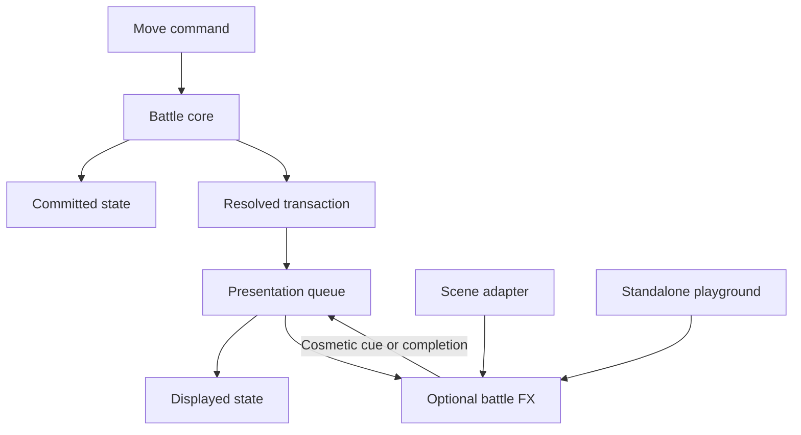

# Project overview

The project contains two browser entry points and two reusable packages. All 33 existing move effects are migrated; the game remains the same fixed-result showcase.

| Component | Owns | Must not own |
| --- | --- | --- |
| `battle-core` | Immutable state and resolved results | Rendering, timing, effects |
| Game host | Committed state, Vue UI and scene lifecycle | Damage derived from visual contact |
| Presenter | Display queue, cues, skip and fallback | Battle rules or authoritative mutations |
| Scene adapter | Sprites, layout, anchor transforms, camera | Move outcomes |
| `battle-fx` | Temporary graphics and pose offsets | HP, condition state, turn progression |
| Playground | Sample effect requests and actor fixtures | Battle simulation |

There is no dependency from core to presenter or FX. The game dynamically imports the base scene and the optional FX runtime separately. It can display results if canvas creation fails. With effects off, it never invokes the FX loader. When an enabled effect fails or times out, the presentation layer releases busy state and reconciles the committed result.

`resolveMove()` is synchronous. An application can feed its returned `after` state to subsequent commands immediately without waiting for presentation. The example page deliberately gates manual input while an effect is displayed to keep previews easy to watch; that is a UI policy, not a battle-engine dependency. Skip and effects-off release that presentation wait.

The presenter retains both before/after snapshots. It shows the before state during anticipation and the already-committed after state at the cosmetic impact cue. Repeated cues cannot repeat damage. When an effect emits no cue, its completion/failure still displays the correct after state. Reset invalidates queued/late presentation callbacks.

## Renderer and actor model

Host scene construction uses a logical stage, layout roots, pose containers and visible artwork. A uniform camera fit adds letterboxing when the window's aspect ratio differs. Resizing the window changes only the view transform; changing logical stage proportions creates a new scene. Both are exercised by the playground or tests.

Profiles specify visible texture bounds, native facing and normalized semantic anchors. The FX package sees resolved anchor points, metrics, an optional snapshot provider and a resettable pose. It never loads Pokémon textures. Tall and wide geometric fixtures make this independence observable without adding new artwork. Automatic default anchors are approximations; an unusual sprite can improve mouth/hand placement with profile metadata without changing a move.

The FX package currently uses PixiJS and GSAP. It is independent of Vue, sprites and combat logic, but is not a renderer-neutral implementation: another renderer would need a compatible implementation of the rendering/pose contract.

## Ownership and assets

The host owns the application, base actors, terrain, resize observer and camera. Each FX playback owns one temporary container and one timeline. Cancel/finish removes those objects and resets its participants and camera. One runtime allows only one active playback on a given scene, while separate scenes can play independently.

Effect artwork is shipped inside the FX package and loaded only for moves that need it. Texture URLs use package-relative `new URL(..., import.meta.url)`. The shared loader cache keeps textures across replays; the runtime does not evict that cache or destroy host sprite textures. It destroys its own generated glow on disposal. Per-frame motion and fading use the same timeline clock rather than a second particle simulation clock.

## Current limitations

The core preserves the original fixed damage, guaranteed hits and manual effectiveness messages. Displayed power/accuracy are reference metadata, not calculations. Thunder Wave applies its demo paralysis condition; other secondary effects, priority ordering, weather, PP, legality, turn systems, multiplayer, healing and misses are not simulated. Every game-page replay starts a fresh preview; callers of the core may keep state across commands.

The FX request shape reserves `targetIds`, but current recipes animate only its first target. Unsupported non-hit outcomes skip effects. Multi-target choreography and miss-specific visuals need explicit future implementations. Character motion still transforms static artwork; the package does not manufacture skeletal or frame-based Pokémon animation.

See `ANIMATION_SPEC.md` for the complete move/timing table, `MIGRATION.md` for integration, and `VERIFICATION.md` for what was tested. The earlier source ZIP is not automatically regenerated during focused development; export scripts now include the workspace layout when a new handoff is requested.

## Original effects restored

The active catalog now contains 33 independent restored move files rather than the three generic recipe modules introduced during migration. Original choreography is retained behind the dynamic coordinate adapter. Numerical comparison against 99 original frames passes; browser pixels have not been reviewed. The UI and battle/presentation package separation are retained.
