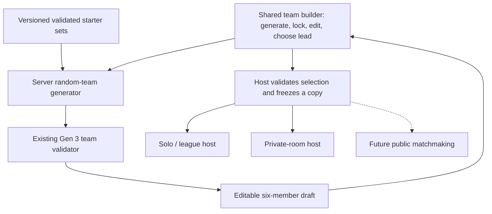

# Random team builder — plan v0.2

Status: implementation of phases 0–3 authorized and completed locally on 2026-09-26; final verification is recorded in section 11. No deployment has been performed. This document retains the design rationale and future scope; product choices below were the proposed defaults accepted for implementation.

Revision v0.2 follows the audit of current presets: they are hand-authored demo teams, while the pinned vendor validator checks legality. This strengthens the set-quality requirements and clarifies data provenance; the shared-builder architecture and battle integration contracts remain the recommendation.

## 1. Recommendation and confirmed experience

Build random generation into the existing six-slot team builder. A generated team becomes an ordinary editable team that can be selected for solo battles, private rooms, and eventually public matchmaking. Share preparation and validation; each battle host retains its own session and match lifecycle.

The user confirmed:

- Generate six Pokémon, keep favorites, and reroll the rest.
- Generate complete legal sets, including moves and battle settings, then allow editing.
- Plan and review the work before implementation (completed); implementation was subsequently requested.

Recommended first flow:

`Generate six → inspect team → lock favorites → reroll unlocked slots → edit if desired → choose lead → use team`

“Complete” means ready for the current battle format, with one through four legal moves. Some species cannot have four distinct moves. A lock preserves the entire set, including its moves, item, ability, nature, EVs and IVs, during randomization. Direct editing remains possible and invalidates the previous validation result.

This first feature is a casual team preparation tool. Rerolls and edits have no gameplay allowance, while server request budgets prevent expensive repeated requests from starving battles. A future mode promising server-assigned random teams and equal reroll allowances is a separate rule policy; it cannot trust an editable team's `source: random` label.

## 2. What already exists

| Existing component | Reuse and implication |
| --- | --- |
| `apps/simulation/src/TeamBuilder.vue` | Six-slot species/set editor; extend this experience instead of building a second editor. |
| `apps/simulation/src/teamDraft.js` | Editable payload conversion, basic feedback and browser draft persistence. Preserve current saved drafts. |
| `apps/server/team-builder.js` | Pinned Gen 3 catalog and candidate moves. Candidate moves are not proof of legal combinations. |
| `apps/server/presets.js` | Three manually defined regional demo teams, shared by solo and private multiplayer. Useful regression fixtures; not a source of optimized randomized sets. |
| `packages/battle-engine/src/teams.js` | Authoritative whole-team validation and normalization. Reuse it. |
| `packages/battle-engine/src/profile.js` | Current Open Singles rules: six distinct base species, level 100, one to four moves, duplicate items allowed. |
| `apps/server/simulation.js` | Already accepts custom teams, validates them and starts solo/league battles. |
| `apps/server/rooms/service.js` | Invite-only human multiplayer already exists, currently selecting server presets. Own selection revisions, readiness, membership and match snapshots already exist. |
| `apps/shared/battle/` | Shared live battle presentation. Team preparation does not require changing it. |

“Private battle” is the current multiplayer mode at `/multiplayer`. Public matchmaking is a future consumer, not a second battle engine to create now. See `docs/MULTIPLAYER.md` for the implemented room lifecycle.

Keep this work out of preview `battle-core`, FX, move recipes and rule RNG. The real battle engine and host services already own live battles.

The preset audit found that all 18 members share Hardy nature and 252 HP / 252 Special Attack / 4 Speed EVs, including physical attackers. All three teams passed a fresh call to the existing validator. That establishes legality under the current profile, not strategically appropriate settings. Keep these existing presets unchanged in this work; auditing or improving them would be a separate task.

Keep three sources of truth distinct:

| Source | What it establishes |
| --- | --- |
| Imported `packages/game-data/data/gen3.json` | Pinned reference facts and learnset candidates. It neither chooses strong sets nor proves complete-set legality. |
| Existing server-side Pokémon Showdown `TeamValidator` | Legality under the selected project format, including interacting obtainability constraints. Reuse this implementation rather than recreating its rules in JSON checks or heuristics. |
| Proposed versioned starter-set collection | Project-approved complete sets selected or adapted using vendor material and documented project rules. Usefulness needs its own review; vendor origin alone is not approval. |

## 3. Alternatives and evaluation

Scores are engineering judgments for this request, not measured performance or guarantees. Each criterion is scored from 1 to 5; totals are weighted percentages.

| Approach | User fit 30% | Reuse 25% | Delivery simplicity 20% | Correctness 15% | Extensibility 10% | Total |
| --- | ---: | ---: | ---: | ---: | ---: | ---: |
| A. Browser button selecting six species; manually finish sets | 2 | 3 | 5 | 3 | 2 | 60/100 |
| B. Shared builder + server generator + existing validator | 5 | 5 | 4 | 4 | 5 | 93/100 |
| C. Build a draft platform, account team library and matchmaking together | 4 | 4 | 1 | 3 | 5 | 67/100 |
| D. Adapt only the vendor's curated random-team pool | 3 | 5 | 4 | 3 | 3 | 74/100 |

Choose **B**. It satisfies the confirmed complete-team experience and establishes one integration seam. A leaves much of the user's requested work manual. C introduces several independent products before establishing that generation feels good. D is a credible smaller alternative if limited roster coverage becomes an explicitly accepted requirement, but does not meet the proposed all-roster default.

Do not add a dependency, service, framework or workspace package for the first slice. Small shared app modules and existing engine exports are enough. Extract a package later only if another consumer justifies it.

## 4. Proposed generation defaults

| Decision | Proposed first release |
| --- | --- |
| Roster | All 386 Gen 1–3 base species; default initial forms for newly generated slots. Existing valid manually selected forms may be locked. |
| Sampling | Sample base species without replacement, with equal initial species weight. Multiple forms and multiple set templates must not increase a species' odds. |
| Duplicates | Exclude base species already retained in other slots. Related evolutions remain different species under the current format. |
| Legendaries | Include them, matching current Open Singles. An exclusion filter can be a later product option. |
| Level | 100, matching the existing profile. No random-level balance system. |
| Moves and settings | Select coherent, prevalidated complete starter sets; settings follow the set, rather than independently randomizing every field. |
| Strength | Legal and usable casual teams. Equal odds and equal level do not imply equally strong teams. |
| Rerolls | Unlimited; whole-team reroll respects locks; an individual reroll replaces only that unlocked slot. |
| Lead | Slot 1 initially; user can select any slot. The selected lead follows its slot, so replacing that slot visibly changes its occupant. |
| Persistence | Existing browser draft saving, with safe migration for any new envelope. Server room selections are separately authoritative. |

Defer type/generation filters, fully evolved-only pools, legendary caps, balanced-team scoring, cosmetic-form randomization, seed sharing, saved-team collections and competitive random-battle enforcement. A small UI can gain those options later without changing the team payload.

## 5. Generating useful legal sets

Avoid selecting four independent moves from the catalog. The engine rejects some combinations of individually listed moves; existing examples include acquisition conflicts. Ability, nature, gender and IV requirements can also interact with legal sets.

Use a **versioned starter-set collection** with a build/verification script:

1. Reuse suitable Gen 3 templates from the already pinned vendor through a narrow server/tool adapter. Preserve source identity and attribution. Do not use the current demo presets or their shared stat defaults as the starter-set generation policy.
2. Convert to allowed project fields, set level 100, choose any missing nature or other required settings for the intended set role subject to legality constraints, and preserve meaningful relationships such as Hidden Power IVs and friendship-sensitive moves. Do not fill every missing nature with Hardy or give every species the same EV spread as a release-quality shortcut.
3. For uncovered species, derive source-aware starter candidates from pinned data. Score legal attacking options, applicable same-type attacks and compatible utility; use curated overrides where mechanical combinations require them. Respect Gen 3 damage categories rather than later-generation assumptions.
4. Validate complete candidate sets in legal six-member fixture teams under the actual Open Singles profile. Export only passing editable sets and a coverage report. Require at least one passing set for every advertised base species.
5. Review the collection for usefulness, with targeted play checks on representative sets. Ordinary species should normally receive four compatible, useful moves and a plausible damage or support plan; a validator-passing one-move fallback is insufficient for them. Legal low-move species remain eligible with explicit documented exceptions; do not invent filler moves or silently remove awkward species. Include Ditto, Unown, Smeargle, Wobbuffet, Shedinja, event-constrained Pokémon and Hidden Power cases in the review. Avoid obvious unusable combinations such as a Choice item on a wholly passive set or Sleep Talk without a viable sleep plan.
6. At runtime, sample species first, then a complete set for each species. Insert retained locked sets unchanged and validate the assembled six-member team again.

Start with one acceptable starter set per advertised base species. Additional roles and template variety are later improvements. Use a small, documented quality checklist, not a competitive optimizer:

- Moves, ability, item, nature and EVs support a stated simple role. For example, a straightforward physical attacking set must not accidentally inherit the demo helper's Special Attack investment; deliberate mixed, defensive and support sets need their own rationale.
- Physical/special choices use Gen 3 categories. Do not infer the category from a move's name or later-generation behavior.
- No obvious contradictory dependencies, such as Sleep Talk without a workable sleep plan. Preserve Hidden Power IVs, friendship-dependent power and any acquisition-constrained settings together.
- Normally provide four useful compatible moves, with species-specific exceptions. A support or counter-based set need not pass an inappropriate direct-damage requirement.

These are collection acceptance checks for generated defaults, not new battle legality rules. Players may intentionally edit a team into an unconventional but legal set and still use it. Reject edited teams only through the existing legality/profile checks; quality guidance must not become an unrequested competitive restriction.

Record provenance outside each editable set: `origin` (vendor-derived or project-generated), source identity where applicable, adaptation notes, intended role, and a separate `reviewStatus`. A reviewed vendor-derived set retains both its origin and review status. Project-generated choices use explicit, reproducible selection rules and review, not an LLM assertion that they are optimal. Keep this collection separate from the imported reference JSON; do not relabel project-authored choices as vendor facts.

Evidence from planning: the pinned upstream random pool contains 220 entries representing 217 distinct base species, leaving 169 of the proposed 386 bases uncovered, and uses variable levels. A read-only sample adapted to level 100 passed local legality on 29 of 30 teams; the remaining team had an acquisition conflict. Another read-only feasibility probe found legal baseline candidates across all 416 current selectable entries. These are feasibility observations, not release validation or evidence that those baselines are strategically good. Treat legality, full roster coverage and useful sets as three separate gates.

Runtime recovery must be bounded. If a chosen template fails, try a bounded number of alternate templates for the **same species**, then its validated baseline. A baseline must pass the same minimum quality gate as every other published template; the fallback path cannot downgrade to a merely legal, unusable set. Do not silently resample species to hide template failures, since that biases the advertised pool. If no valid solution exists, preserve the old draft and return an actionable error. No partially generated team is saved.

Locked sets are untrusted edited input. Reject illegal or mutually conflicting locks with useful feedback; never silently repair a locked set. If validation would change meaningful locked values, return the proposed adjustments for review through the editor before retrying. Canonical aliases can be compared using normalized identities while preserving equivalent settings.

The main feasibility gate is set quality, not choosing six IDs. If all-roster quality takes longer than expected, keep the corpus internal while improving it; any limited-pool release must explicitly disclose its coverage and be a separate scope decision.

## 6. Architecture and contracts

Proposed files are illustrative:

- `apps/shared/teams/`: extracted `TeamBuilder.vue`, draft helpers and randomizer request/UI state; keep solo compatibility imports while migrating.
- `apps/server/teams/`: generation, approved set collection, selection resolution and editable/canonical conversions. Retain the existing catalog implementation where practical.
- An engine-side generation adapter only if vendor internals are needed by the collection builder. Browser code never imports the validator or vendor.
- A focused collection-building tool and tests. Generated collection identity records data, profile, adapter/generator and source versions.

Use three distinct values:

| Value | Contents and owner |
| --- | --- |
| Editable draft | Six existing editable set objects. UI locks, local slot keys, draft revision, source label and collection version are outside those objects. No HP, PP or battle state. |
| Accepted selection | Server-resolved preset/custom choice, profile/version identity, ordered editable team, lead and selection revision. Generated teams use the custom variant. |
| Match snapshot | A detached frozen copy admitted by the host. Later editor changes cannot change a running match or a league run. |

Prefer the existing team DTO over a new parallel `RandomPokemon` representation. A small selection resolver can accept a preset reference or an editable team plus lead. Do not invent a persistent team ID/store before multiple saved teams or accounts are needed.

Generation is a candidate-producing operation, not a battle mutation. For the solo slice, add a proposed `POST /api/simulation/team/random` using the shared generator. Later expose a thin authenticated multiplayer adapter under that host's existing cookie scope. Keep a single generation implementation, regardless of route names.

Implemented generation input: current six-slot draft and locked slot indexes. Client request sequencing and draft/context snapshots stay in the shared controller rather than adding server-trusted draft counters. The server validates bounds, whitelists input and chooses the fixed allowlisted generation policy. A single-slot reroll treats the other occupied slots as retained. The response contains editable sets, validation feedback and public collection/profile identity. Return no engine object or battle RNG state. Locked species use the editor catalog's names or IDs; upstream shorthand aliases require normalization through team validation first.

Use injectable deterministic randomness for generator tests and fresh server randomness in ordinary use. Generation RNG is separate from battle mechanics RNG. Reproducing a generator test requires the seed, algorithm version, policy/collection identity and exact locked inputs; a seed alone is insufficient. Public seed controls are unnecessary in v1. Store actual accepted teams, never instructions to regenerate a running battle's team from a seed after refresh or an upgrade.

Client revision handling is mandatory: edit/lock/unlock/lead changes and each new generation request invalidate older dependent results. Apply a generation response only when its request and draft revision still match. Aborting a request is useful but not a correctness guarantee. Timeout/retry may produce a new casual candidate; receiving a response never changes a committed room selection automatically.

Keep one undo snapshot for replacement/reroll actions. Disable randomization when all slots are locked. On errors or stale results, preserve the current team. Show per-slot locks with text/accessible state, keyboard controls, loading feedback and an optional reduced-motion reveal; the feature must work without reveal animation.

## 7. Server admission and multiplayer integration

Reuse the current solo custom-team path first. The generated team should start a league challenge without a special battle mode or an engine change. League advancement retains the accepted original team rather than generating another one.

Then extend private-room selection from presets to a discriminated preset/custom choice:

1. Owner submits a complete editable team and lead with the expected own `selectionRevision` and an operation ID. Derive ownership from the existing guest membership.
2. Resolve and validate against the same allowlisted profile. Persist the accepted team only on success. Return normalization changes to its owner; meaningful changes require a later explicit ready action on the accepted result.
3. Changing any accepted set field, order or lead increments that owner's selection revision and clears that owner's readiness. Preserve the existing membership-epoch invalidation when guests change.
4. Both current ready records atomically start exactly one match. Revalidate the stored accepted selections and freeze their copies using the existing room transaction flow. A failure leaves a usable lobby and does not partially start a battle.
5. Opponents receive only permitted room information. Drafts, teams, items, moves, locks, generation provenance and generation seeds remain private. Reconnection restores the owner's committed selection from the server, independently of local browser storage.
6. Reject selection changes after start. Retain idempotent retries, stale-revision rejection and the existing viewer-safe battle projections.

The editor maintains a local working copy. “Use team” commits it to the room; “Ready” references that acknowledged version. Dirty drafts and in-flight generation, validation or selection requests cannot become ready. If a user starts editing while already ready, first acknowledge unready against the current revision before opening editing. If the opponent's ready wins the race and starts the match, synchronize the active match and do not imply the changed local draft was selected. Never silently submit a stale ready request or overwrite a newer selection with a delayed generation response.

Two concrete integration hazards need explicit tests:

- Validation can derive `hpType`, but the editable input allowlist rejects that field. Solo currently strips it before engine creation. Centralize a narrow conversion for reuse, retaining the IVs and meaningful settings; do not treat canonical validator output as automatically resubmittable input.
- Room requests currently cap bodies at 4 KiB, while the validator accepts team inputs up to 16 KiB. Permit a deliberately bounded team-selection envelope with room for wrapper fields; preserve smaller bounds for normal commands. Keep payload, CPU, rate and concurrent-generation budgets so repeated rerolls do not starve battles.

For future public matchmaking, enqueue a server-validated immutable selection bound to a queue-entry version. Cancel/requeue to change it. Account-backed saved teams and strict random-team assignment can later supply that same contract. Neither is part of this implementation plan's first releases.

## 8. Delivery sequence and completion gates

Each phase is independently reviewable. Build once per implementation slice after focused checks; do not run broad FX regressions or publish during planning.

| Phase | Work | Completion gate |
| --- | --- | --- |
| 0. Agree defaults and prove the set pipeline | Confirm proposed roster/fairness defaults; prototype collection generation, source tracking, coverage, adaptation and the modest quality checklist. | Every advertised base species has at least one starter passing both legality and collection-quality checks; special cases and validation round trips work; representative play checks support usefulness. Existing preset legality does not satisfy this gate. If quality is weak, improve sets before UI rollout. |
| 1. Share existing preparation code | Extract editor/draft helpers and small selection conversion; migrate storage compatibly. | Existing manual builder, presets, local saves and solo/league flows work unchanged. No vendor code in browser bundles. |
| 2. Deliver the solo randomizer | Generator endpoint, six-card controls, locks, single/all-unlocked rerolls, editing, lead and undo. | Full generated teams pass server admission; locked sets survive; stale/error responses cannot overwrite edits; generated team completes normal battle startup. This is the first useful release. |
| 3. Connect private rooms | Add custom room selections using shared preparation and validation. | Two isolated guest sessions can independently generate, edit, select, ready, battle and reconnect; privacy and selection/ready race tests pass. |
| 4. Evaluate further features | Review actual play quality before filters, balanced generation, collection saves or public matchmaking. | Scope and balance criteria agreed separately. No speculative infrastructure. |

Phase 0 has the highest uncertainty. Phases 1–2 are medium scope together; private-room selection is another medium slice because of privacy, readiness and request-boundary work. Avoid committing to a date until the collection quality gate is known.

## 9. Validation strategy

- **Collection:** coverage of all advertised base species, legal profile identity, no battle-only starting forms, approved field shapes, preserved attribution and reproducible generation. Check templates inside complete team fixtures and verify usable special-case sets.
- **Set quality:** representative physical, special, mixed, support and constrained-species examples pass the documented checklist. Deliberately contradictory generated examples are caught even when legally valid. Review status is separate from source provenance; fallbacks meet the same acceptance bar. Manual legal edits remain permitted without passing the generation-quality checklist.
- **Generator:** seeded repeatability with versioned inputs; exactly six distinct base species; species-first sampling unaffected by template/form count; every returned team passes validation. Exercise zero/one/five/six locks, edited locks, single-slot rerolls, bounded fallback and insufficient pool without changing the old draft. Use a representative seeded batch alongside deterministic full-roster/template coverage; do not use a flaky statistical assertion as the only fairness test.
- **Round trip:** generate → editable draft → save/load → validate → accepted selection → engine creation. Include Hidden Power, friendship moves, constrained acquisitions, forms and normalization. Verify intended settings survive.
- **UI:** keyboard/mobile selection, locks and undo, selected lead behavior, failed generation, timeout, rapid rerolls, edits while requests are in flight, corrupted/older storage and no animation dependency.
- **Solo:** existing presets/manual teams still start; generated selections stay fixed over league advancement and match refresh.
- **Private rooms:** opponent payload secrecy, own selection reload, simultaneous ready, selection-vs-ready, unready-vs-start, rejected post-start edits, immutable match copies, duplicated requests, stale tabs, bounded payloads and preserved room rollback on failure.
- **Boundary/performance:** no browser engine import; generation/validation attempt limits and measured latency under concurrent battles. Add limits using measurements rather than claiming current unmeasured capacity.

Use focused tests for changed team modules, engine adaptation and each host. When phase 3 lands, run relevant simulation/multiplayer integration suites and a two-browser smoke check. FX choreography is unchanged.

## 10. Review, grade and decisions for iteration

Recommended approach grade: **9/10 (A−)** overall. The weighted architecture comparison gives it 93/100; an independent reviewer rated the clarified approach 9/10, up from 8.5/10 before the missing details were made explicit. These are planning judgments, not measured product-quality scores. Implementation verification is recorded below; extended playtesting remains future work.

The v0.2 planning review kept that architecture grade and identified collection quality as the main unproven area. The implemented collection now passes the documented baseline checks, legality checks and representative engine smoke checks. Competitive quality remains unproven. The primary design change prevents existing legal demo defaults from being mistaken for suitable generation templates.

Review changes incorporated: separate legality/coverage/usefulness gates; normally four useful moves with valid exceptions; preserve species sampling during retries; exact whole-set lock semantics; stale-response and undo behavior; editable/canonical round-trip handling; acknowledged Unready before room editing; no Ready with dirty/in-flight selection; and saving actual teams rather than regenerating them from seeds.

Strongest points: it fits the confirmed workflow, reuses existing battle admission, keeps one team representation, preserves privacy/readiness, and reaches a useful solo release before expanding room selection.

Remaining weaknesses: starter sets can feel weak, broader play quality needs review, and equal sampling produces unequal-strength teams. The plan deliberately leaves competitive balancing as a later measurable design problem rather than claiming it is solved.

Implemented defaults: generate six, lock/reroll, complete legal sets and editing; all 386 base species, level 100, legendaries included, unlimited casual rerolls, whole-set locks, no competitive balance promise. Revisit these choices after hands-on play.

## 11. Implementation and verification — 2026-09-26

The shared builder is available in solo preparation and invite-only multiplayer. It supports full-team and individual-slot generation, whole-set locks, editing, one-step generation undo and existing browser draft persistence. Multiplayer uses an explicit accepted selection, owner-only team details, acknowledged unready before editing, revision checks and immutable battle copies.

The versioned collection contains 386 starters: 213 vendor-derived and 173 project-generated. Each has source/adaptation notes and a separate `baseline-checked` review status. The build tool validates every starter in a complete team, checks editable round trips, assembles 65 coverage teams and exercises nine representative engine battles. Runtime generation selects one approved starter per chosen species and performs one bounded whole-team validation; with one template per species, failure preserves the draft instead of resampling.

Final verification:

- 195 distinct relevant tests passed: 95 collection/generator/draft/client/service checks, 39 HTTP and host integration checks, and 61 battle-engine checks.
- `npm run teams:check` confirmed that the committed collection and report reproduce exactly.
- `npm run build` and `git diff --check` passed. The existing large FX-chunk build warning remains; generation/vendor code is absent from browser bundles.
- Browser checks covered locked generation, individual reroll and undo, validation, committed-selection reload, acknowledged unready/edit, and two isolated guests starting a match with separate generated teams and resolving a turn. The disposable match was ended after verification.
- The builder was visually checked at desktop width and at 390 px mobile width, with no horizontal overflow.

These checks establish baseline functionality and legality. They do not establish competitive balance or production load capacity. No dependency was installed, no FX choreography or existing demo preset was changed, and no deployment was performed. See `tools/team-generation/README.md`, `apps/server/README.md` and `docs/MULTIPLAYER.md` for the implemented contracts and maintenance commands.
