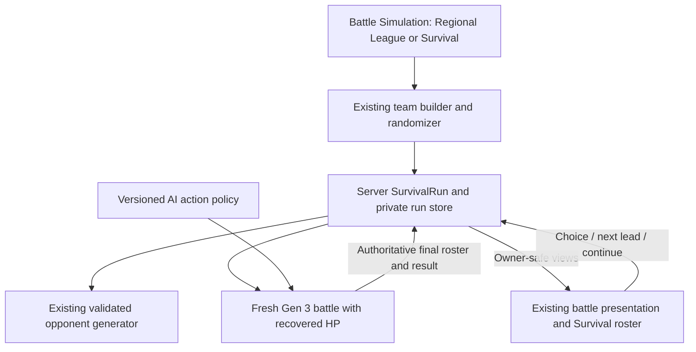

# Survival mode — reviewed plan v0.3

Planning date: 2026-09-27. Repository initially inspected at `96521da`. Status: the original implementation was completed locally on 2026-09-27; the user subsequently requested victory revival at 50% maximum HP. This revision records that current rule contract. Historical verification is recorded in `docs/SURVIVAL.md` and is explicitly separate from verification of the revised recovery. No deployment has been performed.

## 1. Recommendation and decision status

Offer **Regional League** and **Survival** as separate modes within **Battle Simulation**, using `/simulation` and `/survival` respectively. Both setup screens provide League / Survival mode choices. Survival uses a dedicated server-owned `SurvivalRun` with the existing solo battle host, real Gen 3 engine, shared team builder, random-team generator and battle presentation.

The navigation decision reflects the user's revision after the initial local implementation. A later rule revision replaces permanent elimination with revival at 50% maximum HP after a won round; it keeps the same entry point, battle engine and API ownership model.

The user requested endless battles against random teams, a goal of surviving the most rounds, roughly 25% HP recovery between rounds, and curing “stats.” Their original permanent-exclusion request has been superseded: fainted Pokémon now revive at 50% maximum HP after a win. A round means one complete battle against an opposing team. Curing means clearing status conditions and temporary stat changes, not changing base stats, EVs or IVs.

The user confirmed these choices during research:

1. **Solo versus random AI teams.** Cooperative and human competitive Survival are outside this plan.
2. **Restore move PP each round.** Survivor healing by 25% maximum HP and status/stat-change clearing remain part of this rule.
3. **Revive fainted members at 50% maximum HP after a won round.** This later instruction replaces permanent elimination. Loss, draw and forfeit still end the run without recovery.

The subsequent instruction to build this plan used its recommended original-item restoration rule. Other detailed defaults below were adopted for the local implementation. Durable public persistence remains follow-up work; the current UI explicitly discloses temporary runs.

## 2. Historical feasibility and research findings

These findings describe the repository before the original implementation. The missing engine and run capabilities below have since been implemented. The revised revival rule uses the same exact-HP continuation and authoritative terminal-roster boundary.

| Finding | Repository evidence | Consequence |
| --- | --- | --- |
| Battle Simulation hosts the solo League flow | `apps/home/src/Home.vue`, `apps/simulation/src/App.vue` | Offer League / Survival mode choices within Battle Simulation; keep human private-room battles separate. |
| League already owns multi-battle progression outside battle rules | `apps/server/league-run.js:20` | Reuse its general ownership pattern, but keep a separate Survival controller. |
| League recreates the original team at full health | `apps/server/league-run.js:29` | Changing only the recovery display cannot implement Survival. |
| Current engine creation accepts teams, seed and match ID only | `packages/battle-engine/src/index.js:89`, `packages/battle-engine/src/teams.js:5` | Add a narrow trusted engine initialization capability; never put HP in ordinary editable team sets. |
| Open Singles needs six members; League permits smaller/repeated teams and a special NPC exception | `packages/battle-engine/src/profile.js:17`, `:46` | Add a dedicated Survival profile rather than weakening either existing format. |
| Server generator already produces legal six-member teams from all 386 base species | `apps/server/teams/random-team.js:71`, `tools/team-generation/README.md` | Reuse it directly. Do not build another move-selection pipeline or call a live vendor API. |
| The existing bot chooses the first available damaging move, then other actions | `apps/server/simulation.js:201` | This is a usable automation scaffold, not sufficient evidence of an enjoyable survival opponent. |
| A bot failure currently removes the solo session | `apps/server/simulation.js:227` | Survival must preserve its last valid run/checkpoint and expose recovery instead. |
| Solo state survives refresh but is RAM-only and expires after 30 inactive minutes | `apps/server/simulation.js:98` | Local prototype and public persistence promises must be separate. |
| Actual combined host budget is 14 solo + 10 multiplayer battles | `apps/server/capacity.js:1`, `apps/server/start.mjs:131` | Survival consumes existing solo capacity, not a new unrestricted pool. |
| The PvP client rejects a changed match ID within a room | `apps/multiplayer/src/roomSession.js:63` | Use the solo encounter flow, which already handles a fresh match between stages. |

A read-only runtime probe against the pinned local vendor verified the key HP boundary: construct the battle, register the player team, apply validated positive HP, then register the opponent and let normal battle startup occur. The opening protocol and owner request correctly showed **37/360** and **81/362 HP**, with fresh status and PP. This demonstrates feasibility without a vendor patch or a replacement damage engine. It is not a completed Survival implementation or a substitute for integration tests.

Upstream research supports retaining explicit validation: the simulator accepts teams without automatically validating them. Its API also separates player-private updates from public updates. Continue using the project's validator and private projections. [Pokémon Showdown simulator documentation at the declared source revision](https://github.com/smogon/pokemon-showdown/blob/739a5e1fee432ad80ff7136d70cca993be358b59/sim/SIMULATOR.md).

Upstream startup registers players before starting, while Pokémon objects own HP, status, move slots and temporary state. These sources corroborate the approach; the locally verified package tree remains the implementation authority. [Battle startup source](https://raw.githubusercontent.com/smogon/pokemon-showdown/739a5e1fee432ad80ff7136d70cca993be358b59/sim/battle.ts), [Pokémon state source](https://raw.githubusercontent.com/smogon/pokemon-showdown/739a5e1fee432ad80ff7136d70cca993be358b59/sim/pokemon.ts).

## 3. Current v2 rules

The run rule version is `gen3-survival-v2`. The existing battle profile remains
`gen3survivalsinglesv1`; victory recovery is a host rule, not a change to battle mechanics.

| Rule | Current behavior |
| --- | --- |
| Starting team | Choose a preset, build a team, or use the randomizer. Validate and freeze six distinct base species before the first opponent is drawn. |
| Format | Gen 3 singles, level 100, existing legal moves/abilities/items. No new bans in this slice. |
| Opponents | A fresh, server-generated six-Pokémon team each round; same existing all-386 pool and equal species sampling. Repeats across rounds are allowed. |
| Round | One complete opponent-team battle. Turn count is a separate measure. |
| Recovery | After a server-confirmed player victory, every surviving original member gains 25% of its maximum HP, capped at maximum. Benched survivors recover too. |
| Rounding | Survivors: `min(maxHP, currentHP + max(1, floor(maxHP / 4)))`. Fainted members after a win: `max(1, floor(maxHP / 2))`. A revived member does not also receive the survivor's 25% heal. |
| Fainting | A fainted member stays disabled for the rest of the current battle. After a server-confirmed win it revives at 50% maximum HP and returns for the next round. No replacement recruits. |
| Status and temporary effects | Clear major conditions, confusion, trapping and other volatile effects, positive and negative stat stages, Substitute, screens, hazards, weather and temporary transformations between rounds. |
| PP | Restore original moves to full PP. Confirmed by the user. |
| Held items | Restore the original equipped item each round, including a consumed berry or knocked-off item; stolen/swapped items do not become permanent. |
| Original build | Restore original species/form, ability and move list. Nature, EVs, IVs, friendship and other approved set choices stay fixed. No mid-run editor or randomizer. |
| Lead | Allow choosing any recovered or revived original member as next lead before committing the next encounter. This does not change its set. |
| Difficulty | Fixed rules and pool; partial HP recovery carries risk into the next round. No hidden level scaling, adaptive counter-teams or guaranteed bosses. |
| Score | Number of battles won. Show “Round 8” and “7 rounds beaten” separately. Track survivors and total turns as secondary information. |
| End | Engine-declared loss, draw/500-turn cap, or player forfeit ends the run. Only a player win grants recovery and a win increment. |
| Win with no survivors | If the engine actually declares a player win, count it and revive the team normally before the next round. Never infer a winner independently for double KOs. |
| Operational error | Preserve the last committed state; show interrupted/retry. Network failure or an engine/store fault is not a gameplay defeat. |
| Rankings | Casual personal runs only. Optional browser-local personal best is labeled as local and compared within the same rules version. Old permanent-elimination streaks and revival-rule streaks are separate. Public rankings are outside this version. |

After a win: 70/400 HP becomes 170/400; 360/400 becomes 400/400; 0/400 becomes 200/400. A fainted one-max-HP species revives at 1 HP. A surviving Pokémon with 301 maximum HP receives 75 HP, while a fainted one revives at 150 HP. None of these recovery rules apply after a loss, draw or forfeit.

“Clear temporary effects” means the next encounter starts clean; new opening abilities can establish new weather or stat changes as normal. The recovery screen can say **“Survivors recovered 25% max HP. Fainted Pokémon revived at 50%. Status cleared. PP and starting items restored.”** It must not claim the whole team was fully healed.

Full PP/item resets keep the challenge focused on winning each battle and carrying partial HP into the next one. Victory revival reduces the original mode's attrition, so its difficulty needs separate playtesting. Preserving PP would instead make move depletion a major resource and requires original-move accounting for Transform, recovery choices and explicit item-transfer rules.

## 4. Options considered and chosen architecture

These are engineering judgments, not measured product scores.

| Option | Assessment | Grade |
| --- | --- | --- |
| Put a bot into the existing private PvP room | Adds invitations, readiness, membership epochs and PvP timers to a solo task; existing room client assumes one match. | 5/10 |
| Add Survival flags throughout the five-stage League controller | Fast prototype, but entangles full reset, finite progression and partial recovery rules. | 6.5/10 |
| Dedicated SurvivalRun using shared solo services | Reuses proven battle components while giving attrition, scoring and recovery clear ownership. | **9/10 — selected** |
| Build a generalized campaign framework, accounts and leaderboard first | Too much infrastructure before validating the core mode; durable run storage can be added as a focused release requirement. | 6/10 |

Keep mode progression out of preview `battle-core`, move FX and animation callbacks. The renderer shows the committed result; finishing an animation never awards a win, heals a member or chooses the next opponent.

### Engine boundary

Retain `gen3survivalsinglesv1`: one through six members, distinct base species, existing Gen 3 legality and level 100, no League NPC exceptions. The original implementation supported compact survivor parties. Current run rules admit exactly six initial members and restore all six originals after a win; smaller parties remain a supported engine capability. Keep all existing formats unchanged.

Add two server-only capabilities within `packages/battle-engine`:

1. **Initial conditions:** permitted only for the Survival profile, positive integer HP keyed by the engine's stable member identity. Validate against engine-calculated max HP. Apply after player Pokémon construction and before registering the opponent/startup. Include these conditions in the engine's initial record.
2. **Terminal roster:** after authoritative completion, return detached exact HP, max HP and fainted state by stable member identity. Read this inside the adapter, not from UI bars, client payloads or manually edited checkpoint JSON.

Do not pass zero-HP entries into a new engine party. Compute victory recovery and revival from the terminal roster first, then send all six originals with positive HP. Maintain an immutable mapping from original `runMemberId` to that battle's `memberId`; rebuild it when ordering the next lead. Switching can reorder vendor party arrays, so extraction must use stable identity rather than current array position.

Create every recovered or revived member from its original legal set and carry only allowed HP. This avoids accidentally retaining Transform moves, Skill Swap abilities, stolen items or temporary forms. Revalidate the fresh team through the Survival profile. Keep canonical-to-editable conversion so derived `hpType` does not become an unsupported input field; Hidden Power IVs remain intact.

Include initial HP in checkpoint and replay initialization. Replay currently calls `create(saved.initial)`; out-of-band HP changes would otherwise replay later rounds at full health. Test exact terminal state, decisions and events after restore/replay.

### Server record and API

A focused private run record owns:

- Schema, rule, engine/profile, generator collection and AI policy versions.
- Run ID, owner/session identity, run revision, timestamps and expiry.
- Immutable original six legal sets with fixed run member IDs.
- Six member records, authoritative HP/max HP, current faint state and last settled round.
- Current round number, wins, status and aggregate turn statistics.
- Current match identity, member mapping, private opponent team/seed and recoverable checkpoint.
- At most one pending next-encounter specification, a bounded recent command receipt window and a small recent-round summary list.

Never accept HP, faint flags, scores, wins, opponent teams or seeds from browser requests. A lead choice contains only an owned available member ID; revived members are eligible after a victory. Team choices are accepted only when creating a run.

Reuse the solo cookie and API family with an explicit mode discriminator; preserve existing regional and single-battle requests. A start request adds `mode: 'survival'`, mutually exclusive with `regionId`. Advance additionally carries the run revision, last match identity, operation ID and chosen available lead; do not create a second battle protocol.

Start is idempotent too: establish and acknowledge a capped, expiring owner session before creating the run, then require an operation ID, expected current-run identity/revision and a digest of the submitted intent. The client retains that operation ID before sending. Retrying a lost Start response returns the same run and first opponent; the same ID with changed intent fails. Do not rely on receiving a brand-new cookie in the lost Start response to recover ownership. A small pre-run session bootstrap can supply this without creating PvP room membership; its records need their own count/expiry limits and do not allocate battle engines.

The first implementation can retain the existing one-solo-session-per-browser behavior. Starting another solo challenge ends/replaces an existing run only through an explicit UI action and matching server identity, never through visiting another page or receiving a stale response.

### Settlement and advancement

Lifecycle: `setup → active → between-rounds → starting-next → active → … → ended`. `interrupted` preserves its previous playable/retry state and is not a loss.

On a battle command, advance a candidate engine from the last committed checkpoint, run the bounded AI work, and prepare the updated view/checkpoint. If that candidate completes the round:

1. Read the actual final result and exact roster after terminal mechanics settle.
2. Map members to fixed run identities; record which members finished fainted.
3. If the player won, increment wins once, heal survivors by 25% maximum HP and revive fainted members at 50% maximum HP. Otherwise end without recovery or revival.
4. Commit checkpoint, result, roster, run revision, command receipt and intermission/end summary together. A failed commit publishes none of them.

The terminal battle view still shows the actual finishing HP. A separate run recovery summary shows before/after HP; do not rewrite completed battle history to make the final hit look healed.

On Continue:

1. Check owner, run/revision, last match, state, operation identity and available lead.
2. Freeze the selected lead and privately prepare/store the next opponent and battle seed once, atomically moving the run to `starting-next` with a new revision and operation receipt. A failed engine start reuses this pending specification. Repeated requests cannot offer new draws or change the lead after the encounter was prepared.
3. Construct a candidate fresh battle with all six healed/revived originals and a new full opponent team; verify its initial checkpoint/view.
4. Atomically publish the new match, mapping and revision. Dispose the prior engine after successful replacement; discard failed candidates.

Healing and revival are already settled, so Continue, reload, GET, retry and animation completion cannot apply them again. Old requests outside the bounded receipt window return stale/current-state responses without mutation. Two tabs with different operation IDs and the same expected revision cannot create two encounters.

Reuse the immutable-record/atomic-commit pattern from `rooms/memoryStore.js` through a small run-store interface. Do not copy its guest, invite or readiness tables. This is focused recovery work for Survival, not a mandatory rewrite of existing PvP or League storage.

## 5. Opponents, difficulty and meaningful scores

The current collection contains one legal starter per base species: 213 vendor-derived and 173 project-generated. They are baseline checked, not competitively optimized or balanced. Keep their provenance and existing whole-team validation. The mode does not need live JSON fetches or a new vendor dependency.

Uniformly sampling Caterpie through legendary Pokémon creates large encounter variance. Allowing arbitrary player-built teams adds more variation. Therefore a casual streak is a useful personal challenge, but not sufficient for a fair public leaderboard.

Healing can also erase attrition: a 400-HP Pokémon losing 80 HP per battle regains up to 100 afterward. Revival now restores a fainted member to 200/400 after a win, so sacrificing a low-HP member may be beneficial if the rest of the team can still win. This follows the requested rule. Strong recovery moves and predictable AI can enable long easy runs; assess the revised mode separately without silently altering enemy teams.

Before calling the mode ready for players, isolate a versioned Survival AI policy and give it a modest baseline:

- Choose only legal engine-provided actions; keep existing bounded decision driving.
- Rank damaging moves using Gen 3 type/category, accuracy and its own set, considering visible opponent information.
- Avoid repeatedly choosing a known immune attack when a useful move or legal switch exists.
- Use straightforward recovery, setup and status conditions sensibly; cover Counter/Mirror Coat/Transform and constrained sets in tests rather than assuming every team has a standard attack.
- Handle forced switching and score ties without reading hidden opposing moves, items, ability choices or exact private HP. The bot may use its own private team and the opponent information legitimately revealed to it.
- Make tie-breaking reproducible with a separate stored AI RNG state or deterministic policy; do not consume battle-mechanics RNG for AI choice selection.
- Leave existing League AI behavior alone unless the user requests a shared upgrade.

Do not add search-based competitive AI, adaptive enemy counter-picking, level escalation or boss rules initially. Keep the pool, healing and bot policy fixed for a run. If players later want rising difficulty, add an explicit versioned mode and compare separate scores.

Evaluation should include a fixed suite of physical, special, mixed, support, recovery-heavy, weak-species and legendary-heavy teams plus repeated opponent seeds. Record rounds cleared, losses per round, battle duration/turns, repeated ineffective choices and abrupt difficulty spikes. Automated baselines help detect regressions; a small set of human playtests assesses whether choosing leads and preserving survivors is enjoyable. Set a target experience after that data, not an invented promised median streak.

## 6. UI, pause and persistence

Offer Regional League and Survival from Battle Simulation, with League / Survival mode choices on both setup screens. Keep `/simulation` for Regional League and `/survival` for Survival. Both views reuse the solo app and shared presentation without introducing another framework or duplicate battle renderer. Private-room invitations retain the existing multiplayer flow.

Suggested experience:

1. **Prepare:** pick/build/randomize six; inspect the rules; choose the first lead; start.
2. **Battle:** show current round, rounds beaten, members still standing and the original six-member run roster. Fainted members are gray, labeled “Fainted this round,” and cannot be switched in during that battle.
3. **Recovery:** show the round result, exact HP gained, cleared conditions and which members revived at 50%. All six originals are available as the next lead. Choose one, then Continue. No mid-run team editing.
4. **Run end:** show rounds beaten, ending reason and roster. “Try again” creates a new run; it cannot roll back a lost round.

The live battle party and recovery roster are separate views. Never fabricate engine switch choices for currently fainted Pokémon. Their revival is shown in the recovery roster and becomes playable only in the next battle; the completed field keeps its actual ending state.

Pause needs no PvP decision timer in a solo challenge. For a local prototype, closing/refreshing can resume the same server session within the documented inactivity window; it does not freeze expiry. Do not claim a durable Save and quit feature while state remains in RAM.

For a public launch, prefer a **durable transactional current-run store** before promising long streak preservation. Persist the bounded record and current checkpoint, with the same atomic publication semantics. Accounts are not necessary to prove this locally, but cross-device recovery and ranked identity are separate features. Choose the storage backend against actual hosting capabilities rather than installing a database during planning.

Make engine upgrades explicit: engine identity currently includes all adapter JS files plus profile, data and runtime identity, and old checkpoints reject mismatches. Adding Survival can change fingerprints for existing modes too. Public deployment must drain active runs, keep a compatible runtime available or use a tested migration. Incompatible runs must be reported as interrupted with achieved score preserved where durable storage permits, never silently resumed with different rules.

## 7. Resource and failure limits

- “Endless” means no designed round-count finish, not unbounded memory or an infinite individual battle. Retain the 500-turn encounter cap and define its draw outcome.
- Keep one current checkpoint and bounded recent summaries/receipts. Do not copy League's ever-growing `completedMatches` set into an endless loop.
- Reuse the solo host budget. Account for temporarily constructing a replacement candidate within the existing memory budget; a count cap alone is not a load test.
- Dispose replaced and failed engines and clear prior-match event cursors, log buffers and stale presentation callbacks.
- Limit start, advance and team-generation requests. One pending encounter per run prevents rapid draws and concurrent construction.
- Generation, bot, engine or store failures retain the last valid checkpoint and operation identity. A bounded retry may recover; repeated failure shows an actionable interrupted state without losing the streak.
- Network disconnects do not adjudicate solo losses. After a lost response, reconnect returns the committed current state; the client cannot rewind a submitted move.
- Gameplay loss, forfeit, expiry and technical interruption have distinct reasons. Expiry is not falsely presented as a defeat; prototype expiry/restart can still make resumption unavailable and must be disclosed.

## 8. Delivery sequence and acceptance gates

| Slice | Work | Gate before moving on |
| --- | --- | --- |
| 0. Confirm the rule contract | Solo/AI interpretation, PP and item policy, healing/rounding, ending rules and prototype persistence. | One short rules specification; no UI label promises that the backend cannot meet. |
| 1. Engine continuation | Survival profile, initial HP, authoritative terminal roster, member mapping and checkpoint/replay support. | Real engine tests prove exact HP at opening, stable identities and existing 1–6 member support; current run tests prove all six return after victory recovery. Existing Open Singles/League contracts still pass. |
| 2. Run service | Versioned records, atomic battle settlement, once-only recovery, opponent preparation, advance, interruption and bounded storage. | Multi-round headless integration with duplicate/concurrent requests and injected failures. |
| 3. Playable UI | Battle Simulation mode choices, reuse builder/battle presentation, original roster, recovery/lead screen, results and reconnect. | Desktop/mobile runs, refresh during a turn/intermission, effects off/skip/reduced motion; fainted actors stay down on the finished field while revived members become eligible for the next lead. |
| 4. AI and quality | Modest policy above, deterministic scenarios and human playtesting. | No persistent obvious immunity loops or invalid actions; assess fun and encounter variance before broad release. |
| 5. Public readiness | Durable store if long-run retention is promised, retention/upgrade policy, capacity and prolonged-run checks. | Restart/restore, compatibility handling and bounded memory match the advertised experience. |

This is a medium-sized feature with a small but sensitive engine change and meaningful host recovery work. The HP arithmetic is easy; replay, identity mapping, failure recovery and enjoyable opponents dominate the risk. Do not bundle leaderboards, rewards, co-op, public matchmaking, difficulty tiers or a campaign framework into the first playable slice.

Likely implementation locations (illustrative, not a requirement to create every file): `apps/server/survival-run.js`, a focused run store and Survival AI policy; `packages/battle-engine/src/index.js` and `profile.js`; `apps/server/simulation.js`; Survival setup/recovery components in the solo/shared apps; existing page routing and Battle Simulation navigation. Preserve all move recipes, sprite geometry and existing mode rules.

## 9. Test matrix

| Area | Required cases |
| --- | --- |
| Recovery | Partial/full/zero HP; odd maximum HP; fainted Shedinja returns at 1 HP; benched survivors; only authoritative wins heal/revive; revived members receive no extra 25%; neither reload nor repeated Continue recovers twice. |
| End results | Ordinary loss, forfeit, draw, turn limit, residual/recoil/double KO, engine-declared win without survivors, and technical interruption. Never replace the engine's winner decision. |
| Carryover | Low HP applied before startup abilities and requests; correct public HP rounding; max HP calculated by engine; invalid/unknown/duplicate/zero/negative/fractional HP rejected. |
| Original identity | Lead changes, switches, fainted first/middle slots, revived members chosen as lead, all six return after wins and stable mapping after party reordering. |
| Reset semantics | Major conditions and counters, positive/negative stages, volatile effects, hazards/weather/screens/Substitute, Transform/Castform/Skill Swap, consumed/stolen/knocked-off items, original PP and Hidden Power IVs. |
| Replay/recovery | Restore/replay a damaged later round, pending player choice and forced switch; compare decisions, views and terminal roster; incompatible versions rejected explicitly. |
| Integrity | Forged HP/score/round/opponents rejected; wrong owner; stale run/match/revision; changed team after start; unavailable/unknown member as lead. |
| Concurrency | Double click, duplicate same operation, same ID with changed intent, two tabs with distinct operations, lost start/advance responses and stale forfeit/restart requests. |
| Failure | Fail generation, engine creation, AI action driving, checkpoint export and store commit. Recover without losing a win, double-healing/reviving or changing a prepared opponent. |
| UI | Final faint before recovery, correct survivor/revival HP before/after, fainted cards disabled in battle and revived cards enabled for next lead, no stale FX revival on the finished field, mobile controls, keyboard navigation, reconnect without replaying completed entries. |
| Longevity | Thousands of cheap synthetic settlements to prove bounded records; a smaller real-engine soak for disposal/memory; per-match logs reset and existing capacity enforced. |
| Regression | Regional League still fully resets; human PvP readiness/privacy unchanged; ordinary custom teams and the randomizer retain their contracts. |

Run relevant engine/host/client integration checks and a production build for implementation. Broaden to shared rendering tests if shared presentation changes. Planning itself requires no production build or changes to live sessions.

## 10. Historical iterative review and grade

These scores assessed the original permanent-elimination plan before implementation.
They are retained as design history; they do not grade the later revival rule or
establish that its difficulty has been playtested.

The first candidate reused the solo loop, proposed explicit recovery and a separate run controller, but left AI behavior, failure recovery and long-run retention too implicit. Independent engine and host audits then identified the verified pre-start HP boundary, compact survivor mapping, destructive bot-error behavior, PvP client incompatibility and unbounded finite-league history.

The revised plan incorporates those findings and an independent challenge review:

A final artifact review also required explicit idempotent run creation, including ownership established before Start. That closes the lost-first-response case as well as the already covered Continue/recovery races.

| Criterion | Weight | Initial proposal | Revised plan |
| --- | ---: | ---: | ---: |
| Rules and player expectations | 20 | 18 | 20 |
| Engine and architecture fit | 25 | 23 | 24 |
| State integrity and recovery | 20 | 18 | 19 |
| Enjoyment and difficulty | 15 | 8 | 11 |
| Verification strategy | 10 | 8 | 9 |
| Scope and delivery | 10 | 9 | 9 |
| **Total** | **100** | **84** | **92** |

**Recommended plan: 92/100 (A−), with solo/PP confirmed and original-item restoration recommended. Engine feasibility: 9/10.** These are reasoned design-review scores, not evidence of shipped correctness or balanced gameplay.

The remaining uncertainty is concentrated in actual play quality and public persistence requirements. Original-item restoration has since been adopted and the engine/run slices implemented. The current iteration must verify 50% victory revival, unchanged loss handling and revived-member selection, then assess encounter difficulty under the revised rules before expanding features.
